ワンルームな部屋を上手に使うための家具の配置を試行錯誤している記録です。

### B1

- 初期配置

- ベッドを窓際に置いた
  - 正方形に近い空間ができた
  - 部屋の広い感は、床に置ける最大の正方形の面積で決まるかもしれない
  - 冬は寒くなるので、窓にプチプチを貼ったり、ダンボールを立てかけたりして、断熱するといい

### B2

- 机が増えた
  - PC 用のキーボードが引き出せるタイプの机
- クローゼットをひとつオミットした
  - 某ライトセーバーを振り回す VR の音ゲーができる程度の空間がとれた

### B3

- ベッドの上に突っ張り棒を張り服をかけた
  - ベッドの上空は死地になりがち
  - 幸い、服に叩き起こされることはなかった
- 本棚を増やした

### B4

- PC 机と工作机を分けて置いた

- B4 にしてようやく†正解†を見つけた
- 窓の半分は本棚によって隠されているが、常にカーテンを閉じているので問題ない
  - ちなみにオタクがカーテンを閉じているのは、決して陰の者だからではなく、日光により発火する危険があるためである。
- 本棚に電子部品を置くことで、工作机が便利になった

### M1
