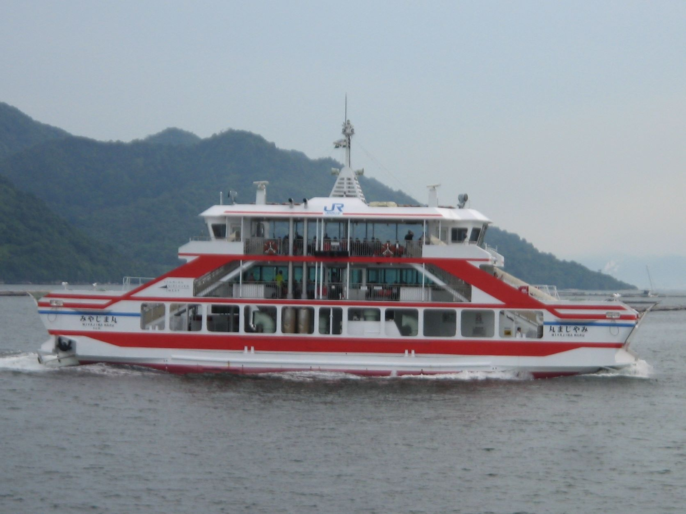
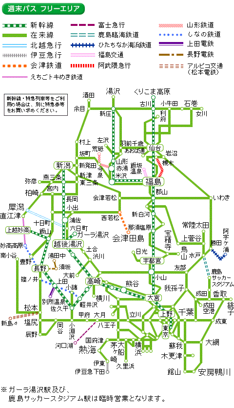
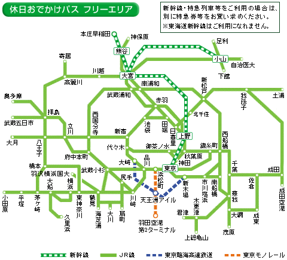

> 旅行がお好き？けっこう。ではますます好きになりますよ。

## フェリー

フェリーというと、こういう島に渡るための小さい渡し船を思い浮かべるかもしれません。

海底トンネルや橋の開通で多くのフェリーが廃止されてきました。青森と函館を結んでいた青函連絡船は有名ですね。

日本には多くのフェリー航路が残っています。

### 長距離フェリー

トラック

フェリーの長所は、大量の荷物を安く長距離運べるということです。また、トラックが船にそのまま乗って、そのまま降りていくので、コンテナ船に比べて積み下ろしが楽です。港にクレーンは不要です。

フェリーは国内の長距離輸送にちょうどいい輸送手段。

昨年、横須賀～北九州の航路が新設されたように、

実際、7 割近くは貨物輸送の収益です。これはフェリーの設計を見るとわかります。

航路の

実際、フェリーに乗るとトラックの運ちゃんが、船の食堂で呑んでるのをよく見かけます。

- 北海道方面
  - 大洗～苫小牧
  - 名古屋～仙台～苫小牧
  - 敦賀～新潟～秋田～苫小牧
  - 舞鶴～小樽
  - 新潟～小樽
- 九州方面
  - 東京～徳島～北九州
  - 横須賀～北九州
- 瀬戸内
  - 大阪～北九州
  - 神戸～北九州
  - 大阪～別府
  - 神戸～大分
  - 神戸～宮崎
  - 大阪～志布志

### 湾フェリー

湾の入り口を横切るように走るフェリーです。2 時間に一本程度、片道 1 時間程度の航路が多いです。ぐるっと一周する旅程を組むときに便利。

- 陸奥湾
  - 津軽半島の中ごろ、蟹田から、下北半島の顎にある漁港、脇野沢を結ぶ
  - 大間に行ったら乗ってみたい
- 東京湾
  - 久里浜～浜金谷
  - 久里浜港は駅から徒歩 10 分、バスもある
  - 浜金谷港は駅のそば
- 駿河湾
  - 清水～土肥
  - 冬の晴れた日には富士山が綺麗に見える
- 伊勢湾
  - 鳥羽～伊良湖
- 中部空港
  - 津～中部空港
- 大分空港（23 年開業予定）
  - 大分～大分空港
  - 開業したら日本で唯一のホバークラフト航路
- 有明海
  - 島原～三池
  - 多比良～長洲
  - 島原～熊本
- 鹿児島湾
  - 鹿児島～桜島
  - 鹿児島～垂水
  - 指宿、山川～根占

### 対岸フェリー

- 津軽海峡
  - 函館～大間
  - 函館～青森
  - 八戸～苫小牧
- 紀伊水道
  - 徳島～和歌山
    - 和歌山～難波の値段で徳島～和歌山～難波が乗れる割引切符がある
- 高松
  - 高松～神戸
  - 高松～宇野
- 愛媛
  - 松山～呉～広島
  - 松山～柳井
  - 別府～八幡浜
  - 臼杵～八幡浜
- 豊後水道

### 離島フェリー

人の住む離島の数だけフェリーがあります。

- 伊豆・小笠原
  - 東海汽船
- 佐渡島
  - 新潟～佐渡両津
  - 佐渡小木～直江津

### 国際フェリー

- 稚内～ Корсаков（稚泊連絡船）
- 下関、福岡～釜山（関釜連絡船）
- 境港～東海～ Владивосток（2020 廃止）

## フリーパス

フリーパスとは、特定のエリア内の列車を自由に乗れる切符のことです。多くのフリーパスは普通列車しか乗れず、時間がかかる、安くなる場合がフリーパスを探すにはこのサイト（ [各地のフリーきっぷ(鉄道)](http://www2s.biglobe.ne.jp/~t_aoyagi/railway/free/index.htm) ）が便利です。おすすめのフリーパスを紹介します。

1. 青春 18 きっぷ
   - 5 日分、12050 円
   - 期間(2021 の場合)
     - 春：3/1~4/20
     - 夏：7/20~9/10
     - 冬：12/10~1/10
   - JR 全線の普通列車が乗り放題
2. 北海道＆東日本パス
   - 連続 7 日、11330 円
   - 期間(2021 の場合)
     - 春：3/1~4/22
     - 夏：7/1~9/30
     - 冬：12/10~1/10
   - JR 北海道＆JR 東日本が乗り放題
   - 18 きっぷでは乗れない、IGR いわて銀河鉄道、青い森鉄道、北越急行にも乗れる
     - 盛岡から青森に行くときにショートカットできる
   - 18 きっぷに比べて、夏休みの期間が長い
   - 北に行くなら 18 きっぷよりこっちがおすすめ
3. 週末パス
   - 連続する土休日 2 日、8880 円
   - 前日まで発売。当日は買えないので注意
   - 特急券を買えば特急に乗れる
     
4. 休日おでかけパス
   - 土休日 1 日、2720 円
   - 特急券を買えば特急に乗れる
     
5. 青空フリーパス
   - 土休日 1 日、2620 円
   - JR 東海の豊橋以西

## 宿

ネカフェがない街に泊まるとき

文字通り、屋外で寝ることを意味します。

始発列車までの数時間を耐える

駅で寝ることを駅寝と言います。田舎の終着駅で降ろされてしまった場合などにに決行されることがあります。

推奨される行為ではありませんが

## 観光

### 都市

## 記録

## 徒歩
