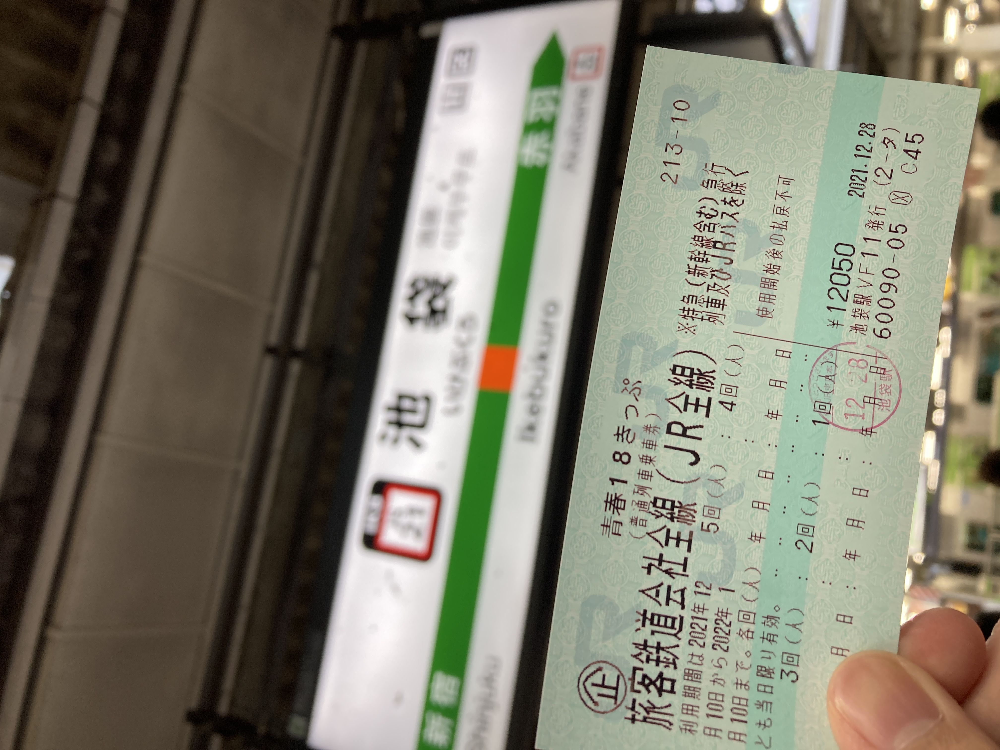
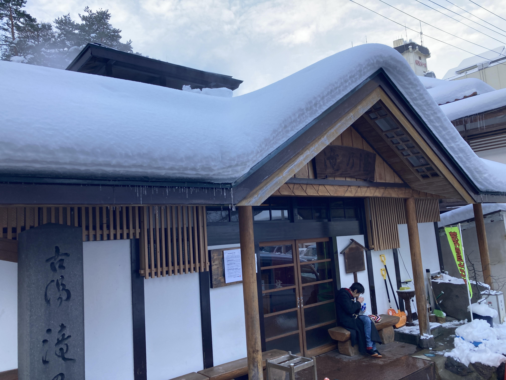

## 東北の入口 (2021-12-28)

雪を見るとはしゃいでしまう。

雪国に住んで雪に呆れない限り、心の底から湧いてくるわくわくを抑えられるようにはならない気がする。

冬休みの初日、部屋の掃除を終えて何気なく TL を眺めていたら、それは突然やってきた。

マフラー、手袋、耳当てと、ある限りの耐寒装備をリュックに放り込み、一番分厚いダウンジャケットを着て池袋へ向かう。

18 きっぷを買ってそのまま埼京線に乗り込んだ。とりあえず北へ向かおう。赤羽で東北線に乗り換える。宇都宮までグリーン券を買った。

夏休みぶりの仙台に着いた。ついこの間きた来た気がする。

もう夜も遅い。

駅へ向かってくる賑やかな人の流れに逆行して、快活クラブに向かった。

繫華街の通りの入り口にラーメン屋を見つけた。

実家に帰っている途中の人、スーツケースを引っ下げた人、顔を赤らめている人、日付が変わろうとしているのに店の前には列ができている。

家系に似た味ではあるものの、海鮮系のダシの味のためかさっぱりとしている。

東京でよく見るチェーン系家系に比べてあっさりしている。家系ばっかり食べてる友人に勧めたいと思った。40 歳で死ぬところ 5 年ぐらい寿命が伸びるだろう。

## 山と雪 (2021-12-29)

始発の仙台駅は思いのほか賑やかである。

4 両編成の電車は薄い雪化粧をして、朝闇の仙台駅へ入線する。仙台 6 時ちょうど、郡山行と同時に一ノ関行は発車した。

かつて北伐の最前線であった多賀城の最寄り、国府多賀城をすぎると、いよいよみちのくへ来たという実感が増してくる。松島は暁闇の中でよく見えない。少し丘越えをして平野に出ると、あたりは青白に包まれた。

太陽が起きてから布団を出るまで、わずかの時間。

朝日と雪と時間が織りなすグラデーションは、雪国の特権だ。

川を越えて街に入ると、もやはすっかり晴れ、太陽は丸く姿を見せていた。

6 時 44 分、小牛田に着いた。

向こうからエンジンの音を立ててやってきた、お馴染みのキハ 110 型気動車は、あまりにも厚化粧である。

小牛田発 7 時 3 分。深い雪へと向かって列車は出発した。

北浦、陸前谷地（前谷地ではない）、古川、塚目と東に向かっていった列車は、西古川のあたりで突然北に折れる。

岩出山で遅延している交換列車を待つ。雪のためであろうか。発車を待ってるあいだに、ここ岩出山と伊達氏の歴史を少々語ろう。福島駅の隣に伊達という駅があるが、そのあたりにあった伊達郡が伊達氏の由来である。伊達には奥州街道と羽州街道の追分、桑折があり、伊達氏の祖、伊達朝宗もこの桑折に居を構えた。奥州街道は現在の東北本線、羽州街道は奥羽本線に対応する。

戦国時代になると、伊達氏、伊達政宗は急速に版図を拡大し、ついに奥州全土を影響下に置いた。桑折を抑え、出羽・陸奥双方に睨みを利かせた伊達が奥州の覇者となったのは、歴史の必然といえないだろうか。

そんな伊達政宗も、小田原攻めで秀吉に服属することとなる。秀吉は惣無事令に違反していたとして、伊達から旧領を取り上げ、岩手沢に減封した。ここに秀吉の天下統一が完成した。居城米沢を失った伊達政宗は、与えられた岩手沢の城を改修し岩出山城として移り住んだ。関ヶ原の戦いでは徳川に味方し、勝利した伊達は、62 万石が与えられ東北一の大名となった。そして奥州街道沿いに仙台城を築き居城とした。

岩出山城は、そんな反撃の機会をうかがい潜んでいた伊達氏の名残りである。

さて、列車は岩出山駅を数分遅れで出発して、次の有備館駅に着く。有備館は岩出山城の跡地に立った伊達の藩校である。寄ってみたかったが、旅程上断念した。

有備館を出ると、山が差し迫ってくる。エンジンもうねりをあげる。

川渡温泉、鳴子御殿湯、湯けむりがぽつぽつと立ち上る村が見えてくる。

8 時 15 分、定刻より 3 分遅れで鳴子温泉に着いた。さっそくこけしが出迎えてくれた。福島の土湯温泉でもこけしの像がいたが、温泉地で作られがちなのだろうか。しかしこのこけし、まじまじと見てみると、夜中に見かけたくはない顔をしておる。

滝の湯。入湯料はたった 200 円。

中に入ると、昭和の銭湯建築に、番頭の東北訛りのおばあちゃん。

懐かしさを感じざるをえない。東北は初めて来たけど。

温泉は非常に高温、体感 45°C ぐらいだろうか。

地元の

他の客が

皮膚のタンパクが変質する感覚か。

打たせ湯

風呂

ダウンなんていらない。

雪の温泉街を、腕まくりでぶらつく浮浪者がひとり。

ひとしきり鳴子の街をぶらついて、駅に戻ってきた。

待合室のストーブの香り。まさに冬の東北の旅情である。

10 時 9 分、陸羽東線新庄行に乗って、山越えをする。

最上

山を下り、家が多くなってくると、左から山形新幹線が合流し、南新庄に着く。

新庄からは奥羽本線に乗り北上する。山形新幹線から乗り継ぎの帰省客で、ロングシートはほとんど埋まっている。運転手の後ろで立っていくことにした。11 時 22 分、新庄発。

列車は次の泉田を出ると左に 90 度曲がり、次の羽前豊里の手前でまた右に 90 度曲がる。天然の掘割の中を進んでいるようになっている。

この区間が開業したのが 1904 年であることを考えれば、できるだけ地形を活かして線路を引きたいという設計の思いが伝わってくる。

真室川駅を出ると、真室川に沿って山を登っていく。奥羽本線の難所、雄勝峠である。峠にある院内トンネルを抜けると、東洋一とも謳われた院内銀山を尻目に、雄物川とともに横手盆地へ駆け下りていく。

12 時 53 分、横手着。さっそくラッセル車が出迎えてくれた。さすが、かまくらの街と言わんばかりの大雪が、駅前の通りに積もっている。

食い道楽という店で横手焼きそばをテイクアウトし、北上線に乗り込んだ。

スーツケースを持った乗客が数名。北上線で北上まで出て、東北新幹線に乗り継ぐようだ。時刻表を引いてみると、新庄まで出て山形新幹線に乗り継ぐよりも早い場合もあるらしい。

列車は、ちょっとした峠越えの後、駅に温泉がある、ほっとゆだ駅に停車した。湯田ダムの作った錦秋湖沿いを走る。きっと紅葉がきれいなんだろう。そう思いながら、水面に映った真っ白な山を眺めていると、北上の平野におりてきた。

15 時 9 分、北上着。盛岡行に乗り換える。東北本線はかなり混んでいて、盛岡まで立っていくことになった。

盛岡からは、花輪線に乗り換える。正確には、好摩までは元東北本線こと IGR いわて銀河鉄道になっている。盛岡好摩間の 660 円の切符を買って、いわて銀河鉄道の改札を通る。

ボックスは満席である。ロングシートに、好摩で立ち客は

ローカル線にしてはそこそこの乗車率である。

大館市の中心に近い東大館で、残りの 8 割が降りた。つられて一旦ホームに降りてしまったが、駅名標をよく見ると東大館と書いてある。構内踏切を渡った先の立派な平屋駅舎。ローカル線の主要駅にありがちな駅舎だ。

町の名を冠する駅より、隣駅のほうが栄えているというのは、こういう幹線から分岐した支線でしばしみられる。八戸と本八戸とか、横浜と桜木町とか、幹線が長距離を。幹線に対してフィーダー
東海管内を走っていた急行・準急

脇道にそれてしまった。

東大館を出た列車は、大館市の中心を東西に流れる長木川を越え、そのまま奥羽本線を超えて大館駅に着く。終着駅なのになぜわざわざオーバークロスしたのか。

奥羽本線がいかに重要な幹線だったかがわかる。

乗り継ぎの青森行きまで 1 時間ほど暇になったので、駅前を散策してみることにした。

小坂鉄道の廃線

ストーブの香る待合室には、

矢立峠を超え、碇ヶ関、大鰐、弘前と、

北の果て、青森に着いた

ホテルの近くにあったラーメン屋に入った。

煮干し

飲み干してしまいたい衝動に

非常に健康的である

家系ばっかり食べてる友人に勧めたいと思った。40 歳で死ぬところ 20 年ぐらい寿命が伸びるだろう。

## 街と雪 (2021-12-30)

津軽半島の先端、竜飛岬に行こうと思っていたが、津軽線は雪で止まっている。残念ながら当然である。

青森県庁の前の交差点は、国道 4 号と国道 7 号の終点である。まさに北の果てである。

国道終点碑画像

のっけ丼というやつを

青函連絡船を見に行くことにした。

11 時 22 分、青森発。新青森からは、大勢の帰省客が乗り込んできた。この混雑はほとんど変わらないまま、弘前に着いた。

弘前からはリゾートしらかみに乗車する。

リゾートしらかみは青森から秋田まで、五能線経由で運行されるが、3 度もスイッチバックを行う。青森を出た列車は、まず五能線との分岐駅川部を通りすぎ、弘前へ向かう。弘前で観光客を拾うと、座席の向きはそのままに、川部まで戻る。川部からはまたスイッチバックして、五能線に入っていく。

五能線の普通列車は、ほとんどが弘前発着として運転されるのに、川部駅の構造のために、スイッチバックを強いられる。

弘前から川部まで、座席が後ろ向きのまま進む。

川部から五能線に入る。

鯵ヶ沢からは、最前列の席に移動する。昨日、大舘駅でマルスと格闘した戦果である。

残念ながら、暗くなって見えなかった。

秋田着。

駅前すぐのビジネスホテルにチェックインして、夜の街へ繰り出す。アーケードを抜けた先にきりたんぽ鍋を出している居酒屋があったので入った。

きりたん鍋ときりたん田楽を食べた。実家でよく食べていた五平餅に似ている。まあ米を潰して串に練りつけるというのは全く同じなので当然だが。

それよりも、鍋の鶏肉が非常に美味しい。秋田の地鶏、比内地鶏というらしい。鶏肉に関してこれほど明確に違いを感じたのは初めてだ。身が締まっていて、歯ごたえがある。たぶん筋肉モリモリマッチョマンの鶏なんだろう。

秋田の繁華街は市内を流れる旭川沿いの川反という地区

駅からは歩いて 15 分ほどのところにある。

## 海と雪 (2021-12-31)

秋田といえば、なまはげ。今日はちょうど大晦日だ。

さて、羽越線は朝から不穏である。全体的に数分の遅延がある。

桂根駅から日本海沿いを下っていく。

モーターの音が弱々しくなった。徐行運転である。列車は日本海から吹きつける吹雪をうけながら、ゆっくりと進む。

終点、酒田。

駅は大勢のキャリーバッグで溢れていた。特急いなほが運休になったようだ。

乗り継ぎの列車まで1時間ほど暇ではあるが、とても街に繰り出せるような天気ではなかった。

おとなしく待合室で秋田の鶏めし駅弁を食べた。

列車はしばらく庄内平野の真っ白な田んぼの中を走る。最上川を超えて陸羽西線と分かれると、鶴岡についた。

しばらく走ると、山がどんどん迫ってくる。ついに列車は崖と海の間を縫うように走っていく。

吹き付ける雪。険しい海岸。荒れる海。

くぐもったエンジン音に包まれて、心地よいレールのリズムに揺すられて、ふわふわした気分で車窓を眺めてると、水墨画の世界にいた。

岩は波を砕き、波は岩を崖ずる。
雪は全てを寒色に染め上げ、

目が覚めると、列車はトンネルを走っていた。列車は越後平野に入り、村上に着いた。
