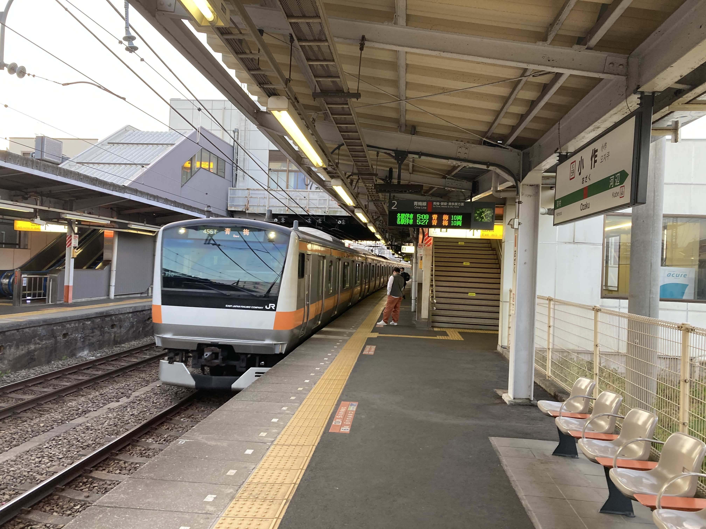

ことは昨年に遡る。休日は昼間まで寝ているような堕落した大学生の
晴天の休日に、たまたま早起きして新宿に出かけたのがことの始まりだった。

思えば、あのロマンスカーが伊勢原停車便だったら登山にはまっていたことはなかっただろう。ただ、登山にハマる素地が十分にあったのは確かだと思う。

そんなわけで、自分は山登りを旅行、観光の一部だと思っている。そこに山があるから登るというよりも、そこに面白いものがあるから登るというモチベーションである。

古来より、山に神性を感じ信仰してきた。

己の足を使って、まだ見ぬ場所を見に行く。情報量を求めているのであって、決して体験を求めているのではない。その証左として、自分と一緒に山に登った方には申し訳ないと思うが、風景の中に現れた情報とそれに対する考察をブツブツと言っている。これは独り登山のときは脳内で行なっていることを、

関東一円には名だたる霊峰がいくつかある。そのうち、大山と筑波山を登った次のターゲットとして、御岳山は必然かもしれない。

そんなわけで、

5 月 2 日昼、突然山に行こうと思い立った。呼んだら来てくれそうな友人に DM したらすぐ返事がきた。御岳山とし、小作の快活に前泊することにした。羽村駅から 2 車線のおそらく県道を、闇の中ひたひた歩く。たまに車か自転車が通る以外、徒歩は私ぐらいである。途中で市役所の前を通り過ぎた。全体的に、田舎でも都会でもないといった街である。ダイソーの居抜きのような風貌の快活クラブに入店し寝床を確保する。

ペナペナのクッションが敷かれただけの寝床に横になったが、あまり寝付けなく、うだうだしていた。これは寝床が悪いわけではなく、4 時寝というおしまいみたいな生活習慣のせいである。3 時ぐらいには寝落ちしていたと思う。数時間の睡眠の後、4:50 のアラームが鳴った。例のごとく、無料のパンはまだやっていない。トースターの置かれた机を横目に、宿代 1600 円を渡し外に出る。5 月とはいえ、西東京の朝はかなり冷え込んでいて、凍えながら小作駅へ向かう。「こさく」だと思ったが「おざく」らしい。某ポテチみたいな名前だなと思いながら、人の少ない方のホームで始発列車を待つ。東京方面は各乗車位置に 1 人か 2 人はいるような盛況ぶりである。青梅行きの始発列車が入線する。乗客は皆山に行く人たちに見える。大きなザックに丸めたシュラフ、奥多摩でテント泊でもするのだろうか。

青梅駅で奥多摩行きに乗り換え。ついでにホームの自販機で大きなどら焼きを買う。18 きっぷ旅行は基本始発なので、キオスクがやっておらず、駅の食べ物自販機のお世話になる。JR 東の自販機のメニューはどこもだいたい同じようで、生地が謎に甘いカレーパン、ワッフル、デニッシュ、スナック類など。大判のどら焼きと尺東謹製朝の茶事が限界旅行の朝の味である。

車内で連れと合流する。彼は快活クラブを私より 1 時間早く出て、青梅駅まで歩いてきていたようだった。青梅駅の周りはお祭りで朝にもかかわらず太鼓を叩いたりしていたらしい。

列車は青梅駅を出て、とある映像作品で有名となった軍畑駅を過ぎると、奥多摩の谷あいを縫うように走る。駅間距離はそれほどないが、くねくねした線路をゆったりと走る。御岳山への最寄り駅、御嶽駅では降りずに、2 駅先の古里駅で降りた。古里駅を出たところにセブンがある。こんな山奥で儲かるのかと思ったのも束の間、キャンプ客と思われる一行が来店し、レジに山を築いていった。我々も糧食を調達した。私は水 2 リットルとおにぎり 2 個、カレーパン、ようかん 2 個を装備した。御岳山は補給が充実しているから、不足分は上で買い足せばよいという算段である。同行人はカロリー効率が高いピーナッツを 2 袋買い込んでいた。

コンビニの脇の道を下り、多摩川の渓流を橋で越える。旧国道っぽい道を 5 分ほど歩き、看板を右に曲がると、登山口が現れる。

害獣対策のゲートを開く。扉の上部には、高圧がかかった有刺鉄線が張ってある。がいしで吊るされているから大丈夫だとは思うが、思わぬ接触があるかもしれない。恐る恐るゲートを開ける。

まずは尾根へ向かってつづら折りの登山道を行く。あまりメジャーではないようだが、よく整備された登山道である。

最初の山、万三郎山に着く。小さな看板が示すのみである。山頂付近には「飯盛杉」という銘板と大きな杉が生えていた。やよい軒で 1kg の飯を食う同行にぴったりである。

そこからは、尾根づたいに次の大塚山を目指す。尾根を境に植生が変わる様子が如実に露わていて面白い。北向きの斜面には彩度の低い針葉樹林が、南向きの斜面には彩度の高い広葉樹林が広がる。そこに綺麗な境目があって面白い。

地図上では存在する。一応、わずかな稜線上にピンク色のリボンが点々と繋がっている。が、これを登るのは人間より猪のほうが多いであろう。鉄塔の管理者向けの道路だろうか。

大塚山

富士峰園地へのゲートを開けて進む。頂上にはお社があった。安産社と書いてある。下るとリフトの駅に着いた。素晴らしい眺望が我々を出迎えてくれた。奥多摩の谷間に住まう集落と、それらを繋ぐ川、道路、青梅線が、関東平野に注ぐ姿を一望できる。季節外れの真紅の紅葉があった。

突如として集落が現れた。

御嶽神社のいちばん奥に遥拝所があった。つまり、本尊はあそこの山らしい。ここから見るとかなり急に見える。

たまに、なんとも言えないが「良い」尾根道を行く。

奥院に登頂。

大岳山の頂上はにぎわっていた。

七代滝

御岳山方面へ戻る。この道が道中でいちばんしんどかった。

長尾平でアクエリアスを購入し一気飲み。最高。草地で大の字になって休んでるうちに、かなり回復してきた。やはり栄養不足だったかもしてない。

すっかり体力を回復し、温泉へ向けて出発。売店の裏手のショートカットルートを進み、日の出山方面の入り口に立つ。宿坊が立ち並ぶ、雰囲気の良い道をしばらく進むとひときわ良い建物が現れた。

日の出山方面の道は非常に歩き易い。

鳥居は各県道への分岐点となっていた。

大きな岩が現れて

平井沢源流の碑というところから、

舗装路が続き、足に負担がくる。

次は旧道経由にしようと思った。

つるつる温泉に到着。40 分待ちと出ていたが、思いのほか早かった。

名前の通りつるつるするお湯だった。

登り筋はかなり鍛わっているが下り筋が弱い
