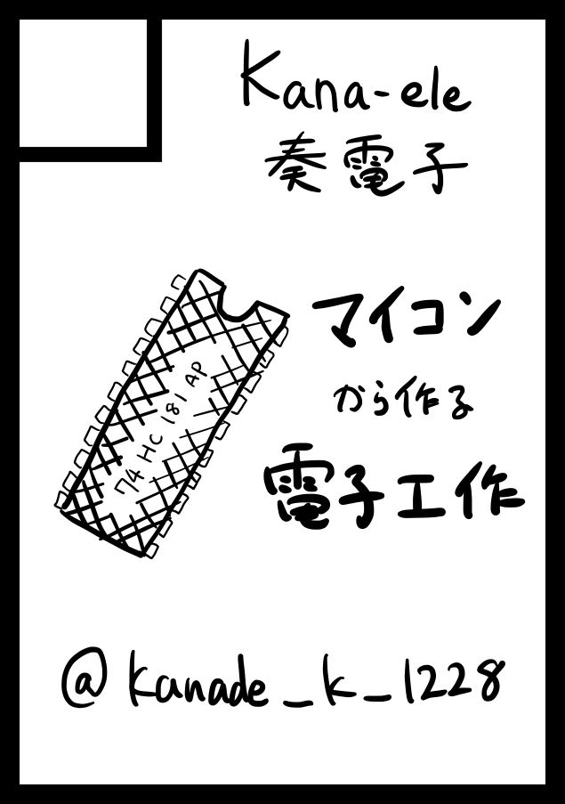

## 本を作る

ノリと勢いで申し込んだコミケに受かってしまったので、本を作ることになりました。

### 本の作り方

技術同人誌でよく使われている [Re:VIEW Starter](https://kauplan.org/reviewstarter/) というツールを使います。これは文書変換ソフトウェアの一種で、Re:VIEW → LaTeX → PDF と変換します。Re:VIEW Starter は Re:VIEW のフォークで、デザインを Web サイト上で簡単に構築でたり、Re:VIEW の機能を拡張したりしています。このあたりは青兎さんに教えてもらいました。感謝…！

### 環境構築

[Re:VIEW Starter](https://kauplan.org/reviewstarter/) を開き、設定をポチポチしていくと、プロジェクトファイルの雛形が生成されます。

[技術系同人誌を書く人の味方「Re:VIEW Starter」の紹介](https://qiita.com/kauplan/items/d01e6e39a05be0b908a1)

Docker イメージがあるので、既存の TeX 環境と競合して壊れることなくビルドできます。しかし私は手元で Docker すら動かすのが面倒な現代っ子なので、GitHub Actions でビルドします。

[GitHub Actions を使って Re:VIEW Starter の PDF をビルドする](https://zenn.dev/orange634nty/articles/b57be747dff41f0a0f64)

### 印刷所

印刷所は日光企画さんにすることとしました。別にステマではなく、技術書典の提携印刷所なので、後々技術書典に出すときにも使えるなぁと思ったというだけです。

[冬コミ 2 日目締切](https://www.nikko-pc.com/only-event/events/2023/1231.html)

印刷にはいろいろな選択肢があります。

印刷方法は主にオフセットとオンデマンドの 2 択です。オフセットは版を作る印刷で、オンデマンドはプリンタのように版を作らない印刷のようです。そのため、オフセットは大量生産、オンデマンドは少量生産に向いています。また、オフセットのほうが締め切りが早く、オンデマンドのほうが締め切りが遅いです。

色は、表紙色と本文色をそれぞれ選ぶことができます。色の種類が少ないほうが安いです。表紙本文ともに黒単色にしました。

綴じ方は主に中綴じか平綴じの２択です。中綴じは紙を半分に折って折り目をホッチキスか紐で留める方法、平綴じは紙を並べて奥を糊かホッチキスで留める方法です。中綴じはパンフレット感があるかなと思ったので、平綴じで印刷することにします。

[オンデマンド印刷　１日本](https://www.nikko-pc.com/onde/od-1day-2day/od-1.html)の「オンデマンド平トジ基本料金」にしました。

印刷所は、まず印刷方法、紙の種類、ページ数、納品先などを指定して発注します。**ページ数＝本文＋表紙(4)** です。発注したら、入金に

その後入稿フォームに本文の PDF と表紙の PDF を入稿します。

### 中身を書く

本文を書きます。ドキュメントの書き方についてググって出てきたサイトをいくつか読みました。

### 表紙を描く

[表紙テンプレート](https://www.nikko-pc.com/index/2022/content/template/template.html)から PSD ファイルをダウンロードして、GIMP で編集しました。

## ブースの用意をする

100 均で小さいアルミラックを買ってポスター立てを作りました。

パワポで簡単にお品書きも作りました。

## コミケに出る

スーツケースに物を詰めて、ビックサイトへ向かいます。
オタクの川の流れに乗って、いつもの逆三角の下を通って東館へ向かいます。

ブースに着くと、本が納品されてました。
見本誌票を貼って所定の場所に提出します。
