## SIMD命令とは



x86のAVX命令とか、ArmのNEONのことです。

```cpp:
#include <iostream>
#include <immintrin.h>
int main(){
}
```

要するに、大きい幅のレジスタを、小さい幅のレジスタの集合とみなして、演算を行う命令です。こうすることで、遊んでいたMSB側の演算器を効率的に使うことができるようになります。

## ロジックICでの実装

↑の図を見てわかる通り、演算器間のキャリーを接続したら単一の演算器、キャリーを外したら複数の演算器ということになりますね。

ということで作ってみました。基本的に、74181・74182のアプリケーションノートに書いてある通りの回路です。



キャリーを接続するかしないかを、74マルチプレクサで切り替えます。

## 8bit単位でやってみる

74182をハックする必要があります。

## まとめ

いかがでしたか？

自作CPUに取り入れてみてはいかがでしょうか？

そもそもAVXとかのSIMD命令はレジスタ長が長いほど効果を発揮します。
