% 2048 on リレーコンピュータ
%
%

<iframe src="./game.html" width="200px"height="250px"></iframe>

|    label    |       |             |               |                            |
| :---------: | ----- | ----------- | ------------- | -------------------------- |
|    INIT     | LOAD  | 0x0F        | RAND_RANGE    | 乱数器の範囲を 0~15 に設定 |
|     PUT     | MOV   | RAND        | POINTER       | 空のマスに 2 を埋める      |
|             | JMPIF | PUT         | [POINTER]!=0  |                            |
| WAIT_BUTTON | JMPIF | UP          | BUTTON==UP    |                            |
|             |       | DOWN        | BUTTON==DOWN  |                            |
|             |       | LEFT        | BUTTON==LEFT  |                            |
|             |       | RIGHT       | BUTTON==RIGHT |
|             | GOTO  | WAIT_BUTTON |               |
|     UP      |       |             |               |
|             | GOTO  | PUT         |               |
|    DOWN     |       |             |               |
|             | GOTO  | PUT         |               |
|    LEFT     |       |             |               |
|             | GOTO  | PUT         |               |
|    RIGHT    |       |             |               |
|             | GOTO  | PUT         |               |

