下宿の共用ルーターが外部からのトラフィックを通さない設定になっていたので、自宅からサーバーを公開できませんでした。なので、外部のサーバーを介して自宅の LAN に接続する VPN を作っていきます。

## SoftEther VPN Server を設定

レンタルサーバーに VPN サーバーをインストールする。公式のドキュメント（[7.3 Linux へのインストールと初期設定](https://ja.softether.org/4-docs/1-manual/7/7.3)）に従って設定していく。

- ビルド
  - サーバーのソースをダウンロードして
  - WinSCP で転送
  - 解凍
  - make がないようなのでインストール
  - make
  - /usr/local 以下に移動
  - パーミッションを変更
  - チェックをかける
  - スタートアップスクリプトに追加
- サービス開始
  - bad interpreter: No such file or directory
  - 改行コードが LF でなかった…
- 管理者パスワードを設定
  - vpncmd
  - 1
  - このサーバーの IP アドレス入力
  - VPN Server > ServerPasswordSet を実行してパスワードを設定
  - サーバー管理ツールからアクセスできます

[参考](https://www.linuxmania.jp/softether-vpn.html)

## VPN に接続

- PC から
  - クライアントとして使いたい PC に、「SoftEther VPN Client」をインストール。（[SoftEther VPN](https://ja.softether.org/5-download)）
  - 仮想 LAN カードの作成
  - 新しい接続
- iPhone から
  - [ここ](https://ja.softether.org/4-docs/2-howto/L2TP_IPsec_Setup_Guide/1)
  - [ここ](https://ja.softether.org/4-docs/2-howto/L2TP_IPsec_Setup_Guide/2)
  - サーバーのポートを開ける
  - `firewall-cmd --permanent --zone=public --add-service=ipsec`
  - `firewall-cmd --permanent --zone=public --add-port=1701/udp`
  - `firewall-cmd --permanent --zone=public --add-port=4500/udp`
  - `firewall-cmd --reload`
  - SecureNAT を有効化

## SoftEther VPN Bridge

自宅のサーバーに SoftEther VPN Bridge をインストールする。

