MFT2022、お疲れ様でした。
リレーコンピュータを構想してから 5 年、なんとか完成することができました。
ということで、ようやくトランジスタ縛りから開放されたので、トランジスタで CPU を作って、OS を動かしていきます。
来年の MFT2023 に出せたらいいな…？

## 目標・野望

> ロマンと実用性の両立！楽しい！感動できる！

### 1. ロジック IC で作る

できるだけスルーホールのロジック IC を使って作る。

### 2. 全部自作。

回路から、アセンブラ、コンパイラ、OS を全て手作り。

### 3. 実用性

いろいろ遊べる。機能がたくさん。

- 割り込み
- DMA
- VGA 映像出力
- キーボード入力
- GPIO、ADC、DAC、PWM
- I2C、SPI、Serial

### 4. 柔軟な開発

リレーコンピュータが5年もかかったのは、何回か大幅な設計変更をしたから。
だいぶ寄り道してたのもあるけど。
回路基板を実装した後に設計変更するのはかなり萎える。

今回のマイコン開発ではエミュレータとFPGAを使って†アジャイル開発†する。
たとえば、OSを作る中でCPUの仕様を変えたくなったらエミュレータを書き換える。
最終的に仕様が決まってからロジックICとして実装する。

## 作るもの

### CPU

RISC-V っぽい CPU。

### アセンブラ

アセンブリと機械語を一対一に変換するだではなく、変数・定数にラベルを割り当てて、生でアセンブリを書く負担を減らします。

### コンパイラ

C言語っぽい高級言語を自作して、そのコンパイラを作ります。

### エミュレータ

機械語コードを読んで CPU をエミュレートします。

### OS

リアルタイム OS を作ります。

### ハードウェア

ロジック IC で CPU を組みます。

### ライタ

パソコンから ROM に機械語コードを書き込みます。

## 将来的に作りたいもの

### LLVM バックエンド

> LLVM 神「力が…欲しいか…」

LLVM の力を借りて、C 言語が完全にサポートされたコンパイラを作ります。

### デバッガ

パソコン側から、ステップ実行したり、ROM の値を読んだりできるようにします。

### 開発環境

VSCode の拡張機能として、フォーマッタ、シンタックスハイライトを実装します。
VSCode のデバッガインターフェースを使って実行＆デバッグできるようにします。

## 開発フロー

