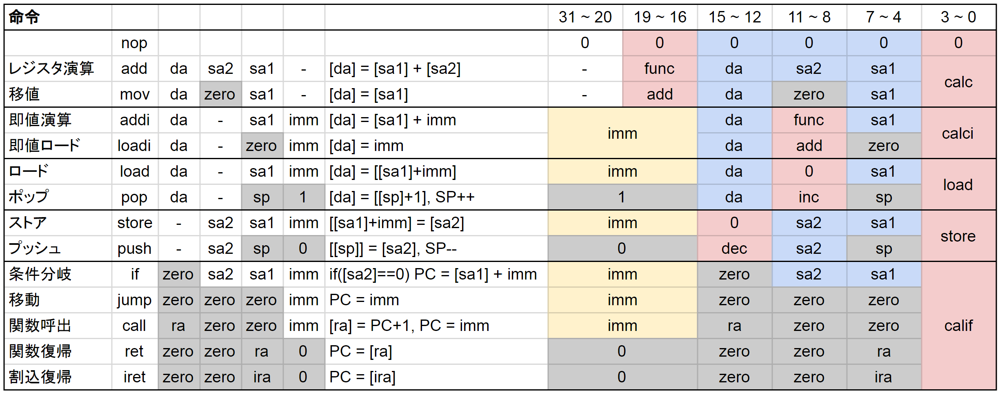

## 設計思想

機械語と一対一に対応するプログラミング言語という点ではアセンブラですが、できるだけ高級な表現ができるようにします。

たとえば、RKISAでは相対ジャンプができず、全て絶対ジャンプです。そのため、プログラムが分岐する部分には`calif`命令が、合流する部分はラベルが存在します。これによって制御フローが見やすくなります。

```
const int N=10;
for(int i=N;i;--i){
   print(i);
}
```

```
@0x0100 cout
#0d0010 N
   loadi t0 N
for0:
   if t0 for0_break
   store t0 zero cout
   jump for0
for0_break:
```

アセンブラを`calif`かラベルで区切っていくと、プログラムの制御単位が簡単に取り出せます。

## 命令一覧



## 命令・変数・定数のラベル

### 制御ラベル

制御ラベルは、`ラベル名:`で定義できます。

```
   jump label
~~~
label:
   addi s0 s0 4
```

制御ラベルは、ある命令アドレスを指定します。

### 変数ラベル

変数ラベルは、`@アドレス ラベル名`で定義できます。

```
@0x0123 hoge
```

### 定数ラベル

定数ラベルは `#値 ラベル名`で定義できます。

```
#0x0334 hanshin
loadi t0 hanshin
```
↓
```
loadi t0 0x0334
```

### 構造体ラベル

`.相対アドレス ラベル名` で相対ラベルを定義できます。相対ラベルは構造体のメンバの位置を表現するために使います。

```
@0x0123 foo
.0 hoge
.1 fuga
.2 piyo
load t0 foo+hoge
load t1 foo+fuga
load t2 foo+piyo
```
↓
```
load t0 0x0123
load t1 0x0124
load t2 0x0125
```

ここでは、後述する演算子`+`を使用しています。

## 即値内演算

コンパイル時に確定している値（ラベル、リテラル）であれば、即値オペランドに演算を書くことができます。

```
loadi t0 1+2
#0x1111 hoge
#0x2222 fuga
loadi t0 hoge+fuga
```

```
loadi t0 0x0003
loadi t0 0x3333
```

対応している演算は以下の通り。

- 加算 `+`
- 相対 `.`
- 減算 `-`
- 乗算 `*`
- 優先順位 `(` `)`

## 型チェック

各命令が即値としてとりうるラベルは以下の通り。

|       | 制御 | 変数 | 定数 |
| ----- | ---- | ---- | ---- |
| calc  | -    | -    | -    |
| calci | ×    | ○    | ○    |
| load  | ×    | ○    | ×    |
| store | ×    | ○    | ×    |
| calif | ○    | ×    | ×    |

違う型のラベルがあったら、Warningを表示します。

### 演算の型チェック

演算は左結合です。演算が可能か、また可能なら返値の型を書きます。リテラルは定数ラベルと同じ扱いです。

#### 制御ラベル

制御ラベルに対しては、どんな演算もできません。

#### 変数ラベル

- 加算 : 定数 `+` 定数→定数
- 相対 : 変数 `.` 相対→変数
- 減算 : 定数 `-` 定数→定数

#### 乗算

定数`*`定数→定数

#### 制御ラベル

制御ラベルに対しては、どんな演算もできません。

#### 変数ラベル


#### 定数ラベル


## アセンブラの実装

1. 一行づつ読み取る
   1. コメント、空行を削除
   2. 一語目を読む
      1. 命令の場合
         1. 命令の引数の型に従い、続く語を読む
         2. 引数にラベルがある場合、ラベルを記録して保留
      2. ラベルの場合
         1. ラベルの辞書に、ラベルの指すアドレスを記録
2. ラベルの置換（リロケーション
3. バイナリを出力

## 関数呼び出し

　関数呼び出しの前後で変更していいレジスタと、いけないレジスタがあります
[参考１](https://valinux.hatenablog.com/entry/20210624)
[参考２](https://inst.eecs.berkeley.edu/~cs61c/resources/RISCV_Calling_Convention.pdf)

| RKASM     |                                |
| :-------- | :----------------------------- |
|           | 関数呼び出し側の仕事 ←①        |
| push t0   | 一時レジスタを退避             |
| push t1   | 関数呼び出し後に使わないなら   |
| push t2   | 退避する必要なし               |
| push t3   |                                |
| push ra   | RAを退避 (callで上書きされる)  |
| push fp   | FPを退避 (FPは引数のポインタ)  |
| mov fp sp | SPを退避                       |
| mov a0 xx | 引数を引数レジスタに入れる     |
| mov a1 yy |                                |
| push zz   | 入らない引数はスタックに入れる |
| push ww   |                                |
| call func | サブルーチンにジャンプ ←②      |
|           | ここに戻ってくる ←③            |
| mov sp fp | SPを復元                       |
| pop fp    | FPを復元                       |
| pop ra    | RAを復元 ←④                    |
| pop t3    |                                |
| pop t2    |                                |
| pop t1    |                                |
| pop t0    |                                |
|           |                                |
| func:     |                                |
| push s0   | 保存レジスタの退避             |
| push s1   | 関数内で上書きしなければ       |
| push s2   | 退避する必要なし               |
| push s3   |                                |
| nop       | 関数の処理                     |
| pop s3    | 保存レジスタを復元             |
| pop s2    |                                |
| pop s1    |                                |
| pop s0    |                                |
| ret       | 元の処理に戻る                 |

### 割り込み処理

| ASM         |                                |
| ----------- | ------------------------------ |
| subi sp 16  | 全てのレジスタをスタックに退避 |
| s x1 sp 0   |                                |
| :           |                                |
| s x15 sp 14 |                                |
| j ra xxxx   | ジャンプ                       |
| :           |                                |
| :           | 割り込み処理を行う             |
| :           |                                |
| l x1 sp 0   | レジスタを復元                 |
| :           |                                |
| l x15 sp 14 |                                |
| jr ra 0     | PC を戻す                      |
