## GPIO

入出力フラグ（0 が入力、1 が出力）。

出力はトライステート、入力はシュミットトリガ。

- [3 ステートバッファ](https://akizukidenshi.com/catalog/g/gI-03632/)
- [シュミットトリガインバータ](https://akizukidenshi.com/catalog/g/gI-14054/)

| Addr | Name       | Func          |
| ---- | ---------- | ------------- |
| 0020 | gpio0_conf | 入出力フラグ  |
| 0021 | gpio0      | GPIO レジスタ |
| 0022 | gpio1_conf |               |
| 0023 | gpio1      |               |

## PWM

PWM の方法には三角波比較方式とかあるけど、今回はロジック回路だけで実装する。

1. ベースクロックの生成
2. バイナリカウンタでカウントアップする
3. カウントが閾値に達したら、パルスを出す
4. パルスごとに ON/OFF を切り替える

- [1MHz 発振器](https://akizukidenshi.com/catalog/g/gP-10385/)
- [8 ビット バイナリカウンタ 74590](https://akizukidenshi.com/catalog/g/gI-10014/)
- [8 ビット 比較演算器 74688](https://eleshop.jp/shop/g/gT11582/)
- [2 回路 D フリップフロップ](https://akizukidenshi.com/catalog/g/gI-10879/)
- [3 ステートバッファ](https://akizukidenshi.com/catalog/g/gI-11487/)

| Addr |           |                                |
| ---- | --------- | ------------------------------ |
| 0030 | pwm0_conf | ON/OFF、ベースクロックの分周比 |
| 0031 | pwm0A     | 閾値                           |
| 0032 | pwm0B     |                                |
| 0033 | pwm1_conf |                                |
| 0034 | pwm1A     |                                |
| 0035 | pwm1B     |                                |
| 0036 | pwm2_conf |                                |
| 0037 | pwm2A     |                                |
| 0038 | pwm2B     |                                |
| 0039 | pwm3_conf |                                |
| 003A | pwm3A     |                                |
| 003B | pwm3B     |                                |

## ADC

[ADC 選定中…](https://www.mouser.jp/c/semiconductors/data-converter-ics/analog-to-digital-converters-adc/?interface%20type=Parallel~~Parallel%20CMOS%2C%20Parallel%20LVDS&mounting%20style=Through%20Hole&rp=semiconductors%2Fdata-converter-ics%2Fanalog-to-digital-converters-adc%7C~Interface%20Type&sort=pricing)

[MAX154](https://www.mouser.jp/ProductDetail/Maxim-Integrated/MAX154ACNG%2b?qs=d3kjJb5aE2YrP%2FUO4CrDQg%3D%3D)

[MAX118](https://www.mouser.jp/ProductDetail/Maxim-Integrated/MAX118CPI%2b?qs=d3kjJb5aE2ZybZ9VNzWdhg%3D%3D)

## UART

| Addr |     |                         |
| ---- | --- | ----------------------- |
|      | UDR | UART データレジスタ     |
|      | UBR | UART ボーレートレジスタ |

## SPI

## I2C

## 回路

前作った FPGA 基板を拡張して、周辺回路をつけます。

この状態でひとまず Arduino みたいに使えるはずです。
