## 演算器



<details>
<summary>演算の種類</summary>

| 演算         |                   |      | 演算               |      |      |
| :----------- | :---------------- | ---- | :----------------- | :--- | ---- |
| **74181**    |                   |      | **比較回路**       |      |      |
| 加算         | A+B (mod 0x10000) | add  | 一致               | A==B | eq   |
| 減算         | A-B (mod 0x10000) | sub  | 不一致             | A!=B | neq  |
| 論理積       | A&B               | and  | 比較(signed)       | A<B  | lts  |
| 論理和       | A\|B              | or   | 比較(unsigned)     | A<B  | lsu  |
| 排他的論理和 | A^B               | xor  | **シフト回路**     |      |      |
| 論理否定     | ~A                | not  | 右シフト(signed)   | A>>1 | srs  |
| 左シフト     | A<<1              | sl   | 右シフト(unsigned) | A>>1 | sru  |
| 左循環       | A<<1 + MSB        | rotl | 右循環             | A>>1 | rotr |

</details>

<details>
  <summary>比較演算の原理</summary>

　比較演算の結果は真偽値型です。結果は1bitなので16bitに広げます。（`true`→`0xffff`、`false`→`0x0000`）

#### 一致/不一致

　74181には `A=B` 出力があります。これと制御信号を XOR すると eq A B / neq A B になります。

#### 大小比較

　比較には74181の減算を使います。まず、4bitの符号なし整数の減算 $A-B$ を考えます。ビット反転して1を足すと負の数になる ($10000-X=\overline{X}+1$) ことを利用して計算します。

$$
A-B=A+(10000-B)-10000=A+\overline{B}+1-10000
$$

　減算器は実際には加算 $A+\overline{B}+1$ を計算します。キャリー出力は結果が10000以上であることを表しています。つまり、減算器のキャリーフラグが立っているとき、

$$
A+\overline{B}+1=A-B+10000 \geq 10000 \Rightarrow A \geq B
$$

| 74181     | A<B | A=B | A>B |
| --------- | --- | --- | --- |
| **Carry** | 0   | 1   | 1   |
| **A=B**   | 0   | 1   | 0   |

　符号つき整数の場合、符号ビットを反転してから同じことをやれば比較ができます。「符号ビットを反転し符号なし整数として解釈する」という操作は、大小関係を保存するからです。
</details>

<details>
<summary>演算のデコード</summary>

| 演算                 |      | C~3~ | C~2~ | C~1~ | C~0~ | 74181       | S~3~ | S~2~ | S~1~ | S~0~ | M   | C   | C_SEL | C_USE | COMP_US | SR_US | SR_SEL | EQ_NEQ | BOOL_SEL | OUT_SEL |
| :------------------- | ---- | ---- | ---- | ---- | ---- | ----------- | ---- | ---- | ---- | ---- | --- | --- | ----- | ----- | ------- | ----- | ------ | ------ | -------- | ------- |
| 加算                 | add  | 0    | 0    | 0    | 0    | A + B       | 1    | 0    | 0    | 1    | 0   | 0   | -     | 0     | 0       | -     | -      | -      | -        | 100     |
| 論理反転             | not  |      |      |      | 1    | ~A          | 0    | 0    | 0    | 0    | 1   | -   | -     | -     | 0       | -     | -      | -      | -        | 100     |
| 左シフト             | sl   |      |      | 1    | 0    | A + A       | 1    | 1    | 0    | 0    | 0   | 0   | -     | 0     | 0       | -     | -      | -      | -        | 100     |
| 左巡回               | lrot |      |      |      | 1    | A + A + MSB | 1    | 1    | 0    | 0    | 0   | MSB | 0     | 1     | 0       | -     | -      | -      | -        | 100     |
| 論理積               | and  |      | 1    | 0    | 0    | A & B       | 1    | 0    | 1    | 1    | 1   | -   | -     | -     | 0       | -     | -      | -      | -        | 100     |
| 排他的論理和         | xor  |      |      |      | 1    | A ^ B       | 0    | 1    | 1    | 0    | 1   | -   | -     | -     | 0       | -     | -      | -      | -        | 100     |
| 論理和               | or   |      |      | 1    | 0    | A \| B      | 1    | 1    | 1    | 0    | 1   | -   | -     | -     | 0       | -     | -      | -      | -        | 100     |
| 減算                 | sub  |      |      |      | 1    | A - B       | 0    | 1    | 1    | 0    | 0   | 1   | 1     | 1     | 0       | -     | -      | -      | -        | 100     |
| 一致                 | eq   | 1    | 0    | 0    | 0    | A - B - 1   | 0    | 1    | 1    | 0    | 0   | 0   | -     | 0     | 0       | -     | -      | 0      | 0        | 001     |
| 不一致               | neq  |      |      |      | 1    | A - B - 1   | 0    | 1    | 1    | 0    | 0   | 0   | -     | 0     | 0       | -     | -      | 1      | 0        | 001     |
| 比較（符号なし）     | ltu  |      |      | 1    | 0    | A - B - 1   | 0    | 1    | 1    | 0    | 0   | 0   | -     | 0     | 0       | -     | -      | -      | 1        | 001     |
| 比較（符号付き）     | lts  |      |      |      | 1    | A - B - 1   | 0    | 1    | 1    | 0    | 0   | 0   | -     | 0     | 1       | -     | -      | -      | 1        | 001     |
| 右シフト（符号なし） | sru  |      | 1    | 0    | 0    | -           | -    | -    | -    | -    | -   | -   | -     | -     | -       | 0     | 0      | -      | -        | 010     |
| 右シフト（符号付き） | srs  |      |      |      | 1    | -           | -    | -    | -    | -    | -   | -   | -     | -     | -       | 1     | 0      | -      | -        | 010     |
| 右巡回               | rrot |      |      | 1    | 0    | -           | -    | -    | -    | -    | -   | -   | -     | -     | -       | -     | 1      | -      | -        | 010     |
| -                    |      |      |      |      | 1    | -           | -    | -    | -    | -    | -   | -   | -     | -     | -       | -     | 1      | -      | -        | 010     |

| OUT           | Deode                                                                   |
| :------------ | :---------------------------------------------------------------------- |
| S~3~          | $\overline{C_3}\cdot(\overline{C_0}+\overline{C_2}\cdot C_1)$           |
| S~2~          | $C_3+C_1\cdot C_0$                                                      |
| S~1~          | $C_3+C_2$                                                               |
| S~0~          | $\overline{C_3+C_1+C_0}$                                                |
| M             | $\overline{C_3}\cdot(\overline{C_1}\cdot C_0 + C_2\cdot\overline{C_0})$ |
| C_SEL         | $C_2$                                                                   |
| C_USE         | $\overline{C_3 \cdot C_1 \cdot C_0}$                                    |
| COMP_US       | $C_3 \cdot C_1 \cdot C_0$                                               |
| SR_US         | $C_3$                                                                   |
| SR_SEL        | $C_2$                                                                   |
| EQ_NEQ        | $C_3$                                                                   |
| BOOL_SEL      | $C_2$                                                                   |
| OUT_SEL_ALU   | $\overline{C_3}$                                                        |
| OUT_SEL_BOOL  | $C_3\cdot\overline{C_2}$                                                |
| OUT_SEL_SHIFT | $C_3\cdot C_2$                                                          |


</details>

<details>
<summary>部品表</summary>

| BOM                |                              | #   |
| :----------------- | ---------------------------- | --- |
| ALU                | [74HC181](./doc/74HC181.pdf) | 4   |
| Carry              | [74HC182](./doc/74HC182.pdf) | 1   |
| XOR                | [74HC86](./doc/74HC86.pdf)   | 1   |
| 3 to 8 Decoder     | [74HC138](./doc/74HC138.pdf) | 1   |
| 3 State Buffer     | [74HC541](./doc/74HC540.pdf) | 2   |
| 3 State Buffer Inv | [74HC540](./doc/74HC540.pdf) | 4   |
| OR                 | 74HC12                       | 1   |
| NAND (1bit MUX)    | 74HC00                       | 1   |

1bitのマルチプレクサは4個のNANDで構成できます。

$$
MUX = A \cdot S + B \cdot \overline{S} = \overline{\overline{A \cdot S}\cdot\overline{A\cdot\overline{S}}}
$$

</details>

<details>
<summary>テスト</summary>

ALUは36入力16出力の組み合わせ回路。2^36パターンを全検査する。



1. 入力レジスタにセット
2. パルスを送信
3. ALUの計算を待つ
4. 規定の遅延時間後の出力がラッチされる
5. 出力を読み取る
6. 一致するか確認

</details>

## メモリ空間



<details>
<summary>タイミングチャート</summary>

#### SRAM

#### レジスタ

#### カウンタ

</details>

<details>
<summary>部品表</summary>

| BOM             |                              | #   |
| :-------------- | ---------------------------- | --- |
| 4 to 16 Decoder | [74HC154](./doc/74HC154.pdf) | 3   |
| 2 to 4 Decoder  | [74HC139](./doc/74HC139.pdf) | 1   |

</details>

<details>
<summary>テスト</summary>

メモリ空間は16入力16出力で状態空間が 2^16^(2^16) 。状態が独立で相互作用がないと考えれば、各bitごとに読み書きをチェックすればいい。また、各チップごとにランダムにエントリを選択して読み書きする。

</details>

## プログラム制御ユニット

リセット時、74157のSTを使ってPCを0にする。



<details>
<summary>部品表</summary>

| BOM         |                                | #   |
| :---------- | ------------------------------ | --- |
| Multiplexer | [74HC157](./doc/74HC157.pdf)   | 8   |
| Adder       | [74HC283](./doc/74HC283.pdf)   | 4   |
| DFF         | [74HC574](./doc/74HC564.pdf)   | 4   |
| 8in OR      | [74HC4078](./doc/74HC4078.pdf) | 2   |
| AND         | 74HC08                         | 1   |
|             |                                | 19  |

</details>

## データパス



## クロック




## デコーダ



<details>
<summary>デコード</summary>

|        | ALU  | S2  | DIN | 1.ADR | 2.ADR | 3.ADR |
| ------ | ---- | --- | --- | ----- | ----- | ----- |
| add    | Func | RS2 | ALU | RS1   | RS2   | RD    |
| addi   | Func | IMM | ALU | RS1   | -     | RD    |
| load   | ADD  | IMM | RS2 | RS1   | ALU   | RD    |
| store  | ADD  | IMM | RS2 | RS1   | RS2   | ALU   |
| callif | ADD  | IMM | RA  | RS1   | RS2   | RD    |

</details>

<details>
<summary>Verilog</summary>


```{.language-verilog}
`define CALC  4'b0000
`define CALCI 4'b0001
`define LOAD  4'b0011
`define STORE 4'b0111
`define CALIF 4'b1111

module ID(
    input  wire [31: 0] OP,
    output wire [ 3: 0] RS1,
    output wire [ 3: 0] RS2,
    output wire [ 3: 0] RD,
    output wire [31:16] IMM,
    output wire [ 1: 0] DIN_SEL,
    output wire [ 1: 0] ADDR_SEL,
    output wire [ 3: 0] ALU_CTRL,
    output wire         PFC_CTRL,
);

wire [3:0] OPC;

assign RS1 = OP[ 3: 0];
assign RS2 = OP[ 7: 4];
assign RD  = OP[11: 8];
assign OPC = OP[15:12];
assign IMM = OP[31:16];

assign ALU_CTRL = OPC==`CALC  ? OP[19:16]
                : OPC==`CALCI ? OP[ 7: 4]
                : `ALU_ADD;

assign ADDR_SEL = STAGE==0 ? `ADDR_RS1
                : STAGE==1 ? `ADDR_RS2
                : STAGE==2 ? `ADDR_RD;

assign DIN_SEL = OPC==`CALC|`CALCI ? `DIN_ALU 
               : OPC==`LOAD|`STORE ? `DIN_RS2
               : OPC==`CALLIF     ? `DIN_RA;

assign S2_SEL = OPC==`CALC ? `S2_RS2 
                           : `S2_IMM;

endmodule
```

</details>

## ハードウェア構成


