## 実装の方針

### 開発のユニット化

ユニット開発という開発方針をとります。アジャイル開発を適用したものです。アジャイル開発の肝は、常に動作可能な物を作り続けることにあります。

普通、ハードウェアは完成するまで動かせません。

まず、CPUのうち、あるユニットをロジックICで作ります。そうしたら、それ以外の部分をマイコンで補完します。

「実装済み部分＋未実装部分のエミュレータ」

#### 1. ALU

最初にALUを作ります。ALUの遅延がステージ長を決める上で重要なので。
ALUはいうても大きな組み合わせ回路なのでテストが楽です。

#### 2. メモリ空間

次にメモリ空間を作ります。「空間」といったのはアドレスとバスをインターフェイスとしてデバイスにアクセスするシステムという意味を強調するためです。

#### 3. データパス

ここまでくれば、演算命令と転送命令を実行することができ、CPUとしての機能を確かめることができます。

#### 4. プログラム制御ユニット

プログラムカウンタ周辺の回路を

#### 5. ROMとライタ

#### 6. 命令デコーダとクロック

プログラムの実行を制御するユニットです。

## RAM

[Renesas 64K x 16 SRAM 71016](https://www.renesas.com/jp/en/document/dst/71016-data-sheet)

これをメインメモリにします。ふつうの SRAM です。SRAM といってもフリップフロップが大量に並んでるだけなので、使い方は単純です。

- Note
  - 出力は最大 50mA
  - !CS=1 で Z 出力
  - TSOP
  - 5V
- READ
  - !WE=1, !CS=0, !OE=0, !BHE=0, !BLE=0
  - ADDRESS にアドレスを書き込めば、
  - tAA < 10ns でデータが出力される
- WRITE
  - !CS=0, !OE=1, !BHE=0, !BLE=0
  - ADDRESS と DATA にセットします
  - !WE の立ち上がりでデータが保存されます

### IO

IO 領域のアドレスが指定された場合、SRAM の!CE=1 にします。

## ROM

[Microchip 2Mb Flash SST39VF200A](https://www.microchip.com/en-us/product/SST39VF200A)
（[データシート](https://ww1.microchip.com/downloads/aemDocuments/documents/OTH/ProductDocuments/DataSheets/25001A.pdf)）

- Note
  - 5V
  - TSOP
- READ
  - !CE=0, !OE=0
  - ADDRESS を入力すると
  - TAA < 55ns でデータが出力される
- WRITE
  - コントローラにコマンドを送る必要がある
  - めんどいがライタでやるのでヨシ

## PFC

## クロック

マイコンの心臓だが…回路は単純

### ステートカウンタ

- ジャンプなし
  - COUNT UP に POSEDGE を入れる
- ジャンプあり
  - DATA INPUT に次のアドレスをセットして、!LOAD に NEGEDGE を入れる

## 部品メモ

- [ボックスピンヘッダ](https://akizukidenshi.com/catalog/g/gP-01137/)
- [フラットケーブル](https://akizukidenshi.com/catalog/g/gC-08931/)
