RK8 は RK16 を 8bit 化した CPU です。
RK16 を ロジック IC で実装する前に、RK8 を作って検証します。

| op   |     |     |     |                      |
| ---- | --- | --- | --- | :------------------- |
| add  | rd  | rs1 | rs2 | R[rd]=R[rs1]+R[rs2]  |
| addi | rd  | rs1 | imm | R[rd]=R[rs1]+imm     |
| mov  | imm | rs1 | rs2 | R[rs1+imm]=R[rs2]    |
| br   | imm | rs1 | rs2 | if(rs1=rs2) PC = imm |

| op   | Stage 0      | Stage 1      | Stage 2      | Stage 3                |
| ---- | ------------ | ------------ | ------------ | ---------------------- |
| add  | rs1 = R[rs1] | rs2 = R[rs2] | R[rd] = alu  | pc++                   |
| addi | rs1 = R[rs1] | -            | R[rd] = alu  | pc++                   |
| mov  | rs1 = R[rs1] | rs2 = R[rs2] | R[alu] = rs2 | pc++                   |
| br   | rs1 = R[rs1] | rs2 = R[rs2] | -            | pc = flag ? imm : pc++ |

| op   | opc | S2_SEL     | DOUT_SEL | DADR_SEL(NOR) | JMP(AND) | COND=CN   | ALU  |
| ---- | --- | :--------- | :------- | :------------ | :------- | :-------- | :--- |
| addi | 00  | 00 : CODE2 | 0 : ALU  | 1 : ALU       | 0        | -         | func |
| mov  | 01  | 01 : CODE1 | 1 : REG2 | 0 : CODE0     | 0        | -         | ADD  |
| add  | 10  | 1- : REG2  | 0 : ALU  | 0 : CODE0     | 0        | -         | func |
| br   | 11  | 1- : REG2  | -        | 0 : CODE0     | 1        | 0:EQ 1:LT | SUB  |

| 74181 | Cn  | M   | S~3~ | S~2~ | S~1~ | S~0~ |
| ----- | --- | --- | ---- | ---- | ---- | ---- |
| ADD   | 0   | 0   | 1    | 0    | 0    | 1    |
| SUB   | 1   | 0   | 0    | 1    | 1    | 0    |
| AND   | -   | 1   | 1    | 1    | 1    | 0    |
| NAND  | -   | 1   | 0    | 0    | 0    | 1    |
| OR    | -   | 1   | 1    | 0    | 1    | 1    |
| NOR   | -   | 1   | 0    | 1    | 0    | 0    |
| XOR   | -   | 1   | 1    | 0    | 0    | 1    |
| XNOR  | -   | 1   | 0    | 1    | 1    | 0    |
| NOT   | -   | 1   | 0    | 0    | 0    | 0    |

|      | opc | Cn / Cond | M,S~3:0~   |
| ---- | --- | --------- | :--------- |
| addi | 00  | 0         | 0 1001 add |
| subi | 00  | 1         | 0 0110 sub |
| andi | 00  | -         | 1 1110 adn |
| ori  | 00  | -         | 1 1011 or  |
| xori | 00  | -         | 1 1001 xor |
| mov  | 01  | 0         | 0 1001 add |
| add  | 10  | 0         | 0 1001 add |
| sub  | 10  | 1         | 0 0110 sub |
| and  | 10  | -         | 1 1110 and |
| or   | 10  | -         | 1 1011 or  |
| not  | 10  | -         | 1 0000 not |
| xor  | 10  | -         | 1 1001 xor |
| be   | 11  | 0 A=B     | 0 0110 -   |
| bl   | 11  | 1 A<B     | 0 0110 sub |

| 品番                                                                      | 個数 | 用途                      |                                                                             |
| :------------------------------------------------------------------------ | ---- | :------------------------ | --------------------------------------------------------------------------- |
| **ロジック IC**                                                           |      |                           |                                                                             |
| 74HC00 NAND                                                               |      |                           |                                                                             |
| 74HC02 NOR                                                                |      |                           |                                                                             |
| 74HC04 NOT                                                                |      |                           |                                                                             |
| 74HC08 AND                                                                |      |                           |                                                                             |
| 74HC32 OR                                                                 |      |                           |                                                                             |
| 74HC564 8bit DFF 反転 3state 出力                                         | 2    | レジスタ                  |                                                                             |
| 74HC181 ALU                                                               | 2    | ALU                       |                                                                             |
| 74HC564 8bit DFF 非反転 3state 出力                                       | 1    | 出力部                    |                                                                             |
| 74HC540 3state バッファ 反転                                              | 5    | セレクタ                  |                                                                             |
| 74HC541 3state バッファ 非反転                                            | 6    | セレクタ、入力部          |                                                                             |
| 74HC161 バイナリカウンタ                                                  | 2    | プログラムカウンタ        |                                                                             |
| 74HC175 4bit DFF                                                          | 1    | ステージカウンタ          |                                                                             |
| 74HC14 シュミットトリガ                                                   | 1    | チャタリング防止、NOT     | [秋月](https://akizukidenshi.com/catalog/g/gI-10923/)                       |
| **メモリ**                                                                |      |                           |
| [UPD431016LE-15](https://wakamatsu.co.jp/biz/aac/14143.pdf) 65536 x 16    | 1    | メインメモリ              | [若松](https://wakamatsu.co.jp/biz/products/detail.php?product_id=17010392) |
| [5V NOR Flash](https://www.alliancememory.com/new-5v-parallel-nor-flash/) | 2    | プログラム ROM            |                                                                             |
| **クロック**                                                              |      |                           |                                                                             |
| 分周器付き発振器                                                          | 1    | クロック                  | [秋月](https://akizukidenshi.com/catalog/g/gP-01685/)                       |
| 押しボタンスイッチ（LED）                                                 | 1    | 手動クロック & 電源ランプ | [秋月](https://akizukidenshi.com/catalog/g/gP-02010/)                       |
| タクトスイッチ                                                            | 1    | リセット                  | [秋月](https://akizukidenshi.com/catalog/g/gP-03647/)                       |
| スライドスイッチ                                                          | 1    | クロック切り替え          | [秋月](https://akizukidenshi.com/catalog/g/gP-15707/)                       |
