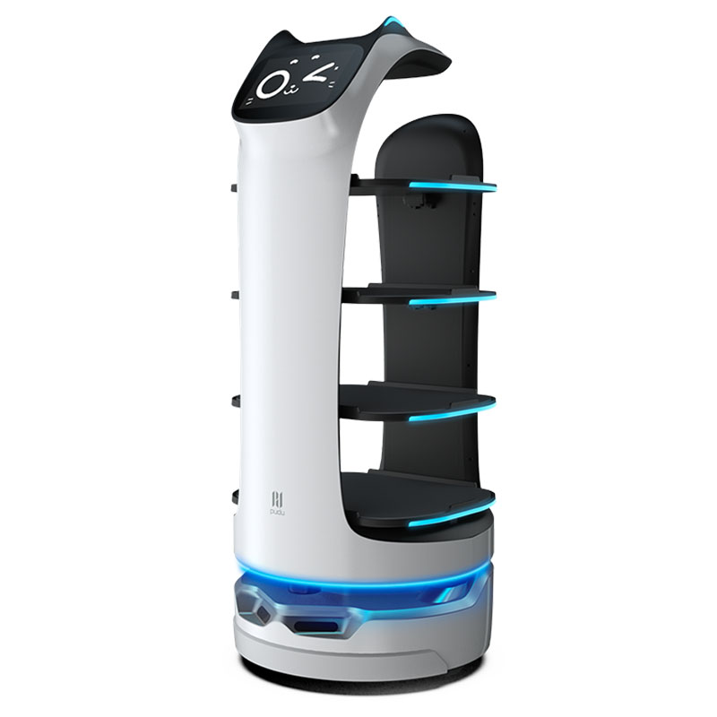

## Arduino で複雑なプログラムを動かしたい！

Arduino でこういうロボットを制御することを考えてみましょう。



このロボットには、以下の要素が含まれているとしましょう。

- センサ
  - カメラ（人や物にぶつからないする、進路を決める）
  - タッチパネル（目的地を指定）
- アクチュエータ
  - モーター
  - LED
  - ディスプレイ（表情、エラー表示）

このロボットを制御するプログラムには、

1. 自己位置推定
2. 障害物認識
3. 進路決定
4. モーター制御
5. ディスプレイ表示
6. タッチパネル入力受け取り
7. LED 点灯

などの機能が必要でしょう。

これを Arduino のプログラムとして書いてみると、こんな感じになるでしょうか。

```C:
loop(){
    画像 = カメラ画像取得()
    現在位置 = 自己位置推定(画像)
    障害物位置 = 障害物認識(画像)
    進路 = 進路決定(現在位置,障害物位置,目的地)
    モーター制御(進路)
    ディスプレイ表示()
    タッチパネル入力受け取り()
    LED点灯()
}
```

ただこれにはかなり問題があります。

たとえば、「ディスプレイ表示()」を実行している間に、人が目の前に迫っても、「障害物認識()」を実行するまでそれに気付きません。

これが車のエアバッグだったら大事です。

＿人人人人人人人＿

＞　 🚙🚙 ドーン　＜

￣ Y^Y^Y^Y^Y^Y^Y^￣

車「ちょっといま音楽流すので忙しいからエアバッグはちょっと待って」

ってなったら最悪ですよね。

どうやらロボットや車の制御には、Arduino の「loop()」のようなプログラムは向いてないみたいです。

ではどうしたらいいでしょうか。

これを解決するのに使われるのが、今回の連載で作っていく「RTOS」です。

てなわけで、次回は事故ってもエアバッグを開かないマイペースなマイコンくんを†わからせ†ます。
