% CPU入門
%
%

## ステートマシン

``` typescript
type State = any;
type Transition = (s: State) => State;

let state: State;
const transition: Transition;

while(true) {
  state = transition(state);
}
```



### 外部入力に応じて状態が変化するステートマシン

``` typescript
type State = any;
type Transition = (s: State) => State;
type Input = () => (s: State) => State;

let state: State;
const transition: Transition;
const input : Input;

while(true) {
  state = transition(state);
  state = input()(state);
}
```
### 例：スイッチをONするとOFFするロボット




``` typescript
type State = "on" | "off";
type Transition = (s: State) => State;
type Input = () => (s: State) => State;

let state: State = "off";
const transition: Transition = (s: State) => "off";
const input : Input;

while(true) {
  state = transition(state);
  state = input()(state);
}
```

## プログラマブルステートマシン

状態からプログラムカウンタを明示的に分離する

``` typescript
type State = any;
type Transition = (s: State) => State;

let state: State;
const program: Transition[];

for(let counter = 0; ; counter++) {
  state = program[counter](state);
}
```

### プログラムの分岐がある場合

``` typescript
type State = any;
type Transition = (s: State) => [State, number];

let state: State;
const program: Transition[];
let counter= 0;

while(true) {
  [state, counter] = program[counter](state);
}
```

### 論理回路による実装


