これは [リレーから始める CPU 自作 Advent Calendar 2021](https://adventar.org/calendars/7052) 2 日目の記事です。[<<< 1 日目](../Day1_Introduction/)

論理回路は組合回路と順序回路に大別されます。この記事では、組合回路の中でも一番汎用的なマルチプレクサという回路を作ります。

## 多数決スイッチを作る

ABC の 3 人で ○ × の多数決をする回路を作ってみましょう。

ABC はそれぞれ手持ちのスイッチで ○ × を投票します。投票数の多い方のランプが点灯します。

愚直に全パターン書き出してみます。

| A   | B   | C   | 結果 |
| --- | --- | --- | ---- |
| ×   | ×   | ×   | ×    |
| ×   | ×   | ○   | ×    |
| ×   | ○   | ×   | ×    |
| ×   | ○   | ○   | ○    |
| ○   | ×   | ×   | ×    |
| ○   | ×   | ○   | ○    |
| ○   | ○   | ×   | ○    |
| ○   | ○   | ○   | ○    |

このように、入力に対する出力を、全パターン書き出した表を「真理値表」といいます。

これを、スイッチで実装すると、こういう回路になります。

点線で繋がっているスイッチは連動しています。

## マルチプレクサ

この回路をマルチプレクサといいます。これは 3 入力のマルチプレクサで、ABC の 8 通りの組み合わせに対応したひとつの端子が導通するようになっています。

2 入力のマルチプレクサはこうなります

## 真理値表

入力と出力の一覧表を「真理値表」といいます。

|   A   |   B   |   C   | 出力  |
| :---: | :---: | :---: | :---: |
|   ×   |   ×   |   ×   |   ?   |
|   ×   |   ×   |   ○   |   ?   |
|   ×   |   ○   |   ×   |   ?   |
|   ×   |   ○   |   ○   |   ?   |
|   ○   |   ×   |   ×   |   ?   |
|   ○   |   ×   |   ○   |   ?   |
|   ○   |   ○   |   ×   |   ?   |
|   ○   |   ○   |   ○   |   ?   |

? に ○ × を当てはめる方法は $2^8=64$ パターンあります。つまり、（3 入力 1 出力の）真理値表は全部で 64 パターンあります。マルチプレクサを使うことで、この 64 パターン全部を簡単に作ることができます。

マルチプレクサの出力部分を、真理値表と対応するように接続することで、任意の論理式を回路に実装できます。

## 組合回路

同じ入力に対して常に同じ出力となる回路を組合回路といいます。（一方、同じ入力であっても、過去の状態によって出力が異なる回路を順序回路といいます。）

組合回路の動作は、全パターンの入力に対する出力の一覧表、すなわち、「真理値表」として書き表すことができます。

前節で確認したように、ある真理値表を満たす回路は、マルチプレクサを使うことで必ず作ることができます。つまり、マルチプレクサを使うことで、”原理的に” 全ての組合回路を作れるようになります。

※　現実的には、マルチプレクサだけで組合回路を作ることは非効率です。
マルチプレクサは、入力の数の増加に対して指数オーダーで回路が大きくなります。
回路が大きくなればなるほど、信号の遅延やコストが増大するという問題が生じます。

## 次回予告

本章ではスイッチを入力とした組合回路を作りましたが、人間が手でスイッチを操作しないといけないという問題があります。

なので次章では、人間の手でなく電気で切り替えられるスイッチ、「リレー」を使って、組合回路を作ります。

[>>> 3 日目](../Day3_RelayLogic/)
