これは [リレーから始める CPU 自作 Advent Calendar 2021](https://adventar.org/calendars/7052) 3 日目の記事です。[<<< 2 日目](../Day2_SwitchLogic/)

## リレーとは

「電気で制御できるスイッチ」です。電磁石に電流が流れると、電磁力によってスイッチが入ります。電流が切れると、ばねの力によってスイッチが切れます。

### 記号

この連載では、リレーをこのような記号で表すことにします。
長方形はリレーの電磁石を表し、長方形の中にリレーの ID を書いておきます。スイッチはリレーの ID を書いて区別します。
今後は電源を省略しますが、左側の縦線がプラスで右側の縦線がマイナスとなります。

## リレーでマルチプレクサ

前回、手動のスイッチで作ったマルチプレクサを、リレーにより電気的に動かせるようになりました。

これで、電気を入力とし、電気を出力とする、組合回路が作れるようになりました。

## リレーで半加算器

ということで、コンピュータっぽい回路を作ってみましょう。

半加算器とは、2 進数で一桁の足し算をする回路です。

2進数の一桁の足し算は次の 4 パターンしかありません。

$$
\begin{aligned}
0+0&=0 \\
0+1&=1 \\
1+0&=1 \\
1+1&=10
\end{aligned}
$$

これを真理値表にするとこうなります。
S は和 (Sum) を、C は繰り上がり (Carry) を意味します。

$$
A + B = C \times 10 + S
$$

| A   | B   | C   | S   |
| --- | --- | --- | --- |
| 0   | 0   | 0   | 0   |
| 0   | 1   | 0   | 1   |
| 1   | 0   | 0   | 1   |
| 1   | 1   | 1   | 0   |

この真理値表を論理回路にすると、こうなります。

[>>> 4 日目](../Day4_Latch/)
