これは [リレーから始める CPU 自作 Advent Calendar 2021](https://adventar.org/calendars/7052) 4 日目の記事です。[<<< 3 日目](../Day3_RelayLogic/)

前回までは、組合回路を作ってきました。
組合回路は、ある入力に対して出力が一意に定まる回路です。
数学の関数 $y=f(x)$ みたいなもので、入力が決まれば答えが決まります。

しかし、それだけではコンピュータは作れません。
コンピュータが数学の関数と違うところは、記憶ができるという点です。
コンピュータは内部状態をもっていて、内部状態の変化で多彩な動作をします。

ということで、今回は、状態を記憶できる「順序回路」という回路を作ります。

## ラッチ

1. ボタンを押すと、リレーが ON になる
2. リレーが ON になると、リレーのスイッチが導通する
3. ボタンを離しても、リレーが ON し続ける

一度ボタンを押したら、リレーが ON になりっぱなしになります。
このような回路を「ラッチ」といいます。

この回路には、OFFとONの2状態があって、スイッチが押されると状態がOFFからONに切り替わります。

電源を入れてから今までにスイッチが押されていればONに、スイッチが押されていなければOFFになります。
過去の状態に応じて出力が変わる順序回路の一種であるといえます。

## RS フリップフロップ

リセットするボタンをつけると、

手押しのボタンではなく、リレーを使って電気的に信号を入力できるようにすると、

これが SR フリップフロップと呼ばれる回路です。

## 早押しボタン

早押しボタンの機能は、

- ある人がボタンを押したら、ランプが光り続ける
- ある人がボタンを押したら、他の人がボタンを押しても光らない
- ゲームマスターがリセットできる

1. A のボタンを押すと、リレー A が ON 状態になる
2. A が ON になると、E が ON になる
3. E が ON になると、BC のボタンを押してもリレーが ON にならなくなる（入力を受け付けなくなる）
4. リセットボタンを押すと、リレー A の ON 状態が解除され OFF 状態になる

[>>> 5 日目](../Day5_DFF/)
