これは [リレーから始める CPU 自作 Advent Calendar 2021](https://adventar.org/calendars/7052) 6 日目の記事です。[<<< 5 日目](../Day5_DFF/)

## 分周器

DFF を使った回路で一番シンプルなのが分周器です。

Q と D が反転するようになっています。

クロック信号の周波数を半分にします。

## カウンタ

分周器を複数繋げると、クロックの周波数を半分、さらに半分、、、にすることができます。

こういう波形になります。

C0,C1,C2,C3 の出力を、2 進数としてみると、数がひとつずつ増えています。

これがカウンタ回路です。

[>>> 7 日目](../Day7_Clock/)
