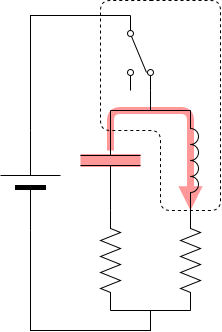

これは [リレーから始める CPU 自作 Advent Calendar 2021](https://adventar.org/calendars/7052) 7 日目の記事です。[<<< 6 日目](../Day6_Counter/)

## クロック回路の回路図

車のウィンカーリレーと同じ回路です。

## クロック回路の動作

リレーが OFF のとき、コンデンサに充電されます。

コンデンサに充電されて、電圧が上がり、リレーが ON になると、スイッチが切れます。

コンデンサに貯まった電気でリレーを ON にし続けます。

コンデンサの電気が切れると、リレーが OFF になり、またコンデンサに充電されます。

一定間隔で ON/OFF を繰り返すクロック信号のできあがりです。

ON と OFF の時間は、コンデンサの容量値と抵抗値で調節します。

[>>> 8 日目](../Day8_Illumination/)
