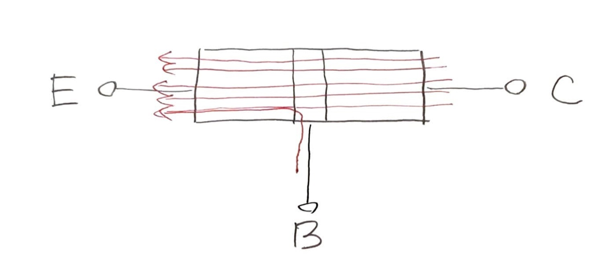

% なぜリレーなのか
%
% 2021-12-02

これは [リレーから始める CPU 自作 Advent Calendar 2021](https://adventar.org/calendars/7052) 2 日目の記事です。

## コンピュータって何？

いろいろ答えが考えられると思いますが、

### ソフトウェアから

コンピュータは「プログラムを実行する機械」

プログラミングをかじったことがある

### ハードウェアから

コンピュータは電子回路

## ああ

私が初めて C 言語に触れたとき「変数は箱」と説明されました。実際、変数は数値を入れておく箱というイメージでプログラミングがうまくいきましたし、。

一方で「コンピュータは電子回路」とか「5V が 1 で 0V が 0 の二進数で計算してる」とか、ハードウェアについて聞きかじった知識があったので、いずれ電子回路の話が出てくるのだろうと予想しながら、プログラミングを学んでいました。

しかし、ハードウェアの話は一向に出てきません。「プログラムを実行すると、ここに電流が流れて、ああなって、こうなって、Hello World が表示される」という一連の流れがわかると期待していたのに。

プログラミングをしているときの「コンピュータ」と、ハードウェアとしての「コンピュータ」のイメージが隔絶していました。

コンピュータがなぜ動いているかわかっていないのに、なぜかプログラミングができてしまっている、というもやもやを抱えて生きていました。

コンピュータは複雑で膨大でとても一人の人間に理解できるような代物ではない、中身のわからないけどなぜかうまく動く「魔法の箱」

## トランジスタがわからない

コンピュータのしくみを電気回路のレベルから理解しようとすると、「トランジスタ → 論理回路 → コンピュータ」という段階を経ることになるわけですが、最初の「トランジスタ」が厄介です。トランジスタの動作はよくこういう図で説明されます。

BE 間に電流が流れると、それに引っ張られるように CE 間で電流が流れる！

この図だけで

これでトランジスタ完全理解したという賢い

トランジスタをちゃんと理解しようとすると、量子力学とかいう複雑で直観的な描像が成り立たない物理が出てきて、難しいです。 （ちゃんと理解したい方には、慶応大の伊藤塾長の講義動画 [慶應大学講義　半導体工学　第一回](https://youtu.be/jwQY0vOAiOQ) がおすすめです。）

「結局トランジスタってなんなんだろう」というもやもやを残したまま、トランジスタをブラックボックスとして受け入れて、論理回路の話に進むわけです。

## リレー

リレーコンピュータはトランジスタの代わりにリレーを使っているので、そのようなもやもやは一切ありません。リレーとは、スイッチを電磁石で動かす

「スイッチ」と「電磁石」

この連載では、トランジスタこそ使わないものの、

リレーコンピュータは、現在のトランジスタコンピュータは全然異なりますが、それらには共通する

「トランジスタ → 論理回路 → コンピュータ」を「リレー → 論理回路 → コンピュータ」と置き換えただけです。

一方で、論理回路の世界は単純明快なパズルです。

コンピュータがパズルの組み合わせであることを

「計算機とは何か？」という問いに、

## 次回予告

## コンピュータ
