% リレーコンピュータ
%
%

## アーキテクチャ

### 最小アーキテクチャ

### 拡張アーキテクチャ

アドレス空間に拡張モジュールを配置することで計算ができるようになります

## 拡張モジュール

### 純粋関数モジュール

#### ビットディスプレイ

ライトを並べただけ

### 内部状態を持つモジュール

#### メモリ

#### 入力スイッチ

#### 疑似乱数モジュール

線形合同法

$$
X' = (AX + B) \% M
$$

## ISA

|       | OPR1      | OPR2    |                                                        |
| ----- | --------- | ------- | ------------------------------------------------------ |
| MOV   | From      | To      | メモリの From 番地の値を To 番地に書き込む             |
|       | Pointer   |         | 番地をポインタ指定                                     |
|       |           | Pointer |                                                        |
|       | Pointer   | Pointer |                                                        |
| LOAD  | Immidiate | To      | 即値をアドレスに書き込む                               |
|       |           | Pointer |                                                        |
| JMPIF | Condition | JumpTo  | Condition（条件文）を満たす場合，JumpTo にジャンプする |

### 疑似命令
- NOP = MOV 0 0

## プログラムの例

### カップ麺タイマー

10 Hz で動作させたとき，1 クロックが 0.1 秒なので，1800 クロックをカウントすれば，3分が測れる．

#### プログラム

| Label |         |            |         |                                                                                                                                       |
| ----- | ------- | ---------- | ------- | :------------------------------------------------------------------------------------------------------------------------------------ |
| INIT  | LOAD    | 0x00       | Display | 画面をクリアする                                                                                                                      |
|       | LOAD    | 0xB4 = 180 | A       | A の値をディクリメントしてカウントする． 以下のループ 1 回あたりに 10 クロックかかるので ループが 180 周したときに 3 分になる |
| COUNT | MOV     | DEC        | A       | A--;                                                                                                                                  |
|       | NOP × 8 |            |         |                                                                                                                                       |
|       | JMPIF   | A!=0       | COUNT   | A が 0 でなければ COUNT に戻る                                                                                                        |
| END   | LOAD    | 0xFF       | Display | 画面（ここでは 8 個の LED）に値を出力する．                                                                                           |

#### ハードウェア構成

必要なモジュールは

- メモリ
- ディクリメント
- ディスプレイ

これをアドレス空間に配置する

|         | アドレス |        |
| :-----: | :------: | :----: |
| 予約済  |   0x00   | 予約済 |
|    A    |   0x01   |        |
|         |   0x02   | DEC(A) |
| Display |   0x03   |        |

#### バイナリ

各モジュールのアドレスが決まったので，アセンブリをバイナリに変換していく．

| Label |       |      |         | 行   |     |            |      |
| ----- | ----- | ---- | ------- | ---- | --- | ---------- | ---- |
| INIT  | LOAD  | 0x00 | Display | 0x00 | 11  | 0x00       | 0x03 |
|       | LOAD  | 0xB4 | A       | 0x01 | 11  | 0xB4       | 0x01 |
| COUNT | MOV   | DEC  | A       | 0x03 | 10  | 0x02       | 0x01 |
|       | NOP   |      |         | 0x04 | 00  | 0x00       | 0x00 |
|       | :     |      |         | :    | :   | :          | :    |
|       | NOP   |      |         | 0x0B | 00  | 0x00       | 0x00 |
|       | JMPIF | A!=0 | COUNT   | 0x0C | 01  | 0b00000011 | 0x03 |
| END   | LOAD  | 0xFF | Display | 0x0D | 11  | 0xFF       | 0x03 |
