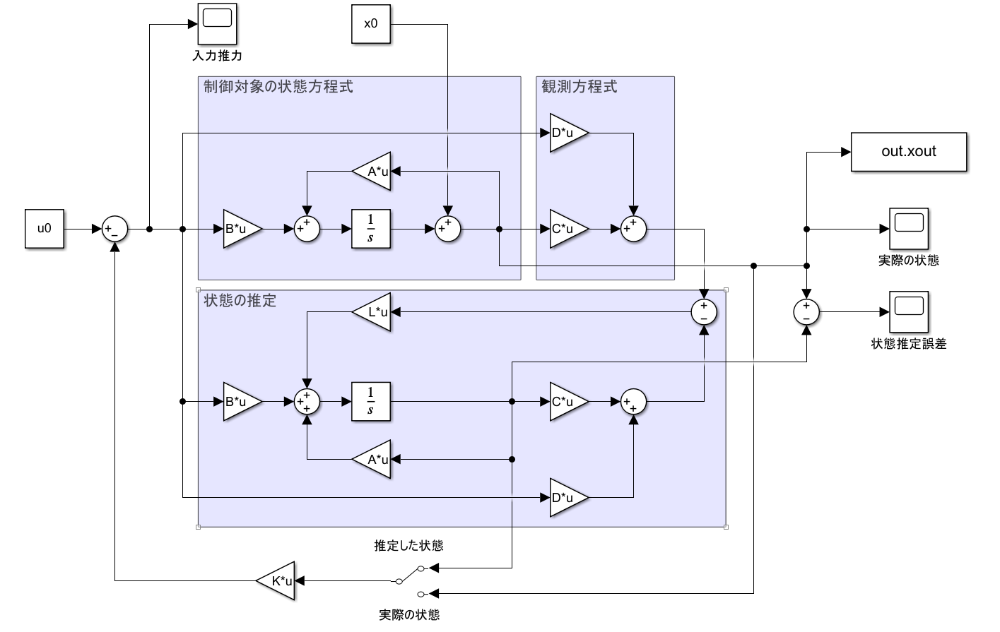
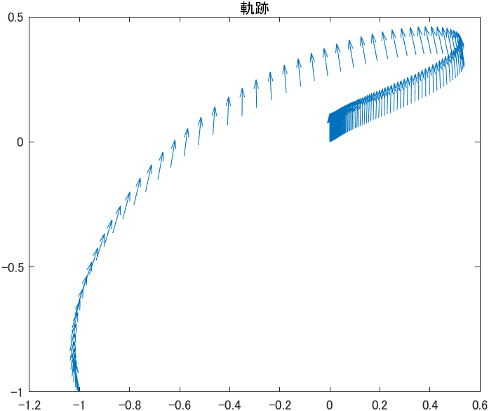
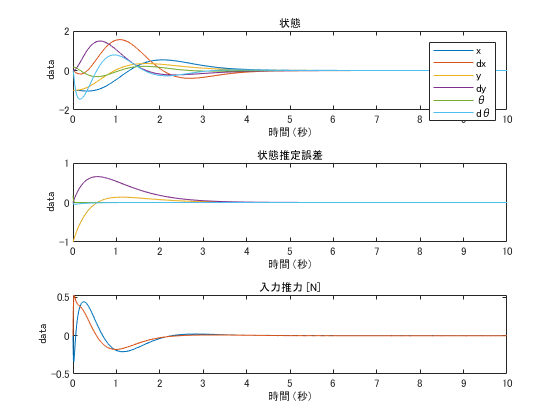
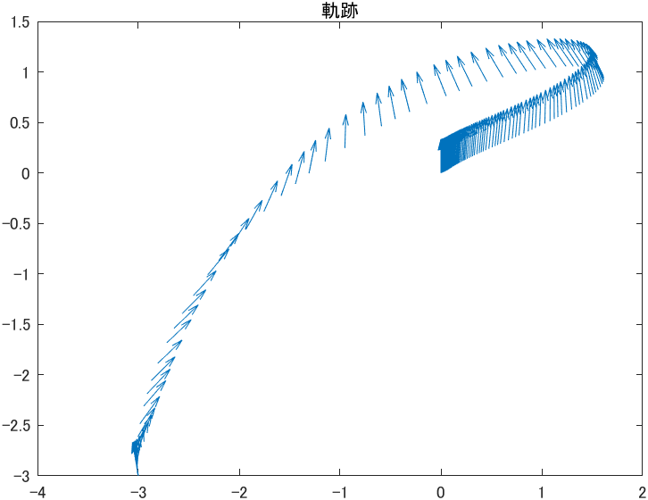

2 次元上を動くドローンをある位置に移動させたい。

ドローンの制御を、機体系（推力による速度の制御）と モーター-プロペラ系（推力の制御） に分けて考える。



## 機体系



二つのプロペラの推力でドローンを動かす。状態の観測のために 加速度センサ、角速度センサを取り付ける。位置の測定のために、カメラでドローンを撮る。

| 記号の定義  |                                  |
| ----------- | -------------------------------- |
| 定数        |                                  |
| $M$         | 機体重量                         |
| $I$         | 機体の重心まわりの慣性モーメント |
| $L$         | プロペラの軸間長さ               |
| 変数        |                                  |
| $(x,y)$     | 重心位置                         |
| $\theta$    | 傾き                             |
| $f_1,f_2$   | プロペラの推力                   |
| $(a_x,a_y)$ | 加速度センサの値                 |
| $\omega$    | 角速度センサの値                 |
| $(x_c,y_c)$ | カメラから推定した位置           |

### 運動方程式

モーターの反トルク、空気抵抗は無視している。

$$
\begin{aligned}
M\ddot{x} &= -(f_1+f_2)\sin\theta \\
M\ddot{y} &=  (f_1+f_2)\cos\theta - Mg \\
I\ddot{\theta} &= \frac{L}{2}(f_1-f_2)
\end{aligned}
$$

### 観測方程式

加速度センサの値はセンサに固定された座標系における値であることに注意して、観測方程式を求める。

$$
\begin{aligned}
x_c &= x \\
y_c &= y \\
a_x &=  \ddot{x}\cos\theta + (\ddot{y}-g)\sin\theta \\
a_y &= -\ddot{x}\sin\theta + (\ddot{y}-g)\cos\theta \\
\omega &= \dot{\theta}
\end{aligned}
$$

加速度センサはセンサにかかる加速度を計測するが、機体の加速度に比べて重力加速度が十分大きいので、もっぱら鉛直方向を指し示すセンサとして働く。

### 状態方程式

$$
\bm{x} =
\begin{bmatrix}
x & \dot{x} & y & \dot{y} & \theta & \dot{\theta}
\end{bmatrix}^T
\quad
\bm{u} = \begin{bmatrix}
f_1 & f_2
\end{bmatrix}^T
\quad
\bm{y} =
\begin{bmatrix}
x_c & y_c & a_x & a_y & \omega
\end{bmatrix}^T
$$

$$
\dot{\bm{x}} = \bm{f}(\bm{x},\bm{u}) =
\begin{bmatrix}
x_2 \\
-\frac{1}{M}(u_1+u_2)\sin x_5 \\
x_4 \\
 \frac{1}{M}(u_1+u_2)\cos x_5 - g \\
x_6 \\
\frac{L}{2I}(u_1-u_2)
\end{bmatrix}
$$

$$
\bm{y}= \bm{g}(\bm{x},\bm{u}) =
\begin{bmatrix}
x_1 \\
x_3 \\
-\frac{1}{M}(u_1+u_2) \sin x_5 \cos x_5 + \left(\frac{1}{M}(u_1+u_2)\cos x_5 - 2g\right)\sin x_5 \\
 \frac{1}{M}(u_1+u_2) \sin x_5 \sin x_5 + \left(\frac{1}{M}(u_1+u_2)\cos x_5 - 2g\right)\cos x_5 \\
 x_6
\end{bmatrix}
$$

平衡点（ホバリング状態） $\bm{x}_0=\bm{0},\bm{u}_0=\left(\frac{Mg}{2},\frac{Mg}{2}\right)$ まわりで一次近似して線形な状態方程式を求めると、

$$
\dot{\bm{x}} =
\begin{bmatrix}
0 & 1 & 0 & 0 & 0 & 0 \\
  & 0 & 0 & 0 &-g & 0 \\
  &   & 0 & 1 & 0 & 0 \\
  &   &   & 0 & 0 & 0 \\
  &   &   &   & 0 & 1 \\
  &   &   &   &   & 0 \\
\end{bmatrix}
\bm{x}
+
\begin{bmatrix}
0 & 0 \\
0 & 0 \\
0 & 0 \\
\frac{1}{M} & \frac{1}{M} \\
0 & 0 \\
\frac{L}{2I} & -\frac{L}{2I} \\
\end{bmatrix}
(\bm{u}-\bm{u}_0)
$$

$$
\bm{y} =
\begin{bmatrix}
1 & 0 & 0 & 0 &    &   \\
0 & 0 & 1 & 0 &    &   \\
  &   &   &   &-2g &   \\
  &   &   &   & 2g &   \\
  &   &   &   &    & 1
\end{bmatrix}
\bm{x}
+
\begin{bmatrix}
0 & 0 \\
0 & 0 \\
0 & 0 \\
\frac{1}{M} & \frac{1}{M} \\
0 & 0
\end{bmatrix}
(\bm{u}-\bm{u}_0)
$$

### 制御方式・状態の計測

Matlab を用いて可制御・可観測を確認した。

```
SS = ss(A,B,C,D)
rank(ctrb(SS)) == length(A)
rank(obsv(SS)) == length(A)
```

制御方式は最適制御とし、フィードバックゲインを以下の Matlab コードで求めた。

```
Q = diag([80,10,80,10,10,30]);
R = diag([50,50]);
[Kreg,~,Ef] = lqr(A,B,Q,R);
```

双対システムのフィードバックゲインを求め、オブザーバゲインとした。

```
S = diag([64,100,63,100,100,100]);
T = diag([10,10,10,10,10]);
[Lregt,~,Eo] = lqr(A',C',S,T);
Lreg = Lregt';
```

### ブロック線図



### シュミレーション

パラメタを $M=0.2 \mathrm{kg},\,L=0.4 \mathrm{m},\, I=0.008\mathrm{kgm^2}$ とする。ホバリング推力は $u_0=\frac{Mg}{2}=0.98\mathrm{N}$ である。

初期位置を $(x,y,\theta)=(-1,-1,10^\circ)$ としたときのシュミレーション結果を示す。





また、初期位置を $(x,y,\theta)=(-3,-3,10^\circ)$ としたときのシュミレーション結果は



### 考察

- 最適制御の評価関数を決めるのに苦労した。各重みの変化に対して根軌跡をプロットすれば直観的に決められると考えられる。
- x 方向に大きく移動すると大きく傾いている。線形近似した運動方程式では、x 方向の加速度を増すために傾きを大きくするしかない。さらに、元の非線形な運動方程式では、傾きによる x 方向の加速度の増加が、線形の場合よりも抑えられるため、現実のドローンはシュミレーションよりも大きな傾きとなることが考えられる。傾きが大きくなると、今回の制御の線形近似から外れ、さらに傾きが増大する危険性がある。x 方向に大きく動かさないようにする必要がある。

## モーター-プロペラ系

### モーター

| 記号     |                |
| -------- | -------------- |
| 定数     |                |
| $K_T$    | トルク定数     |
| $K_E$    | 逆起電力定数   |
| $R$      | 巻線抵抗       |
| $L$      | インダクタンス |
| 変数     |                |
| $e$      | 逆起電力       |
| $E$      | 入力電圧       |
| $I$      | 電流           |
| $\omega$ | 角速度         |

キルヒホッフの法則より

$$
E-e=RI+L\dot{I}
$$

逆起電力は

$$
e=K_E\omega
$$

トルクは

$$
T=K_TI
$$

### プロペラ

| 記号     |                      |
| -------- | -------------------- |
| 定数     |                      |
| $\rho$   | 空気密度             |
| $D$      | 直径                 |
| $I_R$    | 慣性モーメント       |
| $\beta$  | 羽根角               |
| 変数     |                      |
| $V$      | 対気速度             |
| $n$      | 回転数               |
| $\omega$ | 角速度               |
| $J$      | 進行率               |
| $C_F$    | プロペラ推力係数     |
| $C_Q$    | プロペラ反トルク係数 |
| $T$      | 入力トルク           |
| $F$      | 推力                 |
| $Q$      | 反トルク             |

回転の運動方程式は

$$
I_R\dot{\omega}=T-Q
$$

推力と反トルクは の関数

$$
\begin{aligned}
  F &= C_F\rho D^4 n^2 \\
  Q &= C_Q\rho D^5 n^2
\end{aligned}
$$

$C_F,C_Q$ は一般に 羽根角 $\beta$ と進行率 $J=\frac{V}{nD}$ の非線形な関数であり、風洞実験から計測する。今回は対気速度がプロペラの回転数に対して十分小さい領域で動作するので、$C_F,C_Q$は定数とする。

定数 $K_F,K_Q$ を

$$
\begin{aligned}
  K_F &:= \frac{C_F\rho D^4}{4\pi^2} \\
  K_Q &:= \frac{C_Q\rho D^5}{4\pi^2}
\end{aligned}
$$

とすると、

$$
\begin{aligned}
  F &= K_F\omega^2\\
  Q &= K_Q\omega^2
\end{aligned}
$$

参考：航空工学講座６　プロペラ（日本航空技術協会）

### ブロック線図

プロペラとモーターを結合した系のブロック線図は以下のようになる。



### 制御

センサとして回転軸にエンコーダを取り付け回転数を計測する。推力指令に対して追従する制御を行う。ホバリング推力前後で特性が良くなるようにゲインを調整する。


