## オイラー-ラグランジュ方程式

### 運動エネルギー

1. 車輪の回転

   $$
   \f{1}{2}j(\dot{\phi}+\dot{\theta})^2
   $$

2. 本体の回転

   $$
   \f{1}{2}J\dot{\theta}^2
   $$

3. 車輪の並進

   $$
   \f{1}{2}mv^2=\f{1}{2}r^2(\dot{\phi}+\dot{\theta})^2
   $$

   ※ $v=r(\dot{\phi}+\dot{\theta})$ （車輪が滑りなしで回転）を用いた。

4. 本体の並進

   $$
   \begin{aligned}
    &\f{1}{2}MV^2 \\
   =& \f{1}{2}M(V_x^2+V_y^2) \\
   =& \f{1}{2}M[(v+L\dot{\theta}\cos\theta)^2+(-L\dot{\theta}\sin\theta)^2] \\
   =& \f{1}{2}M(v^2+2Lv\dot{\theta}\cos\theta+L^2\dot{\theta}^2) \\
   =& \f{1}{2}M[r^2(\dot{\phi}+\dot{\theta})^2+2Lr(\dot{\phi}+\dot{\theta})\dot{\theta}\cos\theta+L^2\dot{\theta}^2]
   \end{aligned}
   $$

合計の運動エネルギーは、

$$

$$

### ポテンシャルエネルギー

$$
MgL\cos\theta
$$

### 運動方程式

### モーターの式

### 状態方程式

### 線形状態方程式

### 観測方程式
