## オペアンプは電気的なテコ

### 増幅

### 積分・微分

## オペアンプの理論

$$ V*{out}=A (V*+ - V\_-) $$

解析するときは、増幅率は無限大と仮定します。

$$ A\rightarrow \infty $$

実際のオペアンプでは、増幅度は数万あります。ただし、オペアンプの電源電圧以上の出力電圧は出せません。

解析をするときには、入力電流は 0 で、出力電流はいくらでも取り出せると仮定します。

$$
I_+,I_-=0 \\
-\infty \lt I_{out} \lt \infty
$$

実際のオペアンプでは、入力電流は数ナノアンペアで動いてくれます。これを使って、か弱いセンサの信号を増幅してやることができたりします。

出力電流は、「信号としては」大きい電流を流せますが、モーターなどのアクチュエータを動かすために使わないほうがいいです（軽いモーターだったら回せちゃいますが）。

### バーチャルショート

オペアンプはフィードバックがかかっているとき、 $V_+=V_-$ となるように働きます。ただ電流は流れないのでバーチャルショートと言われます。

オペアンプが「テコ」

### 増幅回路

$$
V_{out}=-\frac{1}{1+\frac{1}{A}+\frac{R_2}{R_1}\frac{1}{A}}\frac{R_2}{R_1}V_{in}\rightarrow -\frac{R_2}{R_1}V_{in}
$$

### 微分回路

$$
V_{out}=-\frac{1}{1+\frac{1}{A}}RC\frac{dV_{in}}{dt}\rightarrow -RC\frac{dV_{in}}{dt}
$$

### 積分回路

$$
V_{out}\rightarrow -\frac{1}{RC}\int_0^t V_{in} dt
$$

### 加算回路

$$
V_{out}=\rightarrow -R_f\sum_{i=1}^n \frac{V_i}{R_i}
$$

## 差動信号

