敵前衛艦隊ヲ勇猛果敢ニ突破、コレヨリ敵戦艦隊ニ肉薄シ魚雷攻撃ヲ敢行スル。本艦時雨は敵戦艦ウェストバージニアニ雷撃スル。敵艦速力ハ 20kt、方位角ハ 90°、彼我ノ距離ハ 10 マイルデアル。雷撃角、着弾時間ヲ求メ、魚雷照準シ射撃セヨ。

この計算を行い、同時に魚雷の照準を行う装置が水雷方位盤です。

WW2 以前の海軍では、刻々と変化する彼我の位置関係の中で幾何的な計算を素早く行うためのアナログ計算機が多用されていました。そのような計算機の中で最も単純なもののひとつがこの水雷方位盤です。

（対空砲の照準を行う高射指揮装置になるとパラメタ数が多くなりより複雑になる）

現代のイージス艦は

統合して管理する射撃指揮システムが

## 水雷方位盤の製作

レーザー加工機で

## 射撃ゲームとの連動

## 参考

- [水雷講堂](http://navgunschl.sakura.ne.jp/suirai/koudou_main.html)
- [水雷方位盤　魚雷　照準器](http://core.kyoto3.jp/torpedodirector.html)
