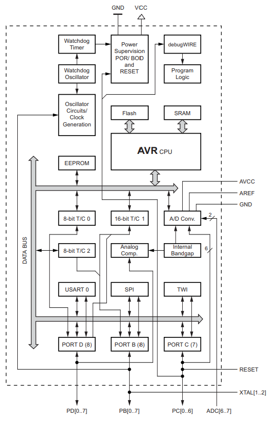

　マイコンどれ使うといいと聞かれたのでメモしておきます。

## マイコンの種類

　独断と偏見で語ります。

### ARM

　「ARMマイコン」というワードが出てきますが、ARM社製のマイコンは存在しません。ARMとはCPUの設計をするだけの会社です。各社マイコンメーカは、ARMからCPUのライセンスを買ってきて、自社のマイコンに組込ます。そのため「ARM」を冠したマイコンが各社から出ています。

### RISC-V

　ARMがARM社の製品であるのに対して、RISC-VはオープンソースのCPUです。オープンソースなので ~~謎の中華メーカ~~ 新興のメーカのものもあります。

### STM

　STMicroelectronics社のARMマイコンです。

[STM32ファミリ](https://www.stmcu.jp/stm32family/)

### AVR

　Atmel（アトメル、現：Microchip）が開発したマイコンです。Arduinoに使われているということで電子工作でも人気です。ただ、次のバージョン(Rev4)からはRenesasのARMマイコンを使うみたいです。ちなみにATMega328は32bitぽい名前をしてますが8bitマイコンです。

### PIC

　Microchipが開発したマイコンです。Arduinoが出てくる前の電子工作では一番メジャーだった。純正のライタは高いですが、秋月で互換のライタが売ってます。おもちゃとか分解するとこいつが入ってることが多いです。

### ESP32

　WiFiとBluetoothがついていて、最近流行ってます。

### RL78

　Renesasが開発したマイコンです。車載用など昔ながらの伝統的な組込開発というイメージ。

### Z80

　「マイコン」というワードがもてはやされていた時代の寵児。いまだにパチンコ機の中で使われています。

## マイコンの構造と選択の基準

　マイコンの中身はこうなっています。

CPUとその周りにさまざまな周辺回路が入っています。

### bit

　マイコンを特徴づけるパラメタとして、ビット数があります。各社、高性能用の32bitマイコンと低消費電力用の8bitマイコンの2種類を用意している場合が多いです。それぞれ、名前に32とか8が入ってるのでわかるはずです。

### CPU

　マイコンの中心にいるのがCPUです。昔は、組込開発といえばアセンブラで書くのが当然で「どのCPUを選ぶか」ということが現代の「どのプログラミング言語を選ぶか」と同じ感覚で重大な問題でした。が、現代の組込開発はC言語でやるのが基本なので、CPU選択の重要性は減りました。それでも、消費電力や処理能力などマイコンの性能に影響する要素でもあります。

### メモリ

#### SRAM

　いわゆる「メモリ」です。組込開発ではメモリの量が不足することが多々あります。

#### Flash

　いわゆる「ROM」です。プログラムを格納しておくメモリになります。長いプログラムを書くと、足りなくなるかもしれません。

#### EEPROM

　Cの`const`みたいな、定数値を事前に格納しておくメモリになります。

### ペリフェラル

#### UART

#### I2C

#### ADC

#### Timer

#### WiFi

#### Bluetooth

## 結局どれがいいのか

　今自分が選ぶとしたら、STMのARMマイコンかなぁ。

　電源と予算が潤沢な研究用途では、とりあえず一番パフォーマンスが高いものを使っておけば問題無いでしょう。
