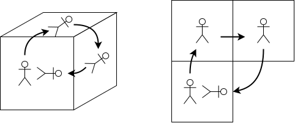

## 地球を地面から俯瞰する

世界がどんな形をしているか．

古代の人々はあれこれ考えたようだ．あるインド人は亀に支えられた円盤だといい，あるバビロン人は巨大なドームだといったが，定量的な主張をしたのはエラトステネスであった．彼は世界が球体であると考え，緯度の異なる２点における太陽高度と，その２点間の距離を測り，地球の径を求めた．幾何を用いて世界を探ろうとする初期の試みである．

世界の形を表した図が地図である．

微分幾何学は地図学の延長にある．空間を理解するための道具の蓄積が微分幾何学である．このことを心掛けておくと，たとえば多様体が地球儀に見えてくる．勝手知ったる概念であったりする．

世界を探求する営みのそばには常に「微分幾何」があった．ガガーリンを待たずとも，人類は地球を俯瞰していた．

※１　ニュートンが微積分を用いて力学の体系を確立したことは有名だが，プリンキピアの記述は現代のニュートン力学とは全く毛色の違うものであったことはあまり有名でない．というのも，プリンキピアは数式でなく図形で書かれているのだ．（詳しく知りたい方には「ファインマンさん，力学を語る」をお勧めする．）そこで使われた幾何と微分幾何とは理論的な関連性は薄いとはいえ，微積分の黎明に幾何学が立ち会っていたことは奇遇であろうか．

## 物理における微分幾何

- 物理の現象は非線形
- 人間は非線形を扱うのに難儀している
- 微小な世界は

## 多様体

地球が丸いと教えられてはいるものの，日常生活で地球の丸さのせいで悩むことはあまりない．（飛行機は地球の丸さを考えないといらぬ遠回りをすることになってしまう．）地球の丸さを考えずに暮らせるのは，地球が多様体であるからである．

> 多様体とは局所的にユークリッド空間な空間のことをいう．

地球は局所的にユークリッド空間である．地球が球体であっても，暮らしている町程度の領域ではユークリッド空間として差支えない．

## 局所座標

道案内を考えてみよう．京都のような整然とした町割りであれば道案内は簡単だろう．一方で，赤門の向かいあたりの複雑で入り組んだ道順を伝えるのは難しい．確実に伝えるにはどうしたらいいだろうか．交差点ごとに様子がそれぞれで異なるために，交差点ごとに次の行き先を指定するのが難しい．碁盤の目であれば左右で指定できるのに．碁盤の目であればどの交差点も同じ交わり方をしているので方向は左・右・直進しかないが，交差点ごとに交わり方が様々であれば方向の指定がそれぞれの交差点ごとに変わってくる．

ユークリッド空間では，どの点をとっても，周囲の空間は同じに見える．一方，多様体では，それぞれの点ごとに周囲の様子が変わってくる．凹んでいるところもあれば鞍状になっているところもある．

## 接続

伊能忠敬が日本中を歩き回って作った地図を貼り合わせという逸話がある．真偽はともかく，理想的な地図を紙に描こうとすると必ず歪みが生じることは古くから知られていた．

なぜ歪むのか．

地球を歩き回るのは大変なので，角砂糖の上を歩く蟻を見てみよう．こいつはその場で回転ができず平行移動しかできないというみょうちくりんな蟻である．

**平行移動だけで回転してしまった** のである．このことの奇妙さというか凄さを理解するに，平行と回転についての直観を思い出していただきたい．

### 平行と回転は独立

## 同相

方向音痴．空間把握能力に乏しい友人が私には何人かいるが，彼らを見るに，どうやら方向音痴にもいくつかの種類があるらしい．しかし，渋谷のマーク下に集合と言って途方に暮れた

道順は覚えているから大丈夫だというのだ．

土地勘．私は土地勘が良いほうだと思う．というのも，私は日本の地方都市を巡るのが趣味なのだが，初めて訪れた街でもあまり迷わずに目的地に行ける．名古屋か東京なら地図なしでもどこにでも行ける自信がある．

同じヒトでも土地の捉え方がこうも違うのかと

鉄道路線図

## 参考文献

- 永長直人「微分幾何学とトポロジー」
