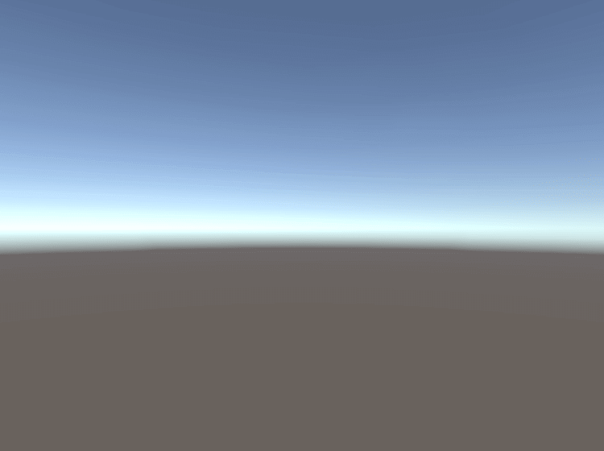

% コンセプトスケッチ
%
%

- 人が見た時の印象を表現する
  - CAD と実物が違うやつ
- 記号化された表現

## 描き方

- 指の関節群 → 手首 → 肘 → 肩 のリンク機構でペンを動かす
- 格子を描いてゲインを調整する
- コピック
  - 飽和して均一の色になるすごいマーカーペン

## パース

- パースのつけかたで，視点・サイズ感が変わる

## 陰影

- 環境光がテクスチャに反射して陰影として見える
- 環境によって陰影は変わる
- いろんな環境での陰影を観察する

### 砂漠の中

外にあるものは ↓ みたいな環境を前提として描く

凸面と凹面

### 部屋の中

