% 生産技術
%
%

## 金属材料

### 鉄

鉄は地球上に大量に存在（O:47%,Si:28%,Al:8.1%,Fe:5.0%）しており、還元するためのエネルギーが少ない（金属は基本的に酸化物として存在している）ため古くから使われている。また鉄は炭素と合金をなし性質を調整しやすい

- α:アルファ鉄
  - 体心立方格子(body-centered cubic, BCC)。FCC より疎。
- γ:ガンマ鉄、オーステナイト
  - 面心立方格子(face-centered cubic, FCC)。BCC より密。
- Fe3C:セメンタイト
- P:パーライト
  - アルファ鉄とセメンタイトが層状になったもの。周期が 0.1um オーダなので光が回折しキラキラして見える。
- M:マルテンサイト
  - オーステナイトを急冷すると、炭素分子がつかえて歪んだ BCC の構造になる。硬いが脆い。
- G:グラファイト
  - これが含まれると非常に脆くなる。

### 製鉄所

### よく使う金属材料

| JIS 名 | 名前                     | 組成          | 切削 | 焼入 | 切削 | 溶接 | 伸び | 用途 | 円/kg | 備考                                           |
| ------ | ------------------------ | ------------- | ---- | ---- | ---- | ---- | ---- | ---- | ----- | ---------------------------------------------- |
| SS400  | 構造用鋼                 | C0.2          | ○    |      |      |      |      | 構造 | 80    | 構造用鋼                                       |
| S20C   | 炭素 0.2%                | C0.2          | ○    |      |      |      |      | 用途 | 90    | SS400 と同じ                                   |
| S45C   | 炭素 0.45%               | C0.45         | ○    |      |      |      |      | 用途 | 90    | 耐摩耗性                                       |
| SK5    | 工具鋼 5 種              | C0.8          | ○    |      |      |      |      | 工具 | 90    | パーライトのみ。熱処理で硬くなる。             |
| SPCC   | 冷間圧延鋼板             |               | ○    |      |      |      |      | 用途 | 95    |                                                |
| SCM435 | クロムモリブデン鋼       | C0.35Cr1Mo0.3 | ○    |      |      |      |      | 用途 | 110   |                                                |
| SKD61  | 熱間金型工具鋼           |               | ○    |      |      |      |      | 用途 | 750   | 耐熱(500°)                                     |
| SUS304 | ステンレス               | C0.35         | ○    |      |      |      |      | 用途 | 100   |                                                |
| FC250  | ねずみ鋳造、ズク         | C2.5~4.0      | ○    |      |      |      |      | 鋳造 | 250   | 湯流れがよいので複雑な鋳造。要焼鈍し。         |
| FCD400 | 球状黒鉛鋳鉄、ダクタイル |               | ○    |      |      |      |      | 用途 | 90    | 注湯前に Mg:0.05%添加 → グラファイトが丸くなる |
| A1050  | 純アルミ                 |               |      |      |      |      |      | 用途 | 90    |                                                |
| A2017  | ジュラルミン             | Mg            |      |      |      |      |      | 用途 | 90    |                                                |
| A5052  |                          | Mg 固溶       |      |      |      |      |      | 用途 | 90    |                                                |
| A6063  |                          | Mg-Si         |      |      |      |      |      | 用途 | 90    |                                                |
| A7075  | 超々ジュラルミン         | Zn-Mg         | ○    |      |      |      |      | 用途 | 90    |                                                |
| ADC12  |                          | Si12          | ○    |      |      |      |      | 用途 | 90    |                                                |
| C1100  | 電気銅                   |               | ○    |      |      |      |      | 用途 | 90    |                                                |
| C3604  | 黄銅、真鍮               |               | ○    |      |      |      |      | 用途 | 90    |                                                |

## 材料と成形

|                | 鉄鋼             | CFRP     |
| -------------- | ---------------- | -------- |
| 価格           | 1                | 100      |
| 引張強度       | 3                | 1        |
| 密度           | 5                | 1        |
| 密度比引張強度 | 1                | 2        |
| ミクロ構造     | フェライト粒子粒 | 炭素繊維 |

- これは控えめな CFRP
- ミクロスケールの構造
  - 鉄鋼：フェライト粒子粒
    - 全体が金属結晶になってるわけではなく，金属結晶の粒がまとまってできている
  - CFRP：炭素繊維
  - 単位組織のサイズが特性に影響する
- 他の素材
  - Ni 超合金
    - 航空機エンジンの高温部
  - セラミックス
    - 発電機タービンの高温部
    - 破壊靭性が悪い
  - アルミ
    - 構造で剛性を確保

## 鉄鋼

- 鉄鋼の圧延成形
  - 板材（切板・コイル）棒線材・形材・管材などのパッケージ
  - 熱間圧延・冷間圧延
    - 生産性に優れる（時速 60km）
    - 寸法精度は悪い
  - ミクロ組織によって機械的性質が変化する
    - 脆性破面への遷移
    - ヤング率
  - 加工プロセスによるミクロ構造の変化
    - 圧延
    - 溶接
    - 熱処理
- 強度とスプリングバックの問題
  - プレス加工は塑性変形
  - 材料を塑性変形させると，その点からヤング率の傾きでさがる
  - スプリングバック：除荷（加工力を取り除く）したときの変形量
  - 強度を上げるとスプリングバックが大きくなり成形が難しくなる
- 成形限界線図

## FRP

- 炭素繊維と樹脂からなる
  - 短繊維 or 長繊維
  - 熱可塑 or 熱硬化
    - 成形性と強度のトレードオフ
    - 短繊維は樹脂の成形（射出成型とか）ができる
    - 長繊維は布状で航空機のような単純な形状は作れるが車のような複雑な形状は作れない
- 複層材
  - 界面が強固に接合されている場合，力を分散する
  - 伸びが悪い材と良い材を複層にして曲げ加工できる
  - 高強度材を加工する
  - 貝殻の層構造
  - フルパーライト
  - 延性材料で挟むと脆性材料も曲げられる？

### 試験

- 鉄鋼成形の寸法値段など
- FRP の成形方法

## CFRC

## 切削

## 圧延

## 工作機械

加工時に発生する加工力・振動・熱などによって精度が落ちる

|            |          | 鋳鉄 | 鋼  | インバー | グラファイト | エポキシ，レジンコンクリート | アルミナセラミック |     | ゼロデュール |
| ---------- | -------- | ---- | --- | -------- | ------------ | ---------------------------- | ------------------ | --- | ------------ |
| ヤング率   |          | 100  | 210 | 140      | 40           | 33                           | 240                | 91  |
| 密度       |          |
| 比剛性     |          |
| 対数減衰率 | 振動応答 |
| 線膨張係数 |          |
| 熱伝導率   |          |
| 温度伝導率 |          |

## 粉体プロセス

1. 分散
   - 液体に材料を入れて溶かし、材料の分子結合をほどく
2. 混錬
   - さまざまな分子をムラなく混ぜる
3. 塗布
   - 基板上に混合液を塗布する
4. 乾燥焼結
   - 1 で溶かした液体を飛ばす
   - 結晶などの構造が決まる

### 燃料電池

- 白金の表面が触媒 → 表面積/体積をいかに増やすか
  - ミライは 20 万円ぐらいの白金を使っている
- ベースとなる微細なカーボン球の表面にさらに微細な白金球を付着させる

### コンデンサ

- 電極と誘電体（セラミックス）を交互に積層する
- 薄いほうが 静電容量/体積 が増加する

## 半導体プロセス

石英 (SiO2)
→ 金属シリコン (Si 98%)
→ 単結晶シリコン
→ シリコンウェーハ

1. 成膜
   - スパッタリング
     - Ar が Al に衝突して Al 原子が飛び出し、基板上にくっつく
     - Al が酸化しないように真空引き
     - エネルギ大
     - 高融点な材料を成膜できる
   - 蒸着
     - W フィラメントで Al を蒸発させる
   - CVD
     - $\rm{}SiH_4 + O_2 \rightarrow SiO_2 + 2\,H_2$
     - 等方的
     - 材料に制限
2. リソグラフィ
   - フォトリソグラフィ
     - 大量生産向け
     - マスクが高い
       - EB で作ってるので
   - EB リソグラフィ
     - EB（電子ビーム）で直接描く
     - 一筆書きなのでサイクルタイムが長い
     - 細かいパターニングが可能
     - 一品もの、研究用途
   - ナノインプリント
     - 回折限界がない
     - 片あたりの問題
3. エッチング
   - ウェットエッチング
     - 等方的
     - サイドエッチング（まわりこみ）に注意
     - $\rm{} Cu + 2\,FeCl_3 \ra CuCl_2 + 2\,FeCl_2$
     - $\rm{} Si + KOH \ra K_2SiO_3 + H_2$
   - リフトオフ
   - ドライエッチング
     - RIE(Reactive Ion Etching)
     - 材料と反応性ガスの組み合わせ
     - スパッタリングのターゲット側に基板があるイメージ
     - $\rm{} Al + 3\,Cl \ra AlCl_3$
4. 洗浄
   - 有機溶媒でレジストを溶かす
   - $\rm{}O_2$ プラズマで焼き切る
5. 熱酸化、ドーピング
   - 900°C の水蒸気酸化で $\rm{} Si \ra SiO_2$
   - As,P,B をドープ
6. CMP (Chemical Mechanical Pollshing)

### MOS のプロセス

## HDD

## SSD

## レーザープリンタ

## テレビ・モニタ

|           |              | 年代      | 原理            | 長所       | 短所         |
| --------- | ------------ | --------- | --------------- | ---------- | ------------ |
| CRT       | ブラウン管   | 1925~2005 | 加速電子 → 蛍光 | 高効率     | 薄くできない |
| SED       | 表面電界放出 | ~2010     |                 | 薄い       |              |
| PDP       | プラズマ     | 1992~2014 | →               | 黒がきれい |              |
| LCD       | 液晶         | 1988~202? |                 |            |              |
| OEL(OLED) | 有機 EL      | 2010~     | 電流 → 発光     | 高効率     |              |
| LED       |              |           |                 |            |              |

- CRT
  - 電子銃で加速した電子を、コンデンサの作る電界で曲げて、画面の蛍光材料に当てて光らせる
- SED
  - 半導体プロセスを使って小さなブラウンを並べる
  - 医療用ぐらい
- PDP
  - 半導体上に並べた小さな蛍光灯の集まり
  - 画面となる透明電極に向かって飛び出す
- LCD
  - バックライト → 偏光フィルタ → 液晶 → カラーフィルタ
    - 液晶の部分は、透明電極 → 配向膜 → 液晶 → 透明電極
    - 電極で液晶の開度を制御する
    - 液晶の向きを揃えるために配向膜を使う
  - バックライトの光を遮るので効率は悪い
    - 全開の白色光でも 9%?
  - バックライトの制御でコントラストを上げる
- OELD
  - 透明電極 → 有機 EL 材 → 透明電極
  - 酸素に弱い
    - 真空蒸着で作る
    - 印刷で作れるようになれば安くなる
  - 電圧でなく電流に依存する
    - 透明電極の抵抗のせいで均一な発光が難しい
  - 透明色が可能
    - ヘッドアップディスプレイとか
- LED
  - 大型のみ
  - 液晶のバックライト
- 透明電極
  - ITO : In Sn O
  - IGZO : In Ga Zn O
- タッチパネル
  - 抵抗式
  - 静電容量式

## レーザー

レーザーの特徴

- 単色性
  - スペクトル幅が狭い
  - 屈折率は波長に依存する（色収差など）
  - 単色光は光学系で扱いやすい
- 指向性
  - ガウシアン
- コヒーレンス（可干渉性）
  - 時間的コヒーレンス
    - 光源から違う時間に出た光が干渉する
  - 空間的コヒーレンス
    - 光源の違う場所から出た光が干渉する
    - ビームの垂直方向で位相がそろっている
  - 干渉はすごい
    - 微小な長さの情報を拡大できる

### レーザー発振の原理

#### 1. 励起

媒質にエネルギーを当てて励起させる。反転分布（基底状態より励起状態のほうが多い分布）になるまで励起させる。

励起方法

- 気体媒質に放電
- 励起用レーザー
  - 別のレーザーを励起に使う
- フラッシュランプ
  - 楕円ミラーの焦点にランプと媒質を配置する
  - ランプから出たすべての光が媒質に到達する

#### 2. 誘導放出

励起された電子はある時間（蛍光寿命）経つと、基底状態にもどり、このときに光を放出する（自然放出）。光の波長は $\Delta E = h\f{c}{\lambda}$ 。自然放出された光が、同じ励起状態にある電子にあたると、まったく同じ状態の（周波数はもちろん、位相、偏光も同じ）光を放出する（誘導放出）。

#### 3. 増幅

光量子束密度

$$
\phi(z) = \f{I(z)}{h\nu}
$$

光子と原子が衝突する頻度

$$
W = \phi\sigma
$$

$\sigma$ : 原子の（吸収）断面積

$z$ ~ $z+dz$ の領域で、誘導放出と吸光する光子数の関係は、

$$
\phi(z+dz) = \phi(z) + N_2Wdz - N_1Wdz
$$

$$
\d{\phi}{z} = (N_2-N_1) \sigma \phi
$$

$$
\phi(z) = \phi(0)\exp\{(N_2-N_1)\sigma z\}
$$

☆ $N_2>N_1$（反転分布） のとき増幅される！

### 半導体レーザー

np

### CO2 レーザー

### レーザーポインタ

## レーザー加工

## 接合の技術

### 技術選定のキーワード

- 接合する材料
  - 金属？樹脂？
  - 同種？異種？
- 接合の形
  - 面？線？点？
  - 母材の表面粗さ
  - 加工精度
- 作業性
  - 加工時間
  - 分解可能か？
- 機械的性能
  - 剛性・強度
  - 密封・遮断
- 熱的性能
  - 耐熱
  - 伝熱・断熱
- 電気的性能
  - 導電・絶縁
  - 接触抵抗
- 耐環境性
  - 温度・湿度
  - 光
  - 力・振動

### 界面に働く力

接合している面には、さまざまな効果による力が複雑に働いている。

- 機械的
  - 摩擦力
  - アンカー効果
    - 表面の凸凹が刺さって結合する
      - 本を一枚ずつ交互に重ねて引っ張るやつ
    - 法線方向にも働く
- 化学的
  - 共有結合
  - イオン結合
  - 金属結合
  - 水素結合
  - 分子間力

### まとめ

|        |                |     | 加工温度 |
| ------ | -------------- | --- | -------- |
| 機械的 | ボルト・ナット |     |          |
|        | リベット       |     |          |
|        | かしめ         |     |          |
|        | 圧入           |     |          |
|        | 焼嵌め         |     | 高       |
|        | 冷やし嵌め     |     | 低       |
| 化学的 | 接着剤         |     |          |
|        | 粘着テープ     |     |          |
| 材料的 | 溶接           |     | 高       |
|        | ろう接         |     | 中       |
|        | 圧接           |     |          |
|        |                |     |          |

### 機械締結

- 原理
  - 弾性変形（ボルト・ナット）、塑性変形・熱変形（リベット）によって接合面に圧力を加え、摩擦力で固定。
- 長所
  - 母材の加熱不要
  - 分解可能
  - 低コスト
  - 面で完全に接着するわけではないので、母材 1 から母材 2 へ、ひびなどの損傷の拡大を防止できる
- 短所
  - 穴が必要
  - 緩む。伸びる。
  - 部品点数 & 重量が増える
- 用途
  - リベット：土木構造物
  - ボルト：いろいろ

### かしめ

- 原理
  - 塑性変形で固定。
- 長所
  - 高速加工・低コスト
  - 加熱不要
  - 気密性
- 短所
  - 金属にしか使えない
  - 分解が困難
- 用途
  - いろいろな金具
  - 飲料缶

### 圧入

- 原理
  - 穴に軸を押し込み、径方向の圧入による摩擦力で固定。
- 長所
  - 高精度
  - 接着剤を併用
- 短所
  - 穴加工の精度が必要
  - 分解が大変（加熱か冷却して、熱膨張率の違いで分解）
- 用途
  - 軸の固定一般
  - 軸受け
  - 鉄道の車輪

### 焼嵌め・冷やし嵌め

- 原理
  - 加熱した穴に、冷却した軸を差し込み、常温に戻し、径方向の圧入による摩擦力で固定。
- 長所
  - 強度大
- 短所
  - 加熱冷却が必要
  - 分解が大変
- 用途
  - 工具のチャック
  - ギア

### 粘着テープ

- 原理
  - 粘着剤（粘弾性体）で表面の凹凸を充填し、接触面積を増やし、分子間力で接合する。
- 長所
- 短所
  - 接着力が低い
  - 耐久性がない
- 用途

  - いろいろ

- 硬い面どうしを両面テープで接合すると取れない
- テープは応力集中で剥がれる
- 薄いと応力集中しにくくなる

### 接着剤

- 原理
  - 母材の表面の分子と、接着剤（高分子とか）の分子が化学的に結合（エステル結合とか）する
- 長所
- 短所
- 用途

### 溶接

- 原理
  - 接合面の母材を加熱溶融して一体化させる
- 長所
  - 安価
  - 気密性
  - 接合強度
  - 締結より短時間
- 短所
  - 点接合
  - 基本的に同種の金属
  - 熱変形・残留応力を取るために後処理が必要
  - 母材の組織組成が変化
    - きちんと制御しないとすぐ壊れる
- 用途
  - 構造部材全般

#### アーク溶接

### 鑞接

- 原理
  - 母材より低融点の材料を溶かし、接合面の隙間に入り込み、接着
  - 表面の凹凸によるアンカー効果
  - 低融点のろう材が母材の融点を下げ表層に合金層を作る
- 長所
  - 比較的低温で寸法精度がよい
  - 母材が溶けない
  - 接着剤と似たようなやり方なので、形状の自由度が高い
  - 面接合
  - 異種材料
  - 再加熱で分解
- 短所
  - 溶接より接合強度が弱い
  - 接合面が見えないので検査が難しい（泡が入ってたりとか
- 用途
  - バルブなどの配管部品、圧力容器
  - 医療部品（小さいので溶接だと全部溶ける
  - はんだ付け

### 溶着

- 原理
  - 接合面をピンポイントに加熱して溶接
  - 超音波、レーザー、誘導加熱など
- 長所
  - 溶着部が外観に現れない
  - 樹脂の接合が可能
  - 加工時間が短い
- 短所
  - 接合力が弱い
- 用途
  - 包装、シート接着
  - ワイヤボンディング

### 圧接

- 原理
  - 加熱して加圧して金属接合が生ずる
  - 抵抗溶接、鍛接、摩擦圧接
- 長所
- 短所
  - 形状が限られる
- 用途
  - 刃物
  - 鋼管
  - 異材シャフト接続

### 撹拌接合 (Friction Stir Welding)

- 原理
  - 加熱軟化させて撹拌塑性流動
- 長所
  - 温度が低い（融点以下）
- 短所
  - 形状が限られる（薄めの平板
  - ピン孔が残る
  - 撹拌不良や気泡
- 用途
  - 板材の接合

### 拡散接合

- 原理
  - 原子の拡散により、界面に結晶粒を形成
- 長所
  - 面接合
  - 母材と同等の接合力
  - 異種金属
- 短所
  - 接合時間が長い
  - 表面粗さ
  - 表面洗浄が必要

### 陽極接合

- 原理
  - ケイ酸ガラスと金属を接触させ、数百 V の直流電圧を加え、クーロン力で接合
- 長所
- 短所

### 膜付け

- 塗装
  - はけへら → ローラー → 吹付 → 静電気
- 印刷
  - 凸版
  - 凹版（グラビア印刷）
  - 平版（オフセット印刷）
  - 孔版（スクリーン印刷）
- 蒸着・スパッタ・CVD
  - 窓の結露を金属でやる
  - 金属を真空＆加熱して蒸発させて、母材にくっつける
  - 電界をかけて母材にくっつける
- めっき
  - 電気めっき
    - 電池の逆
  - 無電解めっき
    - 還元剤で
    - 銀鏡反応
  - 溶融めっき
    - 高温で溶かした金属に、母材を入れて引き上げる
- エピタキシャル成長
- 酸化
  - 熱酸化
    - SiO2
  - 陽極酸化
    - Al2O3
- 琺瑯（ホーロー）
  - 金属の表面にガラス質の膜をつける
  - 伝熱が良く焦げ付きにくい鍋
- 陶磁器
  - 土器の表面に釉薬を付けて焼く
- 溶射
