## 流体

## 基礎方程式

### 登場人物

- 速度 $u_i$
  - 変形速度 $d_{ij} := \pd{x_j} u_i$ → 歪み速度 $S_{ij}:=d_{(ij)}$ + 回転速度 $\Omega_{ij}:=d_{[ij]}$
  - 渦度 $\omega_k := \epsilon_{ijk}d_{ij}$
- 応力 $\sigma_{ij}$
- 密度 $\rho$
- 圧力 $p$
- 外力 $g_i$

### 質量保存則（連続の式）

$$
\pd{}{t}\rho+\pd{}{x_i}(\rho u_i)=0
$$

### 運動量保存則（運動方程式）

$$
\pd{}{t}(\rho u_i) + \pd{}{x_j}(\rho u_i u_j)=\pd{}{x_i}\sigma_{ii}+\rho g_i
$$

### 構成則

構成方程式の一般式

$$
\sigma_{ij}=\mathcal{F}(d_{kl})
$$

1. 静水圧

$$
\sigma_{ij} = -p\delta_{ij}
$$

2. 変形速度テンソル（対称・等方的）

$$
\sigma_{ij} = C_{ijkl}d_{kl}
$$

$$
C_{ijkl} = \lambda\delta_{ij}\delta_{kl} + \mu\delta_{ik}\delta_{jl} + \nu\lambda_{il}\lambda_{jk}
$$

ニュートン流体の構成方程式

$$
\sigma_{ij} = \left( -p + \frac{2}{3} \mu S_{kk} \right) \delta_{ij} + 2 \mu S_{ij}
$$

### ナビエストークス方程式

$$
\pd{}{t}(\rho u_i)+\pd{}{x_j}(\rho u_iu_j)=-\pd{}{x_i}\left(p+\frac{2}{3}\mu\partial_ku_k\right)+\mu\pd{}{x_j}\left(\pd{}{x_j}u_i+\pd{}{x_i}u_j\right)+\rho g_i
$$

#### 非圧縮

$$
\rho \left( \pd{}{t} u_i + u_j \pd{}{x_j} u_i \right) = -\pd{}{x_i} p + \mu \pd{}{x_j} \pd{}{x_j} u_i + \rho g_i
$$

#### 無次元化 $D,V,L$

$$
\rho \pd{}{t} u_i + \rho u_j \pd{}{x_j} u_i = -\pd{}{x_i} p + \frac{\mu}{DVL} \pd{}{x_j} \pd{}{x_j} u_i + \rho g_i
$$

レイノルズ数$Re:=\frac{\rho V L}{\mu}$と外力場$g_i$が同じなら、等価な微分方程式となり、相似な流れになる．

### π 定理

法則が$n$個の変数$(q_1,q_2,,,q_n)$で表現されていて，変数が$k$個の独立な基本単位で表されるとき，

|       | $e_1$ | ... | $e_k$ |
| :---: | ----- | --- | ----- |
| $q_1$ |       |     |       |
|   :   |       | $M$ |       |
| $q_n$ |       |     |       |

$k=\mathrm{rank}\,M$

無次元数の数 $=\mathrm{null}\,M$

### 二次元

$$
\begin{aligned}
\pd{u}{x} + \pd{v}{y} &= 0 \\
\rho \left( \pd{u}{t} + u \pd{u}{x} + v \pd{u}{y} \right) &= -\pd{p}{x} + \mu \left( \pdd{u}{x} + \pdd{u}{y} \right) + \rho g_x \\
\rho \left( \pd{v}{t} + u \pd{v}{x} + v \pd{v}{y} \right) &= -\pd{p}{y} + \mu \left( \pdd{v}{x} + \pdd{v}{y} \right) + \rho g_y
\end{aligned}
$$

### 円筒座標 $(r,\theta,z)$

$$
\begin{aligned}
\frac{1}{r} \pd{r}(ru_r) + \frac{1}{r} \pd{}{\theta} u_\theta + \pd{}{z} u_z &= 0 \\
\rho \left( \pd{u_r}{t} + u_r \pd{u_r}{r} + \frac{u_\theta}{r} \pd{u_r}{\theta} - \frac{u_\theta^2}{r} + u_z \pd{u_r}{z} \right) &= -\pd{p}{r} + \mu \left[ \pd{}{r} \left(\frac{1}{r}\pd{r}(ru_r)\right) + \frac{1}{r^2}\pdd{u_r}{\theta} - \frac{2}{r^2} \pd{u_\theta}{\theta} + \pdd{u_r}{z} \right] + \rho g_r \\
\rho\left( \pd{u_\theta}{t} + u_r \pd{u_\theta}{r} + \frac{u_\theta}{r} \pd{u_\theta}{\theta} + \frac{u_ru_\theta}{r} + u_z \pd{u_\theta}{z} \right) &= -\frac{1}{r}\pd{p}{\theta} + \mu \left[ \pd{}{r} \left( \frac{1}{r} \pd{r}(ru_\theta)\right) + \frac{1}{r^2} \pdd{u_\theta}{\theta} + \frac{2}{r^2} \pd{u_r}{\theta} + \pdd{u_\theta}{z} \right] + \rho g_\theta \\
\rho\left( \pd{u_z}{t} + u_r \pd{u_z}{r} + \frac{u_\theta}{r} \pd{u_z}{\theta} + u_z\pd{u_z}{z} \right) &= -\pd{p}{z} + \mu \left[ \frac{1}{r} \pd{}{r} \left(r\pd{r}u_z\right) + \frac{1}{r^2} \pdd{u_z}{\theta} + \pdd{u_z}{z} \right] + \rho g_z
\end{aligned}
$$

### 圧力ポアソン方程式

非圧縮で外力のないナビエストークス方程式

$$
\rho\left(\pd{u_i}{t} + u_j\pd{u_i}{x_j}\right) = -\pd{p}{x_i} + \mu \pdd{u_i}{x_j}
$$

の両辺に $\pd{}{x_i}$ をかけて，連続の式 $\pd{u_i}{x_i}=0$ を用いると

$$
\rho \pd{u_j}{x_i}\pd{u_i}{x_j} = -\pdd{p}{x_i}
$$

## 円管内層流（ポアズイユ流れ）

半径 $R$ の円管

軸対称 $\partial_\theta=0, u_\theta=0$, 発達流 $\partial_z=0$, 定常 $\pd{t}=0$, 円管表面で $u=0$

NS 方程式に条件を適用して，

$$
\d{p}{z} = \mu\frac{1}{r} \d{}{r} \left( r \d{u_z}{r} \right)
$$

これを解く

$$
\begin{aligned}
\d{}{r} \left( r \d{u_z}{r} \right) &= \frac{1}{\mu} \d{p}{z} r \\
r \d{u_z}{r} &= \frac{1}{2\mu} \d{p}{z} r^2 + C_1 \\
\d{u_z}{r} &= \frac{1}{2\mu} \d{p}{z} r + C_1 r^{-1} \\
u_z &= \frac{1}{4\mu} \d{p}{z} r^2 + C_1 \ln r + C_2 \\
\end{aligned}
$$

$u_x(r)$ は有限なので $C_1=0$ ，また円管表面で $u_z(R)=0$ より

$$
u_z(r) = \frac{1}{4\mu} \left(-\d{p}{z}\right) (R^2-r^2)
$$

中心流速は

$$
u_0 = u(0) = \frac{1}{4\mu} \left(-\d{p}{z}\right) R^2
$$

流量は

$$
Q = \int_0^R 2 \pi r u(r) dr = \frac{\pi}{8\mu} \left(-\d{p}{z}\right) R^4
$$

平均流速は

$$
U = \frac{Q}{\pi R^2} = \frac{u_0}{2}
$$

表面の摩擦応力は

$$
\tau = \frac{1}{2} \left(-\d{p}{z}\right) R
$$

円管の圧力損失は

$$
\Delta p = \left(-\d{p}{z}\right) L = \frac{8 \mu L}{R^2} U
$$

### 血管の分岐（Murray の法則）

評価関数を

$$
J = Q \Delta P + K \frac{\pi d^2}{4} L
$$

### 熱伝達

## 平行平板

間隔 $H$, すべり速度 $U$

発達流，定常

$$
0 = - \d{p}{x} + \mu \dd{u}{y}
$$

一般解は

$$
u(y) = - \frac{1}{2\mu} \left(-\d{p}{x}\right) y^2 + C_1 y + C_2
$$

底板は固定 $u(0)=0$， 上板は速度 $U$ ですべっているので $u(H)=U$

$$
u(y) = - \frac{1}{2\mu} \left(-\d{p}{x}\right) y(y-H) + \frac{U}{H} y
$$

### 穴あき平板

底板平板から一定の湧き出し $V_0$ ，上板から同じ吸い込みがあるとき，

$$
\rho V_0 \d{u}{y} = - \d{p}{x} + \mu \dd{u}{y}
$$

$\alpha:=-\frac{\rho V_0}{\mu}, \beta:=-\frac{1}{\mu}\d{p}{x}$ とすると，

$$
\dd{u}{y} + \alpha \d{u}{y} + \beta = 0
$$

一般解は

$$
u(y) = C_1 \exp(-\alpha y) + C_2 - \frac{\beta}{\alpha}y
$$

境界条件 $u(0)=0$ $u(H)=U$ より

$$
u(y) = \left( U + \frac{\beta}{\alpha} H \right) \frac{\exp(-\alpha y)-1}{\exp(-\alpha H)-1} - \frac{\beta}{\alpha}y
$$

$$
u(y) = \left( U + \frac{1}{\rho V_0} \d{p}{x} H \right) \frac{\exp\left(\frac{\rho V_0}{\mu} y\right)-1}{\exp\left(\frac{\rho V_0}{\mu} H\right)-1} - \frac{1}{\rho V_0} \d{p}{x} y
$$

## 同軸二重円筒

## 境界層

## 非定常

滑らかな入り口では一様な速度分布になる．

粘性の影響で徐々に壁面から運動量が伝わる．（← 発達）

$$
\pd{t} u + u \partial_x u + v \partial_y u = - \frac{1}{\rho} \partial_x p + \mu ( \partial_x^2u + \partial_y^2u )\\
\partial_x u + \partial_y v = 0
$$

条件

$$
\begin{aligned}
u(x,y,0)&=0\\
u(x,0,t)&=U_0 (t>0)\\
u(x,\infty,t)&=0\\
\partial_x u &= 0\\
\partial_x p &= 0
\end{aligned}
$$

解

$$
\pd{t}u=\mu\partial_y^2u
$$

境界層

$$
\delta(t)=\sqrt{\mu t}
$$

## 流体の運動学

### 完全流体の支配方程式

非粘性の流体（$\mathrm{Re}\rightarrow\infty$）

- 連続の式

  $$
  \pd{\rho}{t} + \pd{x_i}(\rho u_i) = 0
  $$

- オイラー方程式（完全流体の運動方程式）

  $$
  \pd{u_i}{t} + u_j \pd{u_i}{x_j} = -\frac{1}{\rho} \pd{p_i}{x_i} + g
  $$

- 断熱方程式
  $$
  \pd{s}{t} + u_j \pd{s}{x_j} = 0
  $$

### 渦度方程式

$$
\d{\omega}{t} = \pd{\omega_i}{t} + u_j\pd{\omega_i}{x_j} = \omega_j \pd{u_i}{x_j} + \nu \pdd{\omega_i}{x_j}
$$

### ラグランジュの渦定理

### ポテンシャル流

$$
\nabla\times(\nabla\Phi)=0
$$

渦無し流れにはポテンシャル $\Phi$ が定義できて $u=\nabla\Phi$ となる．

連続の式より，

$$
\nabla\cdot u = \nabla\cdot(\nabla\Phi) = \nabla^2 \Phi = 0
$$

速度ポテンシャルはラプラス方程式の解

### 圧力方程式（ベルヌイの定理）

$$
\frac{p}{\rho} + \frac{1}{2} u^2 + \pd{\Phi}{t} = F(t)
$$

## 二次元ポテンシャル流

### 流れ関数

$$
u=\pd{\Psi}{y} \quad v=-\pd{\Psi}{x}
$$

流れ関数もラプラス方程式の解

### 複素ポテンシャル

$$
f=\Phi+i\Psi
$$

複素速度

$$
w = \d{f}{z} = u - iv
$$

$$
u=\mathrm{Re}\d{f}{z} \quad v=-\mathrm{Im}\d{f}{z}
$$

### ポテンシャルの例

#### 直角

$$
\Psi (x,y) = axy
$$

$$
u =  \pd{\Psi}{y} =  ax \quad
v = -\pd{\Psi}{x} = -ay
$$

$$
q = \sqrt{u^2+v^2} = a \sqrt{x^2+y^2}
$$

$$
w = \pd{v}{x} - \pd{u}{y} = 0
$$

$$
\Phi = \frac{a}{2} (x^2-y^2) + C
$$

#### 強制渦

$$
\Psi (x,y) = -a(x^2+y^2)
$$

$$
u =  \pd{\Psi}{y} = -2ay \quad
v = -\pd{\Psi}{x} =  2ax
$$

$$
q = \sqrt{u^2+v^2} = 2a \sqrt{x^2+y^2}
$$

$$
w = \pd{v}{x} - \pd{u}{y} = 4a
$$

$$
\Phi = a \ln \sqrt{x^2+y^2}
$$

#### 一様流

$$
f = U e^{-i\alpha} z
$$

$$
\d{f}{z} = U e^{-i\alpha}
$$

#### 湧き出し・吸い込み

$$
f = m \ln z = m \ln (re^{i\theta}) = m \ln r + im\theta \quad
\Phi = m \ln r \quad
\Psi = m \theta
$$

$$
u_r      = \frac{m}{r} \quad
u_\theta = 0
$$

#### 渦糸

$$
f = -i \kappa \ln z
$$

#### 角

$$
f = C z^n
$$

$\pi/n$ のコーナーを回る流れ

#### 二重湧き出し

$$
f = m \ln(z-a) - m \ln(z+a) = m \ln\frac{z-a}{z+a}
$$

二点 $a,-a$ を近づける（$a \rightarrow 0$）（$2ma \rightarrow \mu$）

$$
f = - \frac{\mu}{z} \quad
\Phi = -\frac{\mu}{r}\cos\theta \quad
\Psi =  \frac{\mu}{r}\sin\theta
$$

#### 円筒まわり

$$
f = U \left( z + \frac{R^2}{z} \right) \quad
\Phi = U \left( r + \frac{R^2}{r} \right) \cos\theta \quad
\Psi = U \left( r - \frac{R^2}{r} \right) \sin\theta
$$

$$
u_r      =            \pd{\Phi}{r}      =  U \left( 1 - \frac{R^2}{r^2} \right) \cos\theta \quad
u_\theta = \frac{1}{r}\pd{\Phi}{\theta} = -U \left( 1 + \frac{R^2}{r^2} \right) \sin\theta
$$

円筒表面 $r=R$ では

$$
\Phi = 2U\cos\theta \quad \Psi = 0 \quad u_r = 0 \quad u_\theta = -2U\sin\theta
$$

半径方向の流速がない

遠方 $r = \infty$ では

$$
u_r = U\cos\theta \quad u_\theta = -U\sin\theta
$$

$$
u_x = -u_\theta \sin\theta + u_r \cos\theta =  = U
$$

### 一般の複素ポテンシャル

## 三次元ポテンシャル流

四元数に拡張する

$$
\begin{alignedat}{5}
  u_1 & = & \Im_i \pd{f_0}{x} \\
  u_2 & = & \Im_j \pd{f_0}{y} \\
  u_3 & = & \Im_k \pd{f_0}{z}
\end{alignedat}
$$

となるような関数 $f_0(w+xi+yj+zk)$ が四元数上で正則となるように虚部 $f_1,f_2,f_3$ を定める

$$
\begin{alignedat}{5}
  u_1 & = & \pd{f_0}{x} & = & -\pd{f_1}{w} & = &  \pd{f_2}{z} & = & -\pd{f_3}{y} \\
  u_2 & = & \pd{f_0}{y} & = & -\pd{f_1}{z} & = & -\pd{f_2}{w} & = &  \pd{f_3}{x} \\
  u_3 & = & \pd{f_0}{z} & = &  \pd{f_1}{y} & = & -\pd{f_2}{x} & = & -\pd{f_3}{w}
\end{alignedat}
$$

とすると四元流速 $u = u_1i+u_2j+u_3k$ は

$$
u = \pd{w}f_0
$$

$$
(\nabla f_i) \cdot (\nabla f_j) = \delta_{ij}
$$

#### 一様流

$$
f = Az
$$

$$
u = \d{f}{z} = A
$$

#### ?

$$
f = Az^{-1}
$$

$$
u = \d{f}{z} = -Az^{-2}
$$

#### 湧き出し・吸い込み

$$
f = A \ln z
$$

$$
u = \d{f}{z} = A z^{-1}
$$

#### 球まわり

$$
f = U ( z + R^2 z^{-1} )
$$

$$
u = \pd{f}{z} = U ( 1 - R^2 z^{-2} )
$$

$$
uz = U ( z - R^2 z^{-1} )
$$

円球面 $|z|=R$ 上では $z = R (xi + yj + zk)$ として，

$$
uz = U ( z - z^* ) = 0
$$

つまり流速が半径と垂直になる

## 渦の運動

- 速度場 $u$
- 速度勾配テンソル $d_{ij} := \pd{x_j}u_i$
- 変形速度テンソル $s_{ij} := d_{(ij)}$
  - 軸変形
    - 対称テンソルなので主軸が存在する
    - 体積変化は $(1+\lambda_1)(1+\lambda_2)(1+\lambda_3) \sim 1 + \lambda_1+\lambda_2+\lambda_3 = 1 + \Lambda$
    - 非圧縮の場合，トレース $\Lambda=0$
  - ずり変形
    - 非対格成分はひし形状の変形を表す
    - 体積は保存
- 渦度 $\omega_k := \epsilon_{ijk}d_{ij}$
  - 速度勾配テンソルの反対称成分 $\Omega_{ij}:=d_{[ij]}=\epsilon_{ijk}\omega_k$
  - 回転を表すソレノイダル場（ $\partial_k\omega_k=0$）
- 渦線
  - 渦度ベクトルを繋いだ線
  - 渦線の接ベクトルが渦度ベクトルと一致する
  - $\frac{dx_i}{\omega_i}=\mathrm{const}$
- 渦菅
  - ある閉曲線を通過する渦線のなす閉曲面
  - 渦菅表面から渦度の出入りはない（渦菅表面の法線ベクトルと渦度ベクトルは直交）
- 渦糸
  - 断面積が微小な渦菅
  - 渦菅は曲線とみなせる
  - 渦菅内の渦度は一定（Helmholtz の第三法則）

### Helmholtz の法則

#### 第一法則（渦度方程式）

#### 第二法則

「渦度は流体粒子に凍結している」

粘性がなく，密度が圧力のみに依存し（バロトロピー流体），体積力が保存力なら，渦線を構成する粒子は常に同じで，渦線と流体は一緒に移動する．

## 水波

[本](https://www.nagare.or.jp/download/noauth.html?d=31-4rensai.pdf&dir=113)

水をポテンシャル流と仮定して扱う

深さ $h$ 重力場 $-g\boldsymbol{k}$

$$
\nabla^2\Phi=0
$$

$$
\pd{\Phi}{t}+\frac{1}{2}(\nabla \Phi)^2 +\frac{P}{\rho}+gz=0
$$

このときに表面の形を表す方程式

$$
z=\zeta(x,t),\quad F(x,t)=0
$$

を求めたい．

### 表面条件

表面を構成する粒子は表面を漂うと仮定する．つまり，表面の物質微分

$$
\d{F}{t} = \pd{t}F + u \cdot \nabla F = 0 \\
\pd{\zeta}{t}+\nabla\Phi\cdot\nabla\zeta=\pd{\Phi}{z}
$$

また，表面の圧力は大気圧なので，圧力をゲージ圧として，

$$
P(x,t)=0\,(F(x,t)=0)
$$

表面張力がある場合，圧力が高くなる．表面張力は表面形状に依存する成分と表面張力係数 $T$ の積になる．

### 微小変位

表面の形状に依存した複雑な境界条件になるので，波の変位が微小だと仮定して線形化する

$z$ を微小変位 $\zeta$ として，

$$
\Phi(x,y,z) \simeq \Phi(x,y,0) + \zeta \pd{z}\Phi(x,y,\zeta)
$$

表面形状の条件は

$$
\pd{\zeta}{t}=\pd{\Phi}{z}
$$

表面圧力の条件は（表面張力を含む）

$$
\pd{\Phi}{t}+g\zeta=\frac{T}{\rho}\left(\pdd{\zeta}{x}+\pdd{\zeta}{y}\right)
$$

### 2 次元の解

$y$ 方向を均一として解く

$$
\Phi=-a\frac{\omega \cosh k(z+h)}{k \sinh kh}\cos (kx-\omega t)
$$

#### 浅水波 $kh<<1$ の場合

$$
\Phi = -\frac{a\omega}{k^2h}\cos (kx-\omega t)
$$

速度場

$$
u=\frac{a\omega}{kh}\sin(kx-\omega t)
$$

#### 深水波 $kh>>1$ の場合

$$
\Phi = -a\frac{\omega}{k}e^{kz}\cos(kx-\omega t)
$$

位相速度

$$
c_p=\sqrt{\frac{g}{k}}
$$

群速度

$$
c_g=\frac{1}{2}\sqrt{\frac{g}{k}}
$$

## KdV 方程式

$$
\pd{u}{t} + \alpha u \pd{u}{x} + \beta \pddd{u}{x} = 0
$$

### ソリトン解

$$
u=\frac{c}{2}\sech^2\frac{\sqrt{c}}{2}(x-ct+\delta)
$$
