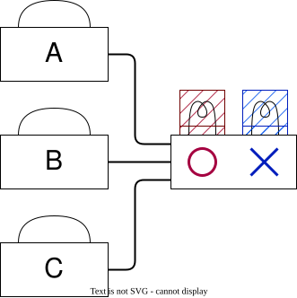
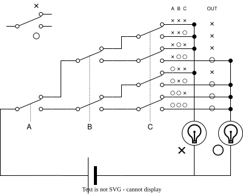
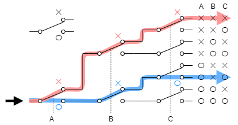
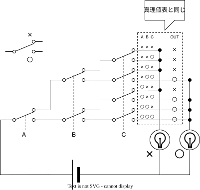

これは [リレーから始める CPU 自作 Advent Calendar 2021](https://adventar.org/calendars/7052) 2 日目の記事です。[<<< 1 日目](../Day1_Introduction/)

論理回路は組合回路と順序回路に大別されます。この記事では、組合回路の中でも一番汎用的なマルチプレクサという回路を作ります。

## 多数決スイッチを作る

ABC の 3 人で ○ × の多数決をする回路を作ってみましょう。

ABC はそれぞれ手持ちのスイッチで ○ × を投票します。投票数の多い方のランプが点灯します。

愚直に全パターン書き出してみます。

| A   | B   | C   | 結果 |
| --- | --- | --- | ---- |
| ×   | ×   | ×   | ×    |
| ×   | ×   | ○   | ×    |
| ×   | ○   | ×   | ×    |
| ×   | ○   | ○   | ○    |
| ○   | ×   | ×   | ×    |
| ○   | ×   | ○   | ○    |
| ○   | ○   | ×   | ○    |
| ○   | ○   | ○   | ○    |

このように、入力に対する出力を、全パターン書き出した表を「真理値表」といいます。

これを、スイッチで実装すると、こういう回路になります。

点線で繋がっているスイッチは連動しています。A さんがレバーを ○ 側に倒せば A の列のスイッチ群が全て上のレールに、× 側に倒せば全て下のレールにつながる、という具合です。

A B C の倒し方の組み合わせは $2^3 = 8$ 通りで、それぞれに対応して、上下に並んだ縦線のうちちょうどひとつだけが電源から出口まで導通します。「○ が多数派になる入力パターン」に対応する縦線を ○ ランプに、それ以外を × ランプに配線してやれば、多数決が完成します。

## 直列と並列

ここで一旦立ち止まって、スイッチの基本的な繋ぎ方を確認しておきます。スイッチの繋ぎ方は、本質的には直列と並列の 2 種類しかありません。

直列に繋いだ場合、A も B も両方 ON のときだけ電流が流れます。これは論理 **AND** と同じ動作です。

並列に繋いだ場合、A か B のどちらかが ON なら電流が流れます。これは論理 **OR** と同じ動作です。

加えて、スイッチが ○ と × の 2 つの端子を持っていれば、配線する側の端子を選ぶだけで信号を反転できます。これが論理 **NOT** に相当します。

AND・OR・NOT が揃えば、ブール代数の任意の論理式を回路として組み立てられます。実際、多数決スイッチの回路も、よく見れば「A が ○ かつ B が ○」「B が ○ かつ C が ○」… の OR を取ったものです。

ただ、論理式を毎回書き下して AND・OR・NOT に分解するのは手間がかかります。もっと機械的に、真理値表から直接回路を組み立てる方法があると便利です。それが次に出てくる**マルチプレクサ**です。

## マルチプレクサ

さきほどの多数決スイッチをよく見ると、入力 A B C の組み合わせで 8 通りに分かれた「経路」が並んでいて、その先で「○ につなぐか × につなぐか」を選んでいるだけの構造になっています。

この「入力の組み合わせごとに、出口の端子のうちちょうどひとつだけが導通する」構造を取り出したものを **マルチプレクサ (MUX : Multiplexer)** といいます。

これは 3 入力のマルチプレクサで、ABC の 8 通りの組み合わせに対応した端子のうち、ちょうどひとつが導通するようになっています。

入力を 2 つに減らすと、こうなります。

2 入力なら 4 通りなので出口は 4 本です。一般に n 入力のマルチプレクサは $2^n$ 本の出口を持ちます。

## 任意の真理値表をマルチプレクサで作る

n 入力 1 出力の組合回路を、真理値表で書き表すと、出力の列がこんなふうに ? を埋める形になります（n = 3 の場合）。

|  A  |  B  |  C  | 出力 |
| :-: | :-: | :-: | :--: |
|  ×  |  ×  |  ×  |  ?   |
|  ×  |  ×  |  ○  |  ?   |
|  ×  |  ○  |  ×  |  ?   |
|  ×  |  ○  |  ○  |  ?   |
|  ○  |  ×  |  ×  |  ?   |
|  ○  |  ×  |  ○  |  ?   |
|  ○  |  ○  |  ×  |  ?   |
|  ○  |  ○  |  ○  |  ?   |

? に ○ × を当てはめる方法は $2^8 = 256$ 通りあります。つまり、3 入力 1 出力の組合回路は全部で 256 種類あります。マルチプレクサを使うことで、この 256 種類を全部、同じやり方で作ることができます。

マルチプレクサの 8 本の出口を、真理値表の「出力」列に対応するように ○ レールか × レールに繋ぎ替えれば、それだけで任意の論理を回路に実装できます。多数決スイッチもこのパターンのひとつです。

## 組合回路

同じ入力に対して常に同じ出力となる回路を組合回路といいます。（一方、同じ入力であっても、過去の状態によって出力が異なる回路を順序回路といいます。）

組合回路の動作は、全パターンの入力に対する出力の一覧表、すなわち、「真理値表」として書き表すことができます。

前節で確認したように、ある真理値表を満たす回路は、マルチプレクサを使うことで必ず作ることができます。つまり、マルチプレクサを使うことで、"原理的に" 全ての組合回路を作れるようになります。

※　現実的には、マルチプレクサだけで組合回路を作ることは非効率です。マルチプレクサは入力数 n に対して指数オーダー ($2^n$) でスイッチが必要になります。回路が大きくなればなるほど、信号の遅延やコストが増大するという問題が生じます。そのため、実用上は AND・OR・NOT で式を組み立てたり、カルノー図で簡略化したりして、必要なスイッチ数を減らします。マルチプレクサが偉いのは「**どんな真理値表でも必ず作れる**」ことが見て取りやすい、というところです。

## 次回予告

本章ではスイッチを入力とした組合回路を作りましたが、人間が手でスイッチを操作しないといけないという問題があります。

なので次章では、人間の手でなく電気で切り替えられるスイッチ、「リレー」を使って、組合回路を作ります。

[>>> 3 日目](../Day3_RelayLogic/)
