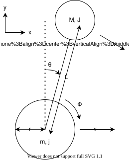

## オイラー-ラグランジュ方程式

### 運動エネルギー

1. 車輪の回転

   $$
   (1)/(2)j(dot(phi)+dot(theta))^2
   $$

2. 本体の回転

   $$
   (1)/(2)Jdot(theta)^2
   $$

3. 車輪の並進

   $$
   (1)/(2)mv^2=(1)/(2)r^2(dot(phi)+dot(theta))^2
   $$

   ※ $v=r(dot(phi)+dot(theta))$ （車輪が滑りなしで回転）を用いた。

4. 本体の並進

   $$

    (1)/(2)MV^2 \

   = (1)/(2)M(V_x^2+V_y^2) \

   = (1)/(2)M[(v+Ldot(theta)costheta)^2+(-Ldot(theta)sintheta)^2] \

   = (1)/(2)M(v^2+2Lvdot(theta)costheta+L^2dot(theta)^2) \

   = (1)/(2)M[r^2(dot(phi)+dot(theta))^2+2Lr(dot(phi)+dot(theta))dot(theta)costheta+L^2dot(theta)^2]

   $$

合計の運動エネルギーは、

$$

$$

### ポテンシャルエネルギー

$$
MgLcostheta
$$

### 運動方程式

### モーターの式

### 状態方程式

### 線形状態方程式

### 観測方程式
