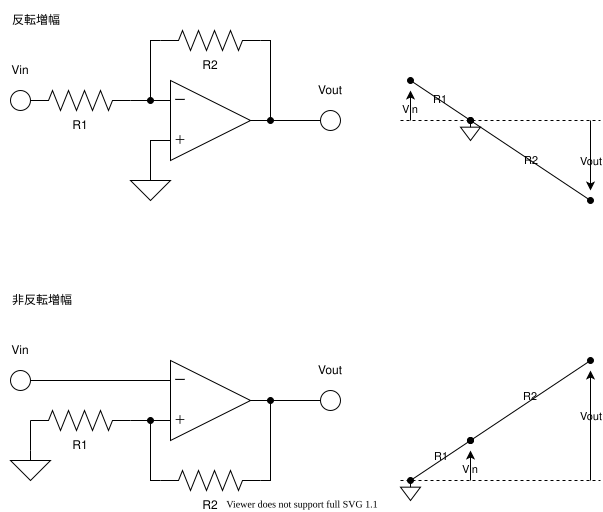

## オペアンプは電気的なテコ

### 増幅

### 積分・微分

## オペアンプの理論

$$ V*("out") = A (V*+ - V\_-) $$

解析するときは、増幅率は無限大と仮定します。

$$ A-> oo $$

実際のオペアンプでは、増幅度は数万あります。ただし、オペアンプの電源電圧以上の出力電圧は出せません。

解析をするときには、入力電流は 0 で、出力電流はいくらでも取り出せると仮定します。

$$
I_+,I_-=0 \\
-oo lt I_("out") lt oo
$$

実際のオペアンプでは、入力電流は数ナノアンペアで動いてくれます。これを使って、か弱いセンサの信号を増幅してやることができたりします。

出力電流は、「信号としては」大きい電流を流せますが、モーターなどのアクチュエータを動かすために使わないほうがいいです（軽いモーターだったら回せちゃいますが）。

### バーチャルショート

オペアンプはフィードバックがかかっているとき、 $V_+=V_-$ となるように働きます。ただ電流は流れないのでバーチャルショートと言われます。

オペアンプが「テコ」

### 増幅回路

$$
V_("out")=-(1)/(1+(1)/(A)+(R_2)/(R_1)(1)/(A))(R_2)/(R_1)V_("in")-> -(R_2)/(R_1)V_("in")
$$

### 微分回路

$$
V_("out")=-(1)/(1+(1)/(A))RC(dV_("in"))/(d t)-> -RC(dV_("in"))/(d t)
$$

### 積分回路

$$
V_("out")-> -(1)/(RC)integral_0^t V_("in") d t
$$

### 加算回路

$$
V_("out")=-> -R_fsum_(i=1)^n (V_i)/(R_i)
$$

## 差動信号

