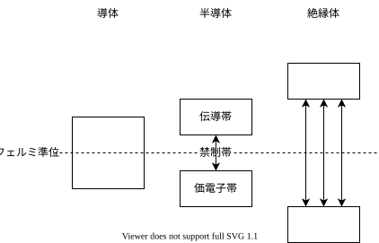
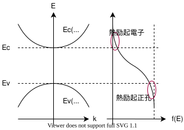
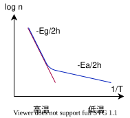
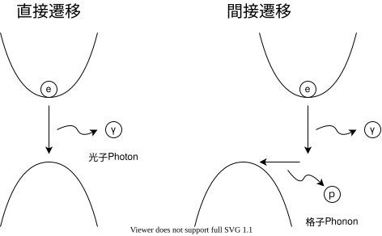
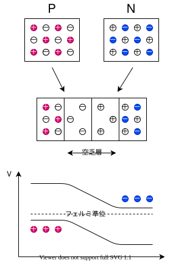
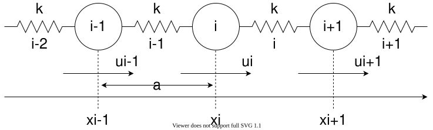
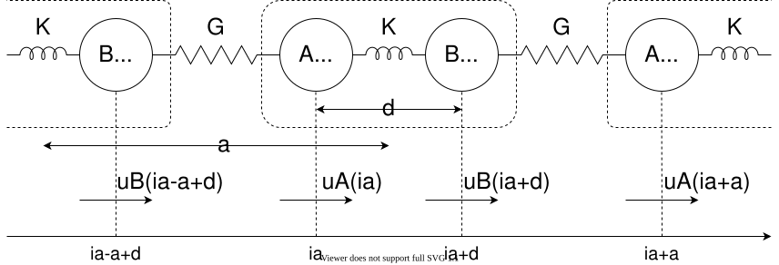
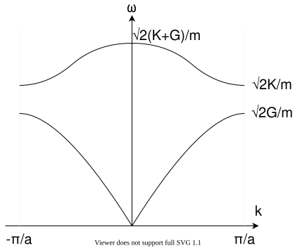

機械分子工学第二のノート

いい PDF → [物性物理学](http://maya.phys.kyushu-u.ac.jp/~knomura/education/Undergraduate/Busseibutsuri-II/Condensed-Matter-II.pdf)

## 1. 格子

- 格子：繰り返しの様子を規定するもの（周期構造）
- 基本構造：繰り返されるもの
- ミラー指数：周期的な格子中の方向や面を表す記法
  - [x,y,z]
  - (x,y,z)
- ブラべ格子：どの点からみても周りが同じ（並行移動で重なる）点の集合
  - 正方格子は 〇
  - 六角格子（グラフェンなど）は ✕
  - 六方格子は〇
- 基本単位格子：ブラべ格子のベクトルで並進したときに、重ならずに全空間を埋めつくす空間
  - 選び方は一意でない
- ヴィグナーサイツ・セル：ある格子点とその他の格子点との垂直二等分線で囲まれた領域
- 逆格子：ブラべ格子の周期
  - ブラべ格子のベクトル$bold(R)$に対して、

    $$
    exp(ibold(K)dot.c bold(r))=0
    $$

    なる波数ベクトル$bold(K)$の集合

  - ブラべ格子ベクトル$a_1,a_2,a_3$に対して、

    $$
    b_1=2pi(a_2times a_3)/(a_1dot.op(a_2times a_3))\\
    b_2=2pi(a_3times a_1)/(a_2dot.op(a_3times a_1))\\
    b_3=2pi(a_1times a_2)/(a_3dot.op(a_1times a_2))\\
    $$

  - 直交する

    $$
    b_idot.op a_j=2pidelta_("ij")
    $$

- ブリルアンゾーン：逆格子のヴィグナーサイツ・セル
  - 一次元格子なら、格子定数$a$に対して、逆格子定数は$2pi/a$

## 2. Drude モデル

電子は金属中の原子核と衝突しながらランダムに運動しているという古典的なモデル。

### 2.1. 直流電場応答

<!-- broken image:  ./img/Fig-2.1.1.drawio.svg -->

電場がかかった金属中の電子が従う運動方程式は、緩和時間を $tau$ として、

$$
m(dif v)/(dif t) + (m)/(tau)v = -eE space (2.1.1)
$$

定常状態 ($(dif v)/(dif t)=0$) に達したときの速度（ドリフト速度）は、

$$
v_d=-(etau)/(m)E space (2.1.2)
$$

運動量は $p(t)=mv(t)$ だが、次の瞬間の運動量（の期待値）は、衝突する確率 $(d t)/(tau)$ 、外力 $f=-eE$ を用いて、

$$
p(t+d t) = l(1-(d t)/(tau)r)p(t) + fdt space (2.1.3)
$$

☆ 衝突するとランダムな方向に飛んでいくので、運動量の期待値は $0$ になる

$(dif p)/(dif t)=(p(t+d t)-p(t))/d t$ を用いて式変形すると

$$
m(dif v)/(dif t)=-(m)/(tau)v-eE space (2.1.4)
$$

オームの法則と対照して定数を比べる。

- 微視的な数
  - 電荷素量 $e$
  - 緩和時間 $tau$
  - 電子密度 $n$
  - 電子のドリフト速度 $v_d$
- 巨視的な数
  - スケールに依存する量
    - 電流 $J$
    - 電位差 $V$
    - 抵抗 $R$
  - スケールに依存しない量
    - 電流密度 $j=J/S$
    - 電場 $E=V/L$
    - 電気抵抗率 $rho=RS/L$
    - 電気伝導率 $sigma=1/rho$

オームの法則 $V=JR$ をスケールに依存しない量で書き直すと

$$
E=jrho space (2.1.5)
$$

ドリフト速度の式

$$
v_d=-(etau)/(m)E space (2.1.2)
$$

電流密度の式

$$
j=-nev_d space (2.1.6)
$$

以上の式から

$$
sigma = 1/rho = (ne^2tau)/(m) space (2.1.7)
$$

### 2.2. 交流電場応答

運動方程式は、$(2.1.1)$ と同じで、

$$
m(dif^2 v)/(dif t^2) + (m)/(tau)(dif v)/(dif t) = -eE(t) space (2.2.1)
$$

周波数 $omega$ の交流電場 $E(t)=E_0exp(-iomega t)$ 変位 $u(t)=u_0exp(-iomega t)$ を代入すると、

$$
l(-momega^2-i(momega)/(tau)r)u_0exp(-iomega t) = -eE_0exp(-iomega t) space (2.2.2)
$$

変位の振幅は、

$$
u_0(omega)=(eE_0)/(momega (omega + i/tau)) space (2.2.3)
$$

☆ 電流の振幅は周波数の関数になっている

ところで、電束密度は

$$
D = epsilon.alt E = epsilon.alt_0 epsilon.alt_r E= epsilon.alt_0 E + P space (2.2.4)
$$

また、分極率（単位体積あたりの、電荷の偏り） $P=-neu$ は、

$$
P = -(ne^2)/(m)(1)/(omega(omega + i/tau))E space (2.2.5)
$$

よって、比誘電率は、

$$
epsilon.alt_r = 1-(omega_P^2)/(omega(omega + i/tau)) space (2.2.6)
$$

ただし、$omega_P$ はプラズマ周波数

$$
omega_P = sqrt((ne^2)/(meps_0)) space (2.2.7)
$$

誘電率を実部と虚部に分解して、

$$
epsilon.alt_r = epsilon.alt'_r + i epsilon.alt''_r = l(1-(omega_P^2)/(omega^2+1/tau^2)r) + il((omega_P^2)/(omegatau(omega_P^2+1/tau^2))r) space (2.2.8)
$$

金属の反射率 $R$ は、空気の比誘電率 $epsilon.alt_(r1)$ と、金属の比誘電率 $epsilon.alt_(r2)$ を用いて、

$$
R = l|(sqrt(epsilon.alt_(r2))-sqrt(epsilon.alt_(r1)))/(sqrt(epsilon.alt_(r2))+sqrt(epsilon.alt_(r1)))r|^2 space (2.2.9)
$$

ドルーテモデルを使うと、周波数ごとの反射率の違いとして、金属の色を説明できる。

プラズマ周波数以上の光は反射率 1 になる。

良さげな PDF → [光の反射メカニズム](http://home.sato-gallery.com/research/reflection_mechanism_proof.pdf)

## 3. 金属中の電子構造

無限に広がった結晶（バルク結晶）の電子状態を考える。周期境界条件を課したシュレディンガー方程式で波動関数を求める。（ゾンマーフェルトモデル）

### 3.1. シュレディンガー方程式

シュレディンガー方程式

$$
Epsi(bold(r))=hat(H)psi(bold(r))
$$

$$
hat(H)=(1)/(2m)hat(p)^2+V(bold(r))=-(planck.reduce^2)/(2m)nabla^2 + V(bold(r))
$$

を、 $V(bold(r))=0$ として解くと、

$$
psi_(bold(k))(r)=Aexp(ibold(k)dot.op bold(r))
$$

振幅 $A$ は、波動関数の規格化条件より、

$$

lr(angle.l psi bar.v psi angle.r)
= integral.triple_(-L/2)^(L/2) psi^\_(bold(r))psi(bold(r)) dbold(r) \

= integral.triple_(-L/2)^(L/2) A^2 dbold(r) \

= A^2 L^3 \

= 1

$$

$$
A=L^(-3/2)
$$

定数 $bold(k)$ は、周期境界条件 $psi(x,y,z)=psi(x+L,y,z)$ より、

$$
k_x = (2pi)/(L)n_x quad n_x = 0, plus.minus 1, plus.minus 2 ,,,
$$

$y,z$ 成分も同様にして、

$$
bold(k)=(2pi)/(L)bold(n) quad bold(n)in cal(Z)^3
$$

エネルギーは、

$$
E(bold(k)) = (planck.reduce^2)/(2m)|bold(k)|^2
$$

位置は、

$$
lr(angle.l psi bar.v)xlr(bar.v psi angle.r) = integral.triple_(-L/2)^(L/2) psi^*(bold(r)) x psi(bold(r)) dbold(r) = integral_(-L/2)^(L/2) x d x = 0
$$

運動量は、

$$
lr(angle.l psi bar.v)hat(p)lr(bar.v psi angle.r) = planck.reduce k_x
$$

☆ 位置が $bold(0)$ で運動量 $bold(k)$ の平面波

### 3.2. 逆格子空間

$k_x,k_y,k_z$ 軸からなる 3 次元空間で、$(2pi)/(L)$ 間隔の格子を張ったとき、各格子点は電子状態に対応する。ただし、電子はスピンの自由度もあるので、格子点と電子状態は 1 対 2 に対応する。

k 空間上で、エネルギーは、原点からの距離の二乗に比例する。

$$
E(bold(k))=(planck.reduce^2)/(2m)|bold(k)|^2 space (3.2.1)
$$

1 個の電子が平均的に占める体積は、単位格子の体積の半分（スピンの自由度）で、

$$
(1)/(2) l((2pi)/(L)r)^3 space (3.2.2)
$$

### 3.3. 状態密度

波数 $k$ 以下の電子の数 $N(k)$ を、逆格子空間の体積を用いて推定すると、

$$
N(k) = ((4)/(3)pi k^3)/((1)/(2) l((2pi)/(L)r)^3)=(L^3)/(3pi^2)k^3 space (3.3.1)
$$

エネルギー $E$ 以下の電子の数 $N(E)$ は、

$$
N(E) = (L^3)/(3pi^2)l((2mE)/(planck.reduce^2)r)^((3)/(2)) space (3.3.2)
$$

状態密度 $D(E)$（エネルギー $E$ をインデックスとしたときの電子数密度）は、

$$
D(E) = (dif )/(dif E)(N(E))/(L^3) = (1)/(2pi^2)l((2m)/(planck.reduce^2)r)^((3)/(2))sqrt(E) space (3.3.3)
$$

☆ 状態密度はエネルギーのルートのオーダー

### 3.4. フェルミ準位

最外殻電子は、共有結合を作ったり、金属の自由電子となったり、その原子の特性に大きく影響する。最外殻電子は原子の中で最も高いエネルギー状態にある電子なので、k 空間上で「最外殻」に位置している。

実格子空間で $L^3$ の単位格子中にある $N$ 個の電子が安定状態にある状況を考える。また $N$ は十分大きいとする。

エネルギーが低い状態、逆格子空間上で原点の近くから順に球状に埋まっていくので、その球の半径を $k_F$ とすると、

$$
(4)/(3)pi k_F^3 = (1)/(2) N l((2pi)/(L)r)^3 space (3.4.1)
$$

電子密度 $n=(N)/(L^3)$ を用いて、

$$
k_F = sqrt[3]{3pi^2(N)/(L^3)} = sqrt[3]{3pi^2n} space (3.4.2)
$$

これをフェルミ半径という。

フェルミエネルギー（フェルミ半径上のエネルギー）

$$
E_F = E(bold(k)_F) = (planck.reduce^2)/(2m)(3pi^2n)^((2)/(3)) space (3.4.3)
$$

フェルミ温度

$$
T_F = (E_F)/(k_B) space (3.4.4)
$$

フェルミ速度

$$
v_F = sqrt((2E_F)/(m)) space (3.4.5)
$$

また、この格子中に含まれる全電子のエネルギーの和は

$$
E = 2 sum_(E<= E_F) (planck.reduce^2|bold(k)|^2)/(2m) tilde (V)/(pi^2)(planck.reduce^2 k_F^5)/(10m) space (3.4.6)
$$

### 3.5. 金属の電子比熱

温度 0 のとき、フェルミ準位まで電子が埋まっており、フェルミ準位以上の電子はいない。（ゆらぎによってわずかに飛び出す。）温度が上がると少しずつフェルミ準位を飛び出すようになる。（熱励起）

ある温度のとき、どの程度の電子が、フェルミ準位を超えて飛び出すかを表したのがフェルミ分布関数

$$
f(E,T) = (1)/(exp lr(((E-mu)/(k_BT)r))+1) space (3.5.1)
$$

$mu$ は化学ポテンシャル $tilde E_F$

ある温度における電子の状態密度は、状態密度 × フェルミ分布関数 で求まる。

$$
D(E,T) = D(E) times f(E,T) space (3.5.2)
$$

温度が上がるとエネルギーがどの程度上昇するか？を代表した量が「電子比熱」である。「比熱」は、温度を上げるために必要な熱量のことだが、これを広く、温度とエネルギーの上昇の割合の比 $(dE)/(dT)$ と考えよう。

フェルミエネルギーから飛び出した電子に注目して、

$$
Delta E = E(T) - E(0) tilde (k_B T)l(n(T)/(T_F)r)
$$

$$
C_e = (dU)/(dT) tilde 2nk_B(T)/(T_F)
$$

☆ 正確には $(pi^2)/(2)nk_B(T)/(T_F)$

電子による熱伝導率は、

$$
K_e = (1)/(3) C_e v_e l_e = (pi^2)/(3)nk_B^2Ttau_e
$$

フェルミ準位における

- $v_F$ 速度
- $l_F$ 平均自由行程
- $tau_F$ 緩和時間

☆ 金属が熱をよく伝える理由

### まとめ

1. ゾンマーフェルトモデルのシュレディンガー方程式から、電子状態の配置、電子を入れる箱の配置を求めた。
2. 電子状態を格子点に対応させて、わかりやすく表す k 空間を導入した。
3. あるエネルギーにある電子状態の数を調べた。
4. 電子状態に実際に電子を配置して、フェルミ半径を求めた。
5. フェルミ分布関数を使って実際の金属電子の状態を求めた。

## 4. 半導体中の電子構造

### 4.1. 半導体のバンド構造

格子点 $bold(R)_n$ にある原子の作るポテンシャル $v(bold(r)-bold(R)_n)$ の合計が、全体のポテンシャル

$$
V(bold(r))=sum_n v(bold(r)-bold(R)_n) space (4.1.1)
$$

周期的なポテンシャルに対する、シュレディンガー方程式

$$
l[-(planck.reduce^2)/(2m)nabla^2+V(bold(r))r]phi(bold(r))=Ephi(bold(r)) space (4.1.2)
$$

の解は、ブロホ関数

$$
phi(bold(r))=u_(bold(R))(bold(r))exp(ibold(R)dot.c bold(r)) space (4.1.3)
$$

となる。$u$ は

$$
u_(bold(R))(bold(r))=u_(bold(R))(bold(r)+bold(R)) space (4.1.4)
$$

の周期性をもつ。

$u$ は一般の $V$ に対して簡単には解けない。

### 4.2. 電気伝導特性

電流

$$
bold(J)=-esum_(bold(k)) v(bold(k)) space (4.2.1)
$$

電場が存在すると、

$$
(dif P)/(dif t)=planck.reduce(dif k)/(dif t)=-eE space (4.2.2)
$$

（$P$：運動量）

$E>0$ の電場がかかると、$(dif k)/(dif t)<0$ となる。すなわち波数が減少する方向に電子状態が移る。電場がかかってないときは波数が均衡しているが、電場がかかると波数の均衡が崩れドリフトする。電圧をかけると電流が流れる。

### 4.3. バンドギャップとドーピング

### 4.4. 温度特性

電子のポテンシャルエネルギー

$$
E_c(k) = E_c + (planck.reduce^2|k|^2)/(2m_c^*)
$$

正孔のポテンシャルエネルギー

$$
E_v(k) = E_v - (planck.reduce^2|k|^2)/(2m_v^*)
$$

$m_c^*,m_v^*$：電子正孔の有効質量

電子の密度は、

$$

n_e
= (N_e)/(V) \

= (2)/(V)sum_(k_c)f(E_c(k)) \

= (2)/(V)integral.triple dk exp lr((-(E_c(k)-E_f)/(k_BT)r))(1)/(l((2pi)/(L)r)^3) \

prop exp lr((-(E_c-E_f)/(k_BT)r))

$$

同様に、正孔の密度は、

$$
n_n = prop exp lr((-(E_f-E_v)/(k_BT)r))
$$

真性半導体は、$n_e=n_n$ なので、

$$
n_e = sqrt(n_e n_n) prop exp lr((-(E_c-E_v)/(2k_BT)r)) = exp lr((-(E_g)/(2k_BT)r))
$$

不純物半導体では、低温域と高温域で温度特性が異なる。低温域では不純物とのバンドギャップが、高温域では伝導帯-価電子帯のバンドギャップが影響する。

### 4.5. 光学特性

エネルギーの差は光子として放出される。光子の周波数 $omega_("gamma")$ は、

$$
Delta E = planck.reduce omega_("gamma")
$$

運動量の差はフォノン（格子振動）として放出される。フォノンの波数 $k_p$ は、

$$
planck.reduce Delta k = planck.reduce k_p
$$

### 4.6. PN 接合

## 5. 格子振動

### 5.1. 一次元調和振動子モデル

原子間のポテンシャルは、Lennard-Jones ポテンシャルは

安定点まわりで近似すると、二次曲線になるが、二次曲線のポテンシャルとはバネのポテンシャルと同じである。

バネ $i$ のポテンシャルエネルギー

$$
phi_i=(1)/(2)k(u_(i+1)-u_i)^2+phi(a)
$$

全体のポテンシャルは

$$
phi = phi_0 + sum_o phi_i
$$

粒子 $i$ に働く力は

$$
f_i = -(partial phi)/(partial u_i) = k(u_(i+1)-2u_i+u_(i-1))
$$

$u_i=u(x_i)$ と書き直すと

$$
f_i=ka^2(u(x_i+a)-2u(x_i)+u(x_i-a))/(a^2)-> ka^2(partial^2 u)/(partial x_i^2)
$$

運動方程式は

$$
m(dif^2 u_i)/(dif t^2) = -(partial phi)/(partial u_i)
$$

を使って書くと

$$
m(dif^2 u_i)/(dif t^2) = ka^2(partial^2 u_i)/(partial x_i^2)
$$

☆ 波動方程式

解を求める

$$
u(x,t)=u_0exp{i(kx-omega t)}
$$

を代入して

$$
momega^2=-k(2 - e^("ika") - e^(-ika)) = -4ksin^2l((ka)/(2)r)
$$

固有値は

$$
omega = 2sqrt((k)/(m))l|sin lr(((ka)/(2)r))r|
$$

この $omega(k)$ を分散関係という。

長波長限界 $ktilde 0$ の固有値は

$$
omega tilde.eq asqrt((k)/(m))k
$$

$omega$ が $k$ に比例する。（音響モード）

サンプリング定理を考えるとわかるように、波長が格子間隔の 2 倍分だけ違う波は区別できない。（格子の点における変位が全く同じになり区別できない。）すなわち、 $k=k_0plus.minus n(pi)/(a)$ の波数の波を区別できない。これがブリルアンゾーンにあたる。

### 5.2. 波の状態

#### 位相速度

単一の波の速度は

$$
v_p=(omega)/(k)
$$

#### 群速度

波を重ね合わせたときのうねりの速度は

$$
v_g=(partial omega)/(partial k)
$$

エネルギーの輸送速度は群速度

#### 分岐

### 例：二原子分子の一次元調和振動子モデル

ポテンシャルは

$$
phi = phi_0 + (G)/(2)sum_i{u_B(ia-a+d)-u_A(ia)}^2 + (K)/(2)sum_i{u_A(ia)-u_B(ia+d)}^2
$$

$d<< a$ の近似をして

$$
phi = phi_0 + (G)/(2)sum_i{u_B(ia-a)-u_A(ia)}^2 + (K)/(2)sum_i{u_A(ia)-u_B(ia)}^2
$$

運動方程式は

$$
m(dif^2 u_A(ia))/(dif t^2) = -(partial phi)/(partial u_A(ia)) = G {u_B(ia-a)-u_A(ia)} - K {u_A(ia) - u_B(ia)}
$$

$$
m(dif^2 u_B(ia))/(dif t^2) = -(partial phi)/(partial u_B(ia)) = - G {u_B(ia)-u_A(ia+a)} + K {u_A(ia) - u_B(ia)}
$$

$$
u_A(x,t)=u_(A0)exp{i(kx-omega t)}
$$

$$
u_B(x,t)=u_(B0)exp{i(kx-omega t)}
$$

を代入すると

$$
{momega^2 - (K+G)}u_(A0) + (K+Ge^(-ika))u_(B0) = 0
$$

$$
(K+Ge^("ika"))u_(A0) + {momega^2 - (K+G)}u_(B0) = 0
$$

$u_(A0),u_(B0)$ を消去すると

$$
omega^2 = (K+G)/(m) plus.minus (1)/(m)sqrt(K^2+G^2+2KGcos(ka))
$$

よって分散関係は

$$
omega(k) = sqrt((K+G plus.minus sqrt(K^2+G^2+2KGcos(ka)))/(m))
$$

$$
omega(0)= sqrt((2(K+G))/(m)), 0
$$

$$
omegal(plus.minus (pi)/(a)r) = sqrt((2K)/(m)),sqrt((2G)/(m))
$$

群速度（振動の伝播速度）$v_g = omega'(k)$ を求める。

波長が長い領域について考える。

$k-> 0$ と近似して、

$$

omega^2(k)
= (1)/(m)l{K+G plus.minus sqrt(K^2+G^2+2KGcos(ka))r} \

tilde.eq (1)/(m)l{K+G plus.minus sqrt(K^2+G^2+2KGl(1-((ka)^2)/(2)r))r} \

= (1)/(m)l{K+G plus.minus sqrt((K+G)^2-KG(ka)^2)r} \

= (K+G)/(m)l{1plus.minus sqrt(1-(KG(ka)^2)/((K+G)^2))r} \

tilde.eq (K+G)/(m)l{1 plus.minus 1 plus.minus (KG(ka)^2)/(2(K+G)^2)r} \

= (KG(ka)^2)/(2m(K+G)) , (2(K+G))/(m)

$$

$$
omega(k) = kasqrt((KG)/(2m(K+G)))
$$

$$
v_g = omega'(k) = asqrt((KG)/(2m(K+G)))
$$

$K=100 "eV/nm"^2 =10 "N/m"$、$M=10 "g/mol"=10^(-25) "kg"$、$a=1 dot(A)=10^(-10) "m"$ を代入してオーダーを推定すると、$v_g=1000 "m/s"$

## 6. 熱物性

### 6.1. フォノン

- 格子振動を量子化したもの
- フォノンの状態は、周波数・波数・量子数
- フォノンのエネルギーは $planck.reduce omega$
- 波数ベクトル $k_s$ 分岐 $s$ のフォノンのエネルギーは、$n_("ks")$ を量子数として、

$$
l(n\_("ks") + (1)/(2)r)planck.reduce omega(k_s)
$$

- フォノンはボーズ粒子で、状態の重複に制限がない
- n は温度に依存し、基底状態 $T=0 "K"$ で $n=0$
  - ただ、ゼロ点振動によってエネルギーは 0 にはならない

### 6.2. フォノンのエネルギー

系全体のエネルギーは、分布関数$n(k,s)$と分散関係$omega(k,s)$を用いて、

$$
E=sum\_(k,s)n(k,s)planck.reduce omega(k,s)
$$

分布関数はボーズ・アインシュタイン分布

$$
(1)/(exp lr(((E)/(k_BT)r))-1)
$$

に従うので、

$$
n(k,s)=(1)/(exp lr(((planck.reduce omega(k,s))/(k_BT)r))-1)
$$

系全体のエネルギーは、

$$
E=sum\_(k,s)(planck.reduce omega(k,s))/(exp lr(((planck.reduce omega(k,s))/(k_BT)r))-1)
$$

### 6.3. 格子比熱

比熱とは、加えた熱量（エネルギー）に対する温度上昇の比のことで、

$$

C_V=(1)/(V)(partial E)/(partial T)=(1)/(V)sum_(k,s)(partial )/(partial T)(planck.reduce omega(k,s))/(exp lr(((planck.reduce omega(k,s))/(k_BT)r))-1)
$$

分散関係がわかれば計算できる。

#### 低温の場合

$planck.reduce omega>> k_BT$

逆格子空間の単位体積は、

$$
l((2pi)/(L)r)^3=(8pi^3)/(V)
$$

※逆格子空間の体積なので次元は$L^(-3)$

単位体積あたりの $k$ の数は、

$$
(V)/(8pi^3)
$$

ブリルアンゾーンで積分する。

$$
C_V=(1)/(V)(partial )/(partial T)sum_s integral.triple (V)/(8pi^3)(planck.reduce omega(k,s))/(exp lr(((planck.reduce omega(k,s))/(k_BT)r))-1) dbold(k)
$$

分布関数を見るとわかるように、低温では $omega$ が小さい領域にのみ存在する。音響モードだけであるので、分散関係は比例 $omegaprop k$ 、比例定数は速度 $nu$（位相速度=群速度）。

$$
integral.triple dbold(x) (x)/(e^x-1) = integral_0^1 integral_0^pi integral_0^pi r^2sinphi   dphi   dtheta (r)/(e^r-1) = 4pi integral (r^3)/(e^r-1) d r=
$$

$$
C_Vtilde.eq(partial )/(partial T)(pi^2)/(10)((k_BT)^4)/((planck.reduce macron(nu))^3)prop T^3
$$

$macron(nu)$は縦波と横波の平均速度

$$
(1)/(macron(nu))=(1)/(3)l((1)/(nu_L^3)+(2)/(nu_T^3)r)
$$

電磁波・光子・熱放射と似ていて、例えば、ステファン・ボルツマンの式

$$
E prop T^4 \\
C_V prop T^3
$$

#### 高温の場合

$planck.reduce omega<< k_BT$ の場合、$exp(x)=1+x+O(x^2)$ の近似から、

$$
E=sum\_(k,s)k_BT
$$

$N$ 粒子系のモード数（自由度）は $3N$ なので、

$$
E=3Nk_BT
$$

比熱は、数密度を$n$として、

$$
C_V=3(N)/(V)k_B=3nk_B
$$

### 6.4. フォノン気体

量子化された格子振動が、格子内を行ったり来たりする様子を、フォノンが気体のように飛び交うモデルで表す。これがフォノン気体の概念で、気体運動論の考え方を適用できる。

平均自由行程内では衝突しないと近似できる。

### 6.5. 熱伝導率

エネルギー密度

$$
P=(E)/(V)
$$

フィックの法則

$$
J=-D(partial P)/(partial z)
$$

拡散係数は

$$
D=(1)/(3)vl
$$

フーリエの法則

$$
J=-lambda(partial T)/(partial z)
$$

と比較すると、

$$
lambda = D(partial P)/(partial T) = (1)/(3)vl(1)/(V)(partial E)/(partial T) = (1)/(3)vlC_V
$$

### 6.6. 古典的サイズ効果

平均自由行程$l$に対して、系のサイズ$L$が小さいと、粒子どうしの衝突より壁との衝突のほうが頻繫に起こるようになる。

$$
l=vtau=(v)/(gamma)
$$

緩和時間 $tau$ に対して、散乱頻度は

$$
gamma=(1)/(tau)
$$

壁との衝突を考慮すると、

$$
gamma=gamma_0+(v)/(L)
$$

$$
(1)/(l)=(1)/(l_0)+(1)/(L)
$$

実質の平均自由行程は、

$$
l=(L)/(l_0+L)l_0
$$

$$
lambda=(1)/(3)C_Vvl(L)/(l_0+L)
$$

$L$ が小さくなると、熱伝導率 $lambda$ も小さくなる。
