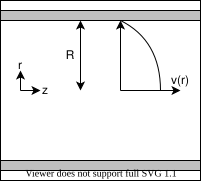
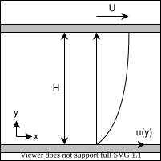
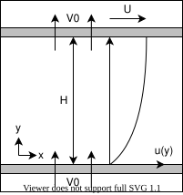
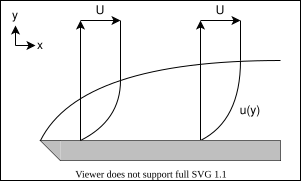

## 流体

## 基礎方程式

### 登場人物

- 速度 $u_i$
  - 変形速度 $d_("ij") := (partial)/(partial x_j) u_i$ → 歪み速度 $S_("ij"):=d_((ij))$ + 回転速度 $Omega_("ij"):=d_([ij])$
  - 渦度 $omega_k := epsilon_("ijk")d_("ij")$
- 応力 $sigma_("ij")$
- 密度 $rho$
- 圧力 $p$
- 外力 $g_i$

### 質量保存則（連続の式）

$$
(partial )/(partial t)rho+(partial )/(partial x_i)(rho u_i)=0
$$

### 運動量保存則（運動方程式）

$$
(partial )/(partial t)(rho u_i) + (partial )/(partial x_j)(rho u_i u_j)=(partial )/(partial x_i)sigma_("ii")+rho g_i
$$

### 構成則

構成方程式の一般式

$$
sigma_("ij")=cal(F)(d_("kl"))
$$

1. 静水圧

$$
sigma_("ij") = -pdelta_("ij")
$$

2. 変形速度テンソル（対称・等方的）

$$
sigma_("ij") = C_("ijkl")d_("kl")
$$

$$
C_("ijkl") = lambdadelta_("ij")delta_("kl") + mudelta_("ik")delta_("jl") + nulambda_("il")lambda_("jk")
$$

ニュートン流体の構成方程式

$$
sigma_("ij") = lr(( -p + (2)/(3) mu S_("kk") )) delta_("ij") + 2 mu S_("ij")
$$

### ナビエストークス方程式

$$
(partial )/(partial t)(rho u_i)+(partial )/(partial x_j)(rho u_iu_j)=-(partial )/(partial x_i)lr((p+(2)/(3)mupartial_ku_k))+mu(partial )/(partial x_j)lr(((partial )/(partial x_j)u_i+(partial )/(partial x_i)u_j))+rho g_i
$$

#### 非圧縮

$$
rho lr(( (partial )/(partial t) u_i + u_j (partial )/(partial x_j) u_i )) = -(partial )/(partial x_i) p + mu (partial )/(partial x_j) (partial )/(partial x_j) u_i + rho g_i
$$

#### 無次元化 $D,V,L$

$$
rho (partial )/(partial t) u_i + rho u_j (partial )/(partial x_j) u_i = -(partial )/(partial x_i) p + (mu)/(DVL) (partial )/(partial x_j) (partial )/(partial x_j) u_i + rho g_i
$$

レイノルズ数$Re:=(rho V L)/(mu)$と外力場$g_i$が同じなら、等価な微分方程式となり、相似な流れになる．

### π 定理

法則が$n$個の変数$(q_1,q_2,,,q_n)$で表現されていて，変数が$k$個の独立な基本単位で表されるとき，

|       | $e_1$ | ... | $e_k$ |
| :---: | ----- | --- | ----- |
| $q_1$ |       |     |       |
|   :   |       | $M$ |       |
| $q_n$ |       |     |       |

$k = "rank" M$

無次元数の数 $= "null" M$

### 二次元

$$

(partial u)/(partial x) + (partial v)/(partial y) = 0 \

rho lr(( (partial u)/(partial t) + u (partial u)/(partial x) + v (partial u)/(partial y) )) = -(partial p)/(partial x) + mu lr(( (partial^2 u)/(partial x^2) + (partial^2 u)/(partial y^2) )) + rho g_x \

rho lr(( (partial v)/(partial t) + u (partial v)/(partial x) + v (partial v)/(partial y) )) = -(partial p)/(partial y) + mu lr(( (partial^2 v)/(partial x^2) + (partial^2 v)/(partial y^2) )) + rho g_y

$$

### 円筒座標 $(r,theta,z)$

$$

(1)/(r) (partial)/(partial r)(ru_r) + (1)/(r) (partial )/(partial theta) u_theta + (partial )/(partial z) u_z = 0 \

rho lr(( (partial u_r)/(partial t) + u_r (partial u_r)/(partial r) + (u_theta)/(r) (partial u_r)/(partial theta) - (u_theta^2)/(r) + u_z (partial u_r)/(partial z) )) = -(partial p)/(partial r) + mu lr([ (partial )/(partial r) lr(((1)/(r)(partial)/(partial r)(ru_r))) + (1)/(r^2)(partial^2 u_r)/(partial theta^2) - (2)/(r^2) (partial u_theta)/(partial theta) + (partial^2 u_r)/(partial z^2) ]) + rho g_r \

rholr(( (partial u_theta)/(partial t) + u_r (partial u_theta)/(partial r) + (u_theta)/(r) (partial u_theta)/(partial theta) + (u_ru_theta)/(r) + u_z (partial u_theta)/(partial z) )) = -(1)/(r)(partial p)/(partial theta) + mu lr([ (partial )/(partial r) lr(( (1)/(r) (partial)/(partial r)(ru_theta))) + (1)/(r^2) (partial^2 u_theta)/(partial theta^2) + (2)/(r^2) (partial u_r)/(partial theta) + (partial^2 u_theta)/(partial z^2) ]) + rho g_theta \

rholr(( (partial u_z)/(partial t) + u_r (partial u_z)/(partial r) + (u_theta)/(r) (partial u_z)/(partial theta) + u_z(partial u_z)/(partial z) )) = -(partial p)/(partial z) + mu lr([ (1)/(r) (partial )/(partial r) lr((r(partial)/(partial r)u_z)) + (1)/(r^2) (partial^2 u_z)/(partial theta^2) + (partial^2 u_z)/(partial z^2) ]) + rho g_z

$$

### 圧力ポアソン方程式

非圧縮で外力のないナビエストークス方程式

$$
rholr(((partial u_i)/(partial t) + u_j(partial u_i)/(partial x_j))) = -(partial p)/(partial x_i) + mu (partial^2 u_i)/(partial x_j^2)
$$

の両辺に $(partial )/(partial x_i)$ をかけて，連続の式 $(partial u_i)/(partial x_i)=0$ を用いると

$$
rho (partial u_j)/(partial x_i)(partial u_i)/(partial x_j) = -(partial^2 p)/(partial x_i^2)
$$

## 円管内層流（ポアズイユ流れ）

半径 $R$ の円管

軸対称 $partial_theta=0, u_theta=0$, 発達流 $partial_z=0$, 定常 $(partial)/(partial t)=0$, 円管表面で $u=0$

NS 方程式に条件を適用して，

$$
(dif p)/(dif z) = mu(1)/(r) (dif )/(dif r) lr(( r (dif u_z)/(dif r) ))
$$

これを解く

$$

(dif )/(dif r) lr(( r (dif u_z)/(dif r) )) = (1)/(mu) (dif p)/(dif z) r \

r (dif u_z)/(dif r) = (1)/(2mu) (dif p)/(dif z) r^2 + C_1 \

(dif u_z)/(dif r) = (1)/(2mu) (dif p)/(dif z) r + C_1 r^(-1) \

u_z = (1)/(4mu) (dif p)/(dif z) r^2 + C_1 ln r + C_2 \

$$

$u_x(r)$ は有限なので $C_1=0$ ，また円管表面で $u_z(R)=0$ より

$$
u_z(r) = (1)/(4mu) lr((-(dif p)/(dif z))) (R^2-r^2)
$$

中心流速は

$$
u_0 = u(0) = (1)/(4mu) lr((-(dif p)/(dif z))) R^2
$$

流量は

$$
Q = integral_0^R 2 pi r u(r) d r = (pi)/(8mu) lr((-(dif p)/(dif z))) R^4
$$

平均流速は

$$
U = (Q)/(pi R^2) = (u_0)/(2)
$$

表面の摩擦応力は

$$
tau = (1)/(2) lr((-(dif p)/(dif z))) R
$$

円管の圧力損失は

$$
Delta p = lr((-(dif p)/(dif z))) L = (8 mu L)/(R^2) U
$$

### 血管の分岐（Murray の法則）

評価関数を

$$
J = Q Delta P + K (pi d^2)/(4) L
$$

### 熱伝達

## 平行平板

間隔 $H$, すべり速度 $U$

発達流，定常

$$
0 = - (dif p)/(dif x) + mu (dif^2 u)/(dif y^2)
$$

一般解は

$$
u(y) = - (1)/(2mu) lr((-(dif p)/(dif x))) y^2 + C_1 y + C_2
$$

底板は固定 $u(0)=0$， 上板は速度 $U$ ですべっているので $u(H)=U$

$$
u(y) = - (1)/(2mu) lr((-(dif p)/(dif x))) y(y-H) + (U)/(H) y
$$

### 穴あき平板

底板平板から一定の湧き出し $V_0$ ，上板から同じ吸い込みがあるとき，

$$
rho V_0 (dif u)/(dif y) = - (dif p)/(dif x) + mu (dif^2 u)/(dif y^2)
$$

$alpha:=-(rho V_0)/(mu), beta:=-(1)/(mu)(dif p)/(dif x)$ とすると，

$$
(dif^2 u)/(dif y^2) + alpha (dif u)/(dif y) + beta = 0
$$

一般解は

$$
u(y) = C_1 exp(-alpha y) + C_2 - (beta)/(alpha)y
$$

境界条件 $u(0)=0$ $u(H)=U$ より

$$
u(y) = lr(( U + (beta)/(alpha) H )) (exp(-alpha y)-1)/(exp(-alpha H)-1) - (beta)/(alpha)y
$$

$$
u(y) = lr(( U + (1)/(rho V_0) (dif p)/(dif x) H )) (explr(((rho V_0)/(mu) y))-1)/(explr(((rho V_0)/(mu) H))-1) - (1)/(rho V_0) (dif p)/(dif x) y
$$

## 同軸二重円筒

## 境界層

## 非定常

滑らかな入り口では一様な速度分布になる．

粘性の影響で徐々に壁面から運動量が伝わる．（← 発達）

$$
(partial)/(partial t) u + u partial_x u + v partial_y u = - (1)/(rho) partial_x p + mu ( partial_x^2u + partial_y^2u )\\
partial_x u + partial_y v = 0
$$

条件

$$

u(x,y,0)=0\

u(x,0,t)=U_0 (t>0)\

u(x,oo,t)=0\

partial_x u = 0\

partial_x p = 0

$$

解

$$
(partial)/(partial t)u=mupartial_y^2u
$$

境界層

$$
delta(t)=sqrt(mu t)
$$

## 流体の運動学

### 完全流体の支配方程式

非粘性の流体（$upright(Re)->oo$）

- 連続の式

  $$
  (partial rho)/(partial t) + (partial)/(partial x_i)(rho u_i) = 0
  $$

- オイラー方程式（完全流体の運動方程式）

  $$
  (partial u_i)/(partial t) + u_j (partial u_i)/(partial x_j) = -(1)/(rho) (partial p_i)/(partial x_i) + g
  $$

- 断熱方程式
  $$
  (partial s)/(partial t) + u_j (partial s)/(partial x_j) = 0
  $$

### 渦度方程式

$$
(dif omega)/(dif t) = (partial omega_i)/(partial t) + u_j(partial omega_i)/(partial x_j) = omega_j (partial u_i)/(partial x_j) + nu (partial^2 omega_i)/(partial x_j^2)
$$

### ラグランジュの渦定理

### ポテンシャル流

$$
nablatimes(nablaPhi)=0
$$

渦無し流れにはポテンシャル $Phi$ が定義できて $u=nablaPhi$ となる．

連続の式より，

$$
nabladot.op u = nabladot.op(nablaPhi) = nabla^2 Phi = 0
$$

速度ポテンシャルはラプラス方程式の解

### 圧力方程式（ベルヌイの定理）

$$
(p)/(rho) + (1)/(2) u^2 + (partial Phi)/(partial t) = F(t)
$$

## 二次元ポテンシャル流

### 流れ関数

$$
u=(partial Psi)/(partial y) quad v=-(partial Psi)/(partial x)
$$

流れ関数もラプラス方程式の解

### 複素ポテンシャル

$$
f=Phi+iPsi
$$

複素速度

$$
w = (dif f)/(dif z) = u - iv
$$

$$
u=upright(Re)(dif f)/(dif z) quad v=-upright(Im)(dif f)/(dif z)
$$

### ポテンシャルの例

#### 直角

$$
Psi (x,y) = axy
$$

$$
u =  (partial Psi)/(partial y) =  ax quad
v = -(partial Psi)/(partial x) = -ay
$$

$$
q = sqrt(u^2+v^2) = a sqrt(x^2+y^2)
$$

$$
w = (partial v)/(partial x) - (partial u)/(partial y) = 0
$$

$$
Phi = (a)/(2) (x^2-y^2) + C
$$

#### 強制渦

$$
Psi (x,y) = -a(x^2+y^2)
$$

$$
u =  (partial Psi)/(partial y) = -2ay quad
v = -(partial Psi)/(partial x) =  2ax
$$

$$
q = sqrt(u^2+v^2) = 2a sqrt(x^2+y^2)
$$

$$
w = (partial v)/(partial x) - (partial u)/(partial y) = 4a
$$

$$
Phi = a ln sqrt(x^2+y^2)
$$

#### 一様流

$$
f = U e^(-ialpha) z
$$

$$
(dif f)/(dif z) = U e^(-ialpha)
$$

#### 湧き出し・吸い込み

$$
f = m ln z = m ln (re^("itheta")) = m ln r + imtheta quad
Phi = m ln r quad
Psi = m theta
$$

$$
u_r      = (m)/(r) quad
u_theta = 0
$$

#### 渦糸

$$
f = -i kappa ln z
$$

#### 角

$$
f = C z^n
$$

$pi/n$ のコーナーを回る流れ

#### 二重湧き出し

$$
f = m ln(z-a) - m ln(z+a) = m ln(z-a)/(z+a)
$$

二点 $a,-a$ を近づける（$a -> 0$）（$2ma -> mu$）

$$
f = - (mu)/(z) quad
Phi = -(mu)/(r)costheta quad
Psi =  (mu)/(r)sintheta
$$

#### 円筒まわり

$$
f = U lr(( z + (R^2)/(z) )) quad
Phi = U lr(( r + (R^2)/(r) )) costheta quad
Psi = U lr(( r - (R^2)/(r) )) sintheta
$$

$$
u_r      =            (partial Phi)/(partial r)      =  U lr(( 1 - (R^2)/(r^2) )) costheta quad
u_theta = (1)/(r)(partial Phi)/(partial theta) = -U lr(( 1 + (R^2)/(r^2) )) sintheta
$$

円筒表面 $r=R$ では

$$
Phi = 2Ucostheta quad Psi = 0 quad u_r = 0 quad u_theta = -2Usintheta
$$

半径方向の流速がない

遠方 $r = oo$ では

$$
u_r = Ucostheta quad u_theta = -Usintheta
$$

$$
u_x = -u_theta sintheta + u_r costheta =  = U
$$

### 一般の複素ポテンシャル

## 三次元ポテンシャル流

四元数に拡張する

$$
begin{alignedat}{5}
  u_1 & = & Im_i (partial f_0)/(partial x) \\
  u_2 & = & Im_j (partial f_0)/(partial y) \\
  u_3 & = & Im_k (partial f_0)/(partial z)
end{alignedat}
$$

となるような関数 $f_0(w+xi+yj+zk)$ が四元数上で正則となるように虚部 $f_1,f_2,f_3$ を定める

$$
begin{alignedat}{5}
  u_1 & = & (partial f_0)/(partial x) & = & -(partial f_1)/(partial w) & = &  (partial f_2)/(partial z) & = & -(partial f_3)/(partial y) \\
  u_2 & = & (partial f_0)/(partial y) & = & -(partial f_1)/(partial z) & = & -(partial f_2)/(partial w) & = &  (partial f_3)/(partial x) \\
  u_3 & = & (partial f_0)/(partial z) & = &  (partial f_1)/(partial y) & = & -(partial f_2)/(partial x) & = & -(partial f_3)/(partial w)
end{alignedat}
$$

とすると四元流速 $u = u_1i+u_2j+u_3k$ は

$$
u = (partial)/(partial w)f_0
$$

$$
(nabla f_i) dot.op (nabla f_j) = delta_("ij")
$$

#### 一様流

$$
f = Az
$$

$$
u = (dif f)/(dif z) = A
$$

#### ?

$$
f = Az^(-1)
$$

$$
u = (dif f)/(dif z) = -Az^(-2)
$$

#### 湧き出し・吸い込み

$$
f = A ln z
$$

$$
u = (dif f)/(dif z) = A z^(-1)
$$

#### 球まわり

$$
f = U ( z + R^2 z^(-1) )
$$

$$
u = (partial f)/(partial z) = U ( 1 - R^2 z^(-2) )
$$

$$
uz = U ( z - R^2 z^(-1) )
$$

円球面 $|z|=R$ 上では $z = R (xi + yj + zk)$ として，

$$
uz = U ( z - z^* ) = 0
$$

つまり流速が半径と垂直になる

## 渦の運動

- 速度場 $u$
- 速度勾配テンソル $d_("ij") := (partial)/(partial x_j)u_i$
- 変形速度テンソル $s_("ij") := d_((ij))$
  - 軸変形
    - 対称テンソルなので主軸が存在する
    - 体積変化は $(1+lambda_1)(1+lambda_2)(1+lambda_3) tilde 1 + lambda_1+lambda_2+lambda_3 = 1 + Lambda$
    - 非圧縮の場合，トレース $Lambda=0$
  - ずり変形
    - 非対格成分はひし形状の変形を表す
    - 体積は保存
- 渦度 $omega_k := epsilon_("ijk")d_("ij")$
  - 速度勾配テンソルの反対称成分 $Omega_("ij"):=d_([ij])=epsilon_("ijk")omega_k$
  - 回転を表すソレノイダル場（ $partial_komega_k=0$）
- 渦線
  - 渦度ベクトルを繋いだ線
  - 渦線の接ベクトルが渦度ベクトルと一致する
  - $(dx_i)/(omega_i)=upright("const")$
- 渦菅
  - ある閉曲線を通過する渦線のなす閉曲面
  - 渦菅表面から渦度の出入りはない（渦菅表面の法線ベクトルと渦度ベクトルは直交）
- 渦糸
  - 断面積が微小な渦菅
  - 渦菅は曲線とみなせる
  - 渦菅内の渦度は一定（Helmholtz の第三法則）

### Helmholtz の法則

#### 第一法則（渦度方程式）

#### 第二法則

「渦度は流体粒子に凍結している」

粘性がなく，密度が圧力のみに依存し（バロトロピー流体），体積力が保存力なら，渦線を構成する粒子は常に同じで，渦線と流体は一緒に移動する．

## 水波

[本](https://www.nagare.or.jp/download/noauth.html?d=31-4rensai.pdf&dir=113)

水をポテンシャル流と仮定して扱う

深さ $h$ 重力場 $-gbold(k)$

$$
nabla^2Phi=0
$$

$$
(partial Phi)/(partial t)+(1)/(2)(nabla Phi)^2 +(P)/(rho)+gz=0
$$

このときに表面の形を表す方程式

$$
z=zeta(x,t),quad F(x,t)=0
$$

を求めたい．

### 表面条件

表面を構成する粒子は表面を漂うと仮定する．つまり，表面の物質微分

$$
(dif F)/(dif t) = (partial)/(partial t)F + u dot.op nabla F = 0 \\
(partial zeta)/(partial t)+nablaPhi dot.c nablazeta=(partial Phi)/(partial z)
$$

また，表面の圧力は大気圧なので，圧力をゲージ圧として，

$$
P(x,t)=0 (F(x,t)=0)
$$

表面張力がある場合，圧力が高くなる．表面張力は表面形状に依存する成分と表面張力係数 $T$ の積になる．

### 微小変位

表面の形状に依存した複雑な境界条件になるので，波の変位が微小だと仮定して線形化する

$z$ を微小変位 $zeta$ として，

$$
Phi(x,y,z) tilde.eq Phi(x,y,0) + zeta (partial)/(partial z)Phi(x,y,zeta)
$$

表面形状の条件は

$$
(partial zeta)/(partial t)=(partial Phi)/(partial z)
$$

表面圧力の条件は（表面張力を含む）

$$
(partial Phi)/(partial t)+gzeta=(T)/(rho)lr(((partial^2 zeta)/(partial x^2)+(partial^2 zeta)/(partial y^2)))
$$

### 2 次元の解

$y$ 方向を均一として解く

$$
Phi=-a(omega cosh k(z+h))/(k sinh kh)cos (kx-omega t)
$$

#### 浅水波 $kh<<1$ の場合

$$
Phi = -(aomega)/(k^2h)cos (kx-omega t)
$$

速度場

$$
u=(aomega)/(kh)sin(kx-omega t)
$$

#### 深水波 $kh>>1$ の場合

$$
Phi = -a(omega)/(k)e^("kz")cos(kx-omega t)
$$

位相速度

$$
c_p=sqrt((g)/(k))
$$

群速度

$$
c_g=(1)/(2)sqrt((g)/(k))
$$

## KdV 方程式

$$
(partial u)/(partial t) + alpha u (partial u)/(partial x) + beta (partial^3 u)/(partial x^3) = 0
$$

### ソリトン解

$$
u=(c)/(2)sech^2(sqrt(c))/(2)(x-ct+delta)
$$
